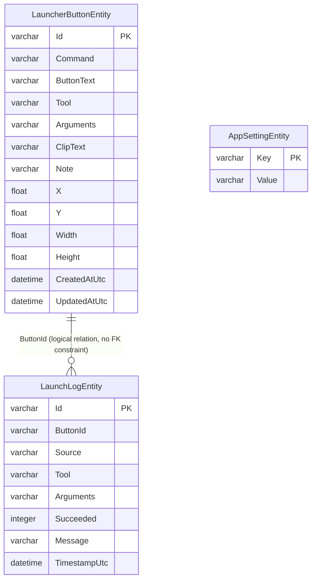

# Database Schema

## Scope
This document defines the SQLite table design used by Praxis.

Authoritative implementation points:
- `Praxis/Services/SqliteAppRepository.cs`
- `Praxis/Models/LauncherButtonEntity.cs`
- `Praxis/Models/LaunchLogEntity.cs`
- `Praxis/Models/AppSettingEntity.cs`

## Database File Location
- Logical path source: `Praxis/Services/AppStoragePaths.cs`
- Current file name: `praxis.db3`
- Current resolved locations:
  - Windows: `%USERPROFILE%/AppData/Local/Praxis/praxis.db3`
  - macOS (Mac Catalyst): `~/Library/Application Support/Praxis/praxis.db3`

Notes:
- `SqliteAppRepository.InitializeAsync` creates tables with `CreateTableAsync<T>()` if missing.
- There is no explicit schema migration framework yet.
- `DateTime` columns are mapped by `sqlite-net-pcl` with provider default settings used by `SQLiteAsyncConnection(dbPath)`.
- `buttons.sync` is stored separately for multi-window signaling:
  - Windows: `%USERPROFILE%/AppData/Local/Praxis/buttons.sync`
  - macOS (Mac Catalyst): `~/Library/Application Support/Praxis/buttons.sync`

## Table List
- `LauncherButtonEntity`
- `LaunchLogEntity`
- `AppSettingEntity`

## ER Diagram (Mermaid)

## Table: LauncherButtonEntity
Purpose: launcher button master records (placement, command, metadata).

| Column | SQLite type | Null | PK | Description |
|---|---|---|---|---|
| `Id` | `varchar` | No | Yes | GUID string (`LauncherButtonRecord.Id`) |
| `Command` | `varchar` | Yes | No | Command match key for launcher execution |
| `ButtonText` | `varchar` | Yes | No | Label shown on launcher button |
| `Tool` | `varchar` | Yes | No | Executable target |
| `Arguments` | `varchar` | Yes | No | Arguments / fallback launch target |
| `ClipText` | `varchar` | Yes | No | Clip word text shown in editor |
| `Note` | `varchar` | Yes | No | Free-form note text |
| `X` | `float` | Yes | No | Canvas X position |
| `Y` | `float` | Yes | No | Canvas Y position |
| `Width` | `float` | Yes | No | Button width |
| `Height` | `float` | Yes | No | Button height |
| `CreatedAtUtc` | `datetime` | Yes | No | Created timestamp (UTC) |
| `UpdatedAtUtc` | `datetime` | Yes | No | Last updated timestamp (UTC) |

Application-level behavior:
- `UpdatedAtUtc` is overwritten on save (`UpsertButtonAsync`) for optimistic conflict checks.
- `Command` lookup optimization is handled by in-memory case-insensitive cache, not DB index.

## Table: LaunchLogEntity
Purpose: execution history logs.

| Column | SQLite type | Null | PK | Description |
|---|---|---|---|---|
| `Id` | `varchar` | No | Yes | GUID string (`LaunchLogEntry.Id`) |
| `ButtonId` | `varchar` | Yes | No | Related launcher button id (optional) |
| `Source` | `varchar` | Yes | No | Trigger source (current implementation: `button` / `command`) |
| `Tool` | `varchar` | Yes | No | Executed tool |
| `Arguments` | `varchar` | Yes | No | Executed arguments |
| `Succeeded` | `integer` | Yes | No | Success flag (bool mapped to integer) |
| `Message` | `varchar` | Yes | No | Execution message / error text |
| `TimestampUtc` | `datetime` | Yes | No | Execution timestamp (UTC) |

Application-level behavior:
- Retention cleanup is executed by:
  - `DELETE FROM LaunchLogEntity WHERE TimestampUtc < threshold`

## Table: AppSettingEntity
Purpose: key-value app settings.

| Column | SQLite type | Null | PK | Description |
|---|---|---|---|---|
| `Key` | `varchar` | No | Yes | Setting key |
| `Value` | `varchar` | Yes | No | Setting value |

Known keys used by current code:
- `theme`
  - Values: `Light` / `Dark` / `System` (parsed to `ThemeMode`)
- `dock_order`
  - Comma-separated GUID list for dock ordering

## Constraints, Indexes, Relations
- Primary keys only (SQLite auto-index for PK).
- No explicit foreign key constraint between `LaunchLogEntity.ButtonId` and `LauncherButtonEntity.Id`.
- No additional secondary indexes currently.

## Compatibility Notes
- Old database files may contain legacy tables (for example `LauncherItems`).
- Current repository code reads/writes only the three tables listed above.

---

# データベース設計（日本語）

## 目的
Praxis が使う SQLite テーブル設計を明文化します。

実装上の正本:
- `Praxis/Services/SqliteAppRepository.cs`
- `Praxis/Models/LauncherButtonEntity.cs`
- `Praxis/Models/LaunchLogEntity.cs`
- `Praxis/Models/AppSettingEntity.cs`

## DB ファイル
- パス定義: `Praxis/Services/AppStoragePaths.cs`
- ファイル名: `praxis.db3`
- 現在の実解決先:
  - Windows: `%USERPROFILE%/AppData/Local/Praxis/praxis.db3`
  - macOS（Mac Catalyst）: `~/Library/Application Support/Praxis/praxis.db3`

補足:
- `InitializeAsync` で `CreateTableAsync<T>()` を実行し、未作成テーブルを作成します。
- 現在は専用マイグレーション機構を持っていません。
- `DateTime` 列は `SQLiteAsyncConnection(dbPath)` の既定設定に従って `sqlite-net-pcl` 側でマップされます。
- `buttons.sync` は複数ウィンドウ通知用の別ファイルとして保存します。
  - Windows: `%USERPROFILE%/AppData/Local/Praxis/buttons.sync`
  - macOS（Mac Catalyst）: `~/Library/Application Support/Praxis/buttons.sync`

## テーブル一覧
- `LauncherButtonEntity`: ボタン定義のマスタ
- `LaunchLogEntity`: 実行ログ
- `AppSettingEntity`: アプリ設定（Key-Value）

## ER 図（Mermaid）
- 上記 ER 図（`ER Diagram (Mermaid)`）を参照。

## 主要仕様
- `LauncherButtonEntity.UpdatedAtUtc` は保存時に更新し、編集競合判定に使います。
- `LaunchLogEntity.Source` の現行値は `button` / `command` です。
- `LaunchLogEntity` は保持期間超過分を `TimestampUtc` 条件で一括削除します。
- `AppSettingEntity` の既知キー:
  - `theme`（`Light` / `Dark` / `System`）
  - `dock_order`（GUID の CSV）

## 制約と関連
- 明示制約は主キー中心（追加インデックスなし）。
- `LaunchLogEntity.ButtonId` は論理的にはボタンID参照ですが、DB上の外部キー制約はありません。

## 互換性メモ
- 既存環境には旧テーブル（例: `LauncherItems`）が残る場合があります。
- 現行コードがアクセスするのは本ドキュメント記載の 3 テーブルのみです。
