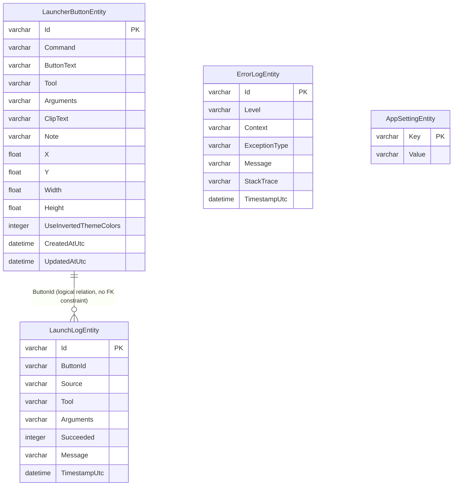

# Database Schema

## Scope
This document defines the SQLite table design used by Praxis.

Authoritative implementation points:
- [`Praxis/Services/SqliteAppRepository.cs`](../Praxis/Services/SqliteAppRepository.cs)
- [`Praxis/Models/LauncherButtonEntity.cs`](../Praxis/Models/LauncherButtonEntity.cs)
- [`Praxis/Models/LaunchLogEntity.cs`](../Praxis/Models/LaunchLogEntity.cs)
- [`Praxis/Models/ErrorLogEntity.cs`](../Praxis/Models/ErrorLogEntity.cs)
- [`Praxis/Models/AppSettingEntity.cs`](../Praxis/Models/AppSettingEntity.cs)

## Database File Location
- Logical path source: [`Praxis/Services/AppStoragePaths.cs`](../Praxis/Services/AppStoragePaths.cs)
- Current file name: `praxis.db3`
- Current resolved locations:
  - Windows: `%USERPROFILE%/AppData/Local/Praxis/praxis.db3`
  - macOS (Mac Catalyst): `~/Library/Application Support/Praxis/praxis.db3`

Notes:
- `SqliteAppRepository.InitializeAsync` manages schema version by `PRAGMA user_version`.
- Startup applies each pending migration step in order (`current + 1 .. CurrentVersion`) and bumps `user_version` after each step completes.
- Current schema version: `4`
- Version `1` migration creates the initial three tables with `CreateTableAsync<T>()`.
- Version `2` migration adds `UseInvertedThemeColors` column to `LauncherButtonEntity` (safe on already-updated/newly-created tables).
- Version `3` migration creates `ErrorLogEntity` table for application error logging.
- Version `4` migration adds `Level` column to `ErrorLogEntity` (`TEXT NOT NULL DEFAULT 'Error'`).
- Automatic startup migration examples:
  - `user_version=0` -> apply `v1`, then `v2`, then `v3`, then `v4`
  - `user_version=1` -> apply `v2`, then `v3`, then `v4`
  - `user_version=2` -> apply `v3`, then `v4`
  - `user_version=3` -> apply `v4`
  - `user_version=4` -> no migration
- `DateTime` columns are mapped by `sqlite-net-pcl` with provider default settings used by `SQLiteAsyncConnection(dbPath)`.
- `buttons.sync` is stored separately for multi-window signaling:
  - Windows: `%USERPROFILE%/AppData/Local/Praxis/buttons.sync`
  - macOS (Mac Catalyst): `~/Library/Application Support/Praxis/buttons.sync`
- `crash.log` is stored in the same directory for crash-safe file-based logging (see [Crash Log File](#crash-log-file) section below).

## Table List
- `LauncherButtonEntity`
- `LaunchLogEntity`
- `ErrorLogEntity`
- `AppSettingEntity`

## ER Diagram (Mermaid)

```mermaid
erDiagram
    LauncherButtonEntity {
        varchar Id PK
        varchar Command
        varchar ButtonText
        varchar Tool
        varchar Arguments
        varchar ClipText
        varchar Note
        float X
        float Y
        float Width
        float Height
        integer UseInvertedThemeColors
        datetime CreatedAtUtc
        datetime UpdatedAtUtc
    }

    LaunchLogEntity {
        varchar Id PK
        varchar ButtonId
        varchar Source
        varchar Tool
        varchar Arguments
        integer Succeeded
        varchar Message
        datetime TimestampUtc
    }

    ErrorLogEntity {
        varchar Id PK
        varchar Level
        varchar Context
        varchar ExceptionType
        varchar Message
        varchar StackTrace
        datetime TimestampUtc
    }

    AppSettingEntity {
        varchar Key PK
        varchar Value
    }

    LauncherButtonEntity ||--o{ LaunchLogEntity : "ButtonId (logical relation, no FK constraint)"
```

## Table: LauncherButtonEntity
Purpose: launcher button master records (placement, command, metadata).

| Column | SQLite type | Null | PK | Description |
|---|---|---|---|---|
| `Id` | `varchar` | No | Yes | GUID string (`LauncherButtonRecord.Id`) |
| `Command` | `varchar` | Yes | No | Command match key for launcher execution |
| `ButtonText` | `varchar` | Yes | No | Label shown on launcher button |
| `Tool` | `varchar` | Yes | No | Executable target |
| `Arguments` | `varchar` | Yes | No | Arguments / fallback launch target |
| `ClipText` | `varchar` | Yes | No | Clip word text shown in editor |
| `Note` | `varchar` | Yes | No | Free-form note text |
| `X` | `float` | Yes | No | Canvas X position |
| `Y` | `float` | Yes | No | Canvas Y position |
| `Width` | `float` | Yes | No | Button width |
| `Height` | `float` | Yes | No | Button height |
| `UseInvertedThemeColors` | `integer` | Yes | No | Per-button theme inversion flag (`0`=normal, `1`=inverted) |
| `CreatedAtUtc` | `datetime` | Yes | No | Created timestamp (UTC) |
| `UpdatedAtUtc` | `datetime` | Yes | No | Last updated timestamp (UTC) |

Application-level behavior:
- `UpdatedAtUtc` is overwritten on save (`UpsertButtonAsync`) for optimistic conflict checks.
- Conflict resolution uses `UpdatedAtUtc` as the primary version signal, but treats rows as non-conflicting when only timestamp differs and all content fields match.
- `Command` lookup optimization is handled by in-memory case-insensitive cache, not DB index.

## Table: LaunchLogEntity
Purpose: execution history logs.

| Column | SQLite type | Null | PK | Description |
|---|---|---|---|---|
| `Id` | `varchar` | No | Yes | GUID string (`LaunchLogEntry.Id`) |
| `ButtonId` | `varchar` | Yes | No | Related launcher button id (optional) |
| `Source` | `varchar` | Yes | No | Trigger source (current implementation: `button` / `command`) |
| `Tool` | `varchar` | Yes | No | Executed tool |
| `Arguments` | `varchar` | Yes | No | Executed arguments |
| `Succeeded` | `integer` | Yes | No | Success flag (bool mapped to integer) |
| `Message` | `varchar` | Yes | No | Execution message / error text |
| `TimestampUtc` | `datetime` | Yes | No | Execution timestamp (UTC) |

Application-level behavior:
- Retention cleanup is executed by:
  - `DELETE FROM LaunchLogEntity WHERE TimestampUtc < threshold`

## Table: ErrorLogEntity
Purpose: application error logs (exception, warning, and info logging).

| Column | SQLite type | Null | PK | Description |
|---|---|---|---|---|
| `Id` | `varchar` | No | Yes | GUID string (`ErrorLogEntry.Id`) |
| `Level` | `varchar` | No | No | Severity level (`Error` / `Warning` / `Info`) |
| `Context` | `varchar` | Yes | No | Code context where the entry was logged (e.g. method name) |
| `ExceptionType` | `varchar` | Yes | No | Full exception type chain (e.g. `InvalidOperationException -> NullReferenceException`; empty for Info/Warning entries) |
| `Message` | `varchar` | Yes | No | Exception message chain or info/warning message |
| `StackTrace` | `varchar` | Yes | No | Full exception output via `Exception.ToString()` (empty for Info/Warning entries) |
| `TimestampUtc` | `datetime` | Yes | No | Timestamp when the entry was logged (UTC) |

Application-level behavior:
- Error entries written by `DbErrorLogger` via `IErrorLogger.Log(exception, context)`. Exception type chains, concatenated inner messages, and full stack traces (including inner exceptions) are captured.
- Warning entries written by `DbErrorLogger` via `IErrorLogger.LogWarning(message, context)`.
- Info entries written by `DbErrorLogger` via `IErrorLogger.LogInfo(message, context)`.
- All log calls first write synchronously to a file-based crash log (`CrashFileLogger` → `crash.log`) for crash-safe persistence, then enqueue for async DB write.
- Retention cleanup: `DELETE FROM ErrorLogEntity WHERE TimestampUtc < threshold` (30-day retention; cleanup is triggered only when Error entries are written, and deletes all rows older than the threshold regardless of Level).
- DB write failures are silently suppressed (the crash file already has the record).

## Crash Log File
Purpose: synchronous file-based fallback for crash-safe logging (not stored in SQLite).

- File name: `crash.log`
- Resolved locations:
  - Windows: `%LOCALAPPDATA%\Praxis\crash.log`
  - macOS (Mac Catalyst): `~/Library/Application Support/Praxis/crash.log`
- Written synchronously by `CrashFileLogger` on every `IErrorLogger` call (Error/Warning/Info levels).
- Automatic rotation at 512 KB (`crash.log` → `crash.log.old`).
- Contains timestamped entries with full exception chains, stack traces, and `Exception.Data` dictionaries.
- Intended as a diagnostic fallback when the SQLite database is unavailable or the process terminates before async DB writes complete.

## Table: AppSettingEntity
Purpose: key-value app settings.

| Column | SQLite type | Null | PK | Description |
|---|---|---|---|---|
| `Key` | `varchar` | No | Yes | Setting key |
| `Value` | `varchar` | Yes | No | Setting value |

Known keys used by current code:
- `theme`
  - Values: `Light` / `Dark` / `System` (parsed to `ThemeMode`)
- `dock_order`
  - Comma-separated GUID list for dock ordering

## Constraints, Indexes, Relations
- Primary keys only (SQLite auto-index for PK).
- No explicit foreign key constraint between `LaunchLogEntity.ButtonId` and `LauncherButtonEntity.Id`.
- No additional secondary indexes currently.

## Compatibility Notes
- Old database files may contain legacy tables (for example `LauncherItems`).
- Current repository code reads/writes only the four tables listed above.

---

# データベース設計（日本語）

## 目的
Praxis が使う SQLite テーブル設計を明文化します。

実装上の正本:
- [`Praxis/Services/SqliteAppRepository.cs`](../Praxis/Services/SqliteAppRepository.cs)
- [`Praxis/Models/LauncherButtonEntity.cs`](../Praxis/Models/LauncherButtonEntity.cs)
- [`Praxis/Models/LaunchLogEntity.cs`](../Praxis/Models/LaunchLogEntity.cs)
- [`Praxis/Models/ErrorLogEntity.cs`](../Praxis/Models/ErrorLogEntity.cs)
- [`Praxis/Models/AppSettingEntity.cs`](../Praxis/Models/AppSettingEntity.cs)

## DB ファイル
- パス定義: [`Praxis/Services/AppStoragePaths.cs`](../Praxis/Services/AppStoragePaths.cs)
- ファイル名: `praxis.db3`
- 現在の実解決先:
  - Windows: `%USERPROFILE%/AppData/Local/Praxis/praxis.db3`
  - macOS（Mac Catalyst）: `~/Library/Application Support/Praxis/praxis.db3`

補足:
- `InitializeAsync` は `PRAGMA user_version` でスキーマバージョンを管理します。
- 起動時に未適用バージョン（`current + 1 .. CurrentVersion`）を順次適用し、各ステップ完了後に `user_version` を更新します。
- 現在のスキーマバージョン: `4`
- バージョン `1` のマイグレーションで初期 3 テーブルを `CreateTableAsync<T>()` で作成します。
- バージョン `2` のマイグレーションで `LauncherButtonEntity` に `UseInvertedThemeColors` 列を追加します（既存/新規DBのどちらでも安全に適用）。
- バージョン `3` のマイグレーションでアプリエラーログ用の `ErrorLogEntity` テーブルを作成します。
- バージョン `4` のマイグレーションで `ErrorLogEntity` に `Level` 列（`TEXT NOT NULL DEFAULT 'Error'`）を追加します。
- 起動時の自動移行例:
  - `user_version=0` -> `v1`、`v2`、`v3`、`v4` を順に適用
  - `user_version=1` -> `v2`、`v3`、`v4` を順に適用
  - `user_version=2` -> `v3`、`v4` を順に適用
  - `user_version=3` -> `v4` のみ適用
  - `user_version=4` -> 移行なし
- `DateTime` 列は `SQLiteAsyncConnection(dbPath)` の既定設定に従って `sqlite-net-pcl` 側でマップされます。
- `buttons.sync` は複数ウィンドウ通知用の別ファイルとして保存します。
  - Windows: `%USERPROFILE%/AppData/Local/Praxis/buttons.sync`
  - macOS（Mac Catalyst）: `~/Library/Application Support/Praxis/buttons.sync`

## テーブル一覧
- `LauncherButtonEntity`: ボタン定義のマスタ
- `LaunchLogEntity`: 実行ログ
- `ErrorLogEntity`: アプリエラーログ（例外記録）
- `AppSettingEntity`: アプリ設定（Key-Value）

## ER 図（Mermaid）
- 上記 ER 図（`ER Diagram (Mermaid)`）を参照。

## 主要仕様
- `LauncherButtonEntity.UpdatedAtUtc` は保存時に更新し、編集競合判定の一次シグナルとして使います。
- `UpdatedAtUtc` だけが異なり内容が一致する場合は非競合として扱います。
- `LaunchLogEntity.Source` の現行値は `button` / `command` です。
- `LaunchLogEntity` は保持期間超過分を `TimestampUtc` 条件で一括削除します。
- `ErrorLogEntity` は `IErrorLogger.Log(exception, context)`（Error）、`IErrorLogger.LogWarning(message, context)`（Warning）、および `IErrorLogger.LogInfo(message, context)`（Info）経由で `DbErrorLogger` が書き込みます。全ログ呼び出しはまず `CrashFileLogger` でファイルに同期書き込みし、その後 DB への非同期書き込みをキューイングします。保持期間クリーンアップは Error エントリ書き込み時にのみ発動し、Level を問わず閾値より古い全行を削除します（30 日保持）。DB 書き込み失敗はクラッシュファイルに記録済みのため握り潰します。
- `crash.log` はクラッシュ安全ロギング用の同期ファイルベースフォールバックです（SQLite 外）:
  - Windows: `%LOCALAPPDATA%\Praxis\crash.log`
  - macOS（Mac Catalyst）: `~/Library/Application Support/Praxis/crash.log`
  - 512 KB で自動ローテーション（`crash.log` → `crash.log.old`）
  - SQLite が利用不可、または非同期 DB 書き込み完了前にプロセスが終了した場合の診断用フォールバックです。
- `AppSettingEntity` の既知キー:
  - `theme`（`Light` / `Dark` / `System`）
  - `dock_order`（GUID の CSV）

## 制約と関連
- 明示制約は主キー中心（追加インデックスなし）。
- `LaunchLogEntity.ButtonId` は論理的にはボタンID参照ですが、DB上の外部キー制約はありません。

## 互換性メモ
- 既存環境には旧テーブル（例: `LauncherItems`）が残る場合があります。
- 現行コードがアクセスするのは本ドキュメント記載の 4 テーブルのみです。
