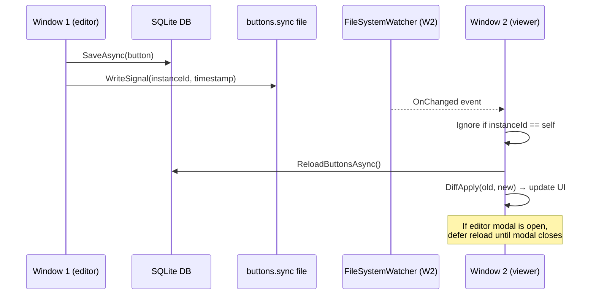
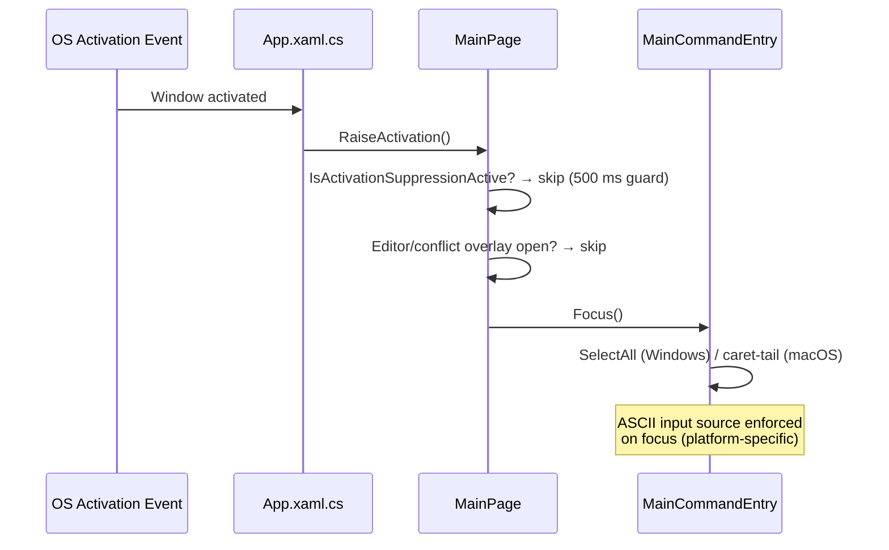
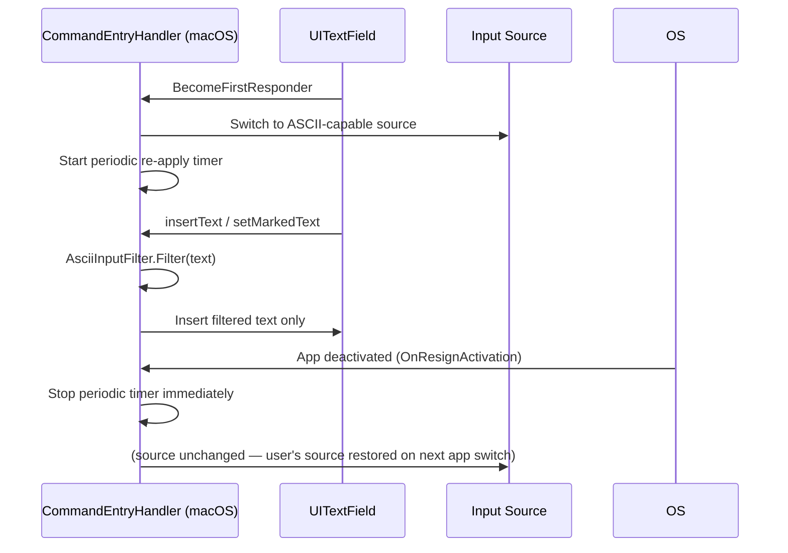
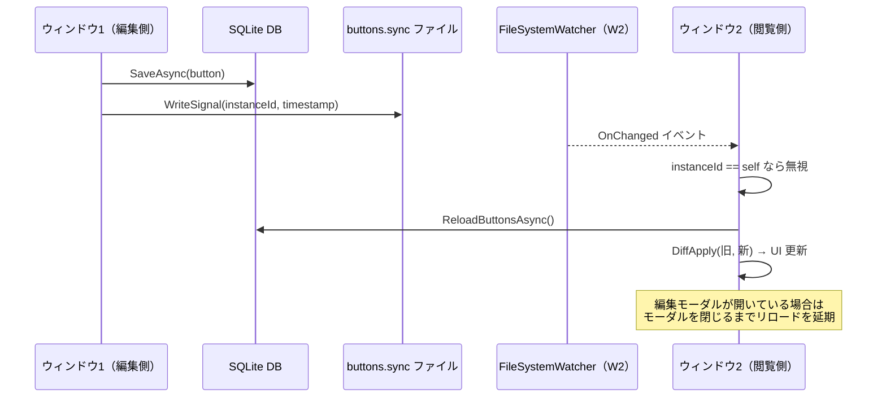
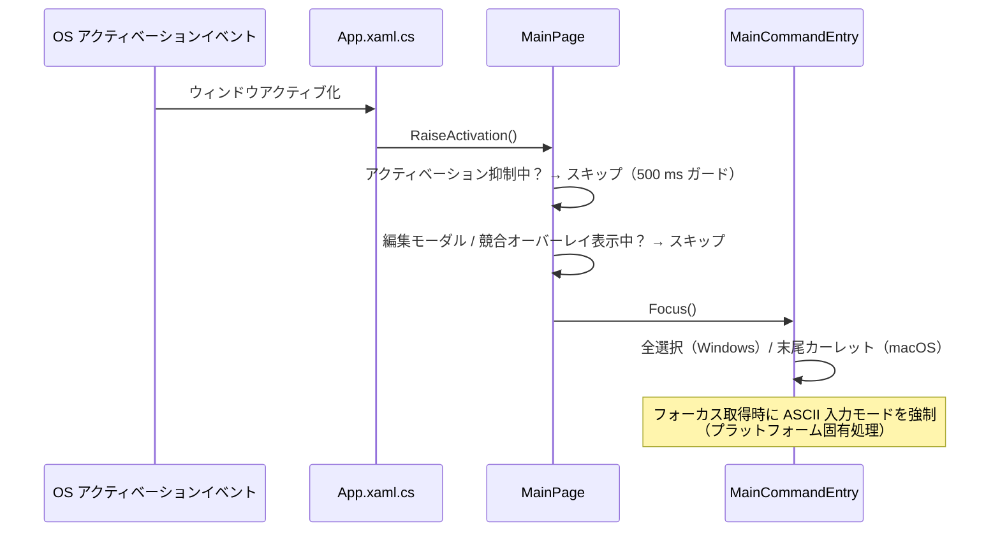
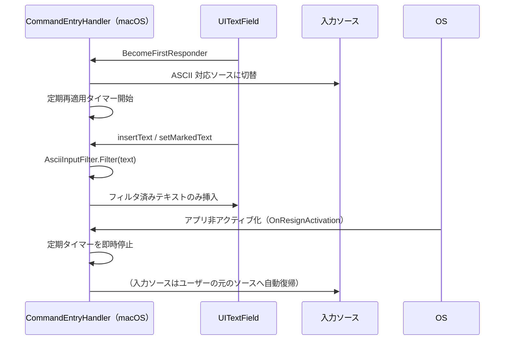

# Developer Guide

## Scope
This document is for developers working on Praxis.
README is user-facing summary; this guide is the implementation-level source of truth.
Test-specific operation and coverage inventory are documented in `docs/TESTING_GUIDE.md`.

## Tech Stack
- UI/App: .NET MAUI (`Praxis`)
- Core logic: .NET class library (`Praxis.Core`)
- Tests: xUnit (`Praxis.Tests`)
  - Includes linked-source workflow integration tests for `MainViewModel` with lightweight MAUI test stubs.
- Persistence: SQLite (`sqlite-net-pcl`)
- MVVM tooling: `CommunityToolkit.Mvvm`

## Target Platforms
- See `../README.md` (`Supported Platforms` section).

## Environment Setup
- For .NET SDK / MAUI workload / package-restore setup, see `../README.md` (`Environment Setup (Prerequisites)` section).

## Architecture Rules
- MVVM-centered architecture in app layer
- UI orchestration (focus, keyboard routing, platform-specific event handling) may live in code-behind/handlers
- Keep business logic and reusable policies in `Praxis.Core` when possible
- UI services (clipboard/theme/process) stay in `Praxis/Services`

## Main Components
- `App.xaml.cs`
  - Resolves `IErrorLogger` from DI on construction and stores it as a static field for use in static `Raise*` helpers
  - Registers `AppDomain.CurrentDomain.UnhandledException` and `TaskScheduler.UnobservedTaskException` global handlers that forward to `IErrorLogger`
  - All static event-dispatch helpers (`RaiseThemeShortcut`, `RaiseEditorShortcut`, `RaiseCommandInputShortcut`, `RaiseHistoryShortcut`, `RaiseMiddleMouseClick`, `RaiseMacApplicationDeactivating`, `RaiseMacApplicationActivated`) log caught exceptions via `IErrorLogger` instead of silently discarding them
- `MainPage` partial classes
  - `MainPage.xaml.cs`: lifecycle/event wiring and startup orchestration; calls `viewModel.NotifyWindowDisappearing()` in `OnDisappearing` to log window close
  - `MainPage.Fields.Core.cs`: shared lifecycle/orchestration fields
  - `MainPage.Fields.OverlayAndEditor.cs`: editor/overlay/quick-look field groups
  - `MainPage.Fields.ConflictDialog.cs`: conflict-dialog field enum grouping
  - `MainPage.Fields.Windows.cs`: Windows-only native field groups
  - `MainPage.Fields.MacCatalyst.cs`: Mac Catalyst-only native field groups
  - `MainPage.InteractionState.cs`: pointer/selection state fields
  - `MainPage.PointerAndSelection.cs`: drag/drop, selection rectangle, pointer button detection
  - `MainPage.FocusAndContext.cs`: context/conflict focus visuals and tab-policy handling
  - `MainPage.EditorAndInput.cs`: modal editor, status flash, dock/quick-look, Windows key hooks
  - `MainPage.ShortcutsAndConflict.cs`: shortcut routing, conflict dialog flow, command suggestion placement
  - `MainPage.MacCatalystBehavior.cs`: Mac Catalyst modal focus, key commands, observers/polling
  - `MainPage.LayoutUtilities.cs`: shared coordinate helpers and Windows tab-stop reflection
- `ViewModels/MainViewModel.cs` + partial classes
  - `MainViewModel.cs`: shared state, observable properties, initialization, external sync; exposes `NotifyWindowDisappearing()` for `MainPage` to call on page lifecycle close
  - `MainViewModel.Actions.cs`: create/edit/delete/drag/theme/dock command handlers; logs key user actions via `IErrorLogger.LogInfo` (button/command execution, editor open/cancel/save/delete, theme change, undo/redo, conflict resolution)
  - `MainViewModel.CommandSuggestions.cs`: suggestion list lifecycle, viewport diffing, command-match execution; logs command-not-found events
  - Overall behavior orchestrates command execution, filtering, edit modal, drag/save, dock, and theme apply
  - Persists dock order through repository when dock contents change
  - Handles cross-window sync reload with diff-apply when external button/dock changes are notified
  - Applies cross-window theme sync by reloading persisted theme on external notifications
  - Refreshes command suggestions on external sync when command input is active
  - Defers sync reload while editor modal is open and applies it after close
  - On editor save, first checks `UpdatedAtUtc`, then treats timestamp-only drift as non-conflict when latest DB row content matches local pre-edit snapshot; material mismatch resolves by `Reload latest` / `Overwrite mine` / `Cancel`
  - Maintains command-pattern action history for button mutations (`move` / `edit` / `delete`) and applies Undo/Redo with optimistic version checks against latest DB rows
- `Services/SqliteAppRepository.cs`
  - Tables: button definitions, launch logs, error logs, app settings
  - Detailed table schema: `docs/DATABASE_SCHEMA.md`
  - Tracks SQLite schema version with `PRAGMA user_version` and applies upgrades step-by-step (`current + 1 .. CurrentVersion`)
  - Updates `user_version` only after each migration step succeeds
  - Startup auto-migrates older DB layouts to the current layout (no manual migration step required for users)
  - Uses `SemaphoreSlim` gate on all public operations (DB + cache) to avoid async read/write races
  - Includes in-memory button cache and case-insensitive command cache
  - Provides `ReloadButtonsAsync` for cross-window sync paths to force-refresh cache from SQLite
  - Provides `GetByIdAsync(id, forceReload: true)` for save-time conflict checks against latest persisted row
  - Uses explicit initialized-connection guard (`InvalidOperationException`) instead of null-forgiving access
  - Purges old launch logs and error logs with one SQL `DELETE ... WHERE TimestampUtc < threshold`
  - Stores dock order in `AppSettingEntity` key `dock_order` (comma-separated GUID list)
- `Services/IErrorLogger.cs` / `Services/DbErrorLogger.cs`
  - `IErrorLogger` exposes `void Log(Exception exception, string context)` for exceptions and `void LogInfo(string message, string context)` for informational events
  - `DbErrorLogger` writes `ErrorLogEntry` records to SQLite via `IAppRepository`; error entries trigger a 30-day retention purge after each write
  - Write is fire-and-forget (async, non-blocking); write failures are silently suppressed to avoid infinite error loops
  - Registered as singleton in DI (`MauiProgram.cs`)
  - `App` stores a static reference to `IErrorLogger` set from the constructor so static `Raise*` event helpers can log exceptions
- `Services/CommandExecutor.cs`
  - Launches tool + arguments with shell execution
  - Validates process-start results (`Process.Start` null case) and returns contextual failure messages
  - If `tool` is empty, falls back to `Arguments` target resolution:
    - `http/https` => default browser
    - file path => default associated app (for example `.pdf`)
    - directory path => file manager (`Explorer`/`Finder`)
    - on Windows UNC paths (`\\\\server\\share...`), bypasses pre-check and opens via `explorer.exe` to allow auth prompt first
- `Services/FileStateSyncNotifier.cs`
  - Uses a local signal file (`buttons.sync`) and `FileSystemWatcher` for multi-window notifications
  - Payload includes instance id and timestamp; self-origin events are ignored
- `Services/AppStoragePaths.cs`
  - Centralizes shared local-storage constants/paths (DB, sync signal)
  - DB path policy:
    - Windows: `%USERPROFILE%/AppData/Local/Praxis/praxis.db3`
    - macOS (Mac Catalyst): `~/Library/Application Support/Praxis/praxis.db3`
  - Sync signal path policy:
    - Windows: `%USERPROFILE%/AppData/Local/Praxis/buttons.sync`
    - macOS (Mac Catalyst): `~/Library/Application Support/Praxis/buttons.sync`
  - On startup, prepares target directories and migrates DB only from safe legacy locations (skips `Documents` paths on macOS to avoid permission prompts)
- `Controls/CommandEntry.cs` / `Platforms/MacCatalyst/Handlers/CommandEntryHandler.cs`
  - `Command`/`Search` initialize with `Keyboard.Plain` to prevent platform auto-capitalization side effects
  - Top-bar `MainCommandEntry` and modal `ModalCommandEntry` both use `CommandEntry`; modal disables command-navigation shortcuts and activation-time native refocus while keeping ASCII enforcement enabled
  - macOS command input uses a dedicated handler so `Up/Down` suggestion navigation is handled at native `UITextField` level for main command input, and enforces ASCII input with filtering via `AsciiInputFilter` + focused-state periodic re-apply (detached immediately on key-window/app deactivation)
- Windows command input uses a dedicated handler that applies native `InputScopeNameValue.AlphanumericHalfWidth` on focus, then nudges IME open/conversion state toward ASCII via `imm32` with an immediate attempt plus one short delayed retry per focus acquisition. Global focused-state periodic re-apply and `TextChanging` rewrite remain disabled to protect text Undo/Redo granularity, but modal edit `Command` opts into focused-state ASCII reassertion to prevent manual IME-mode switching while focused. If native `InputScope` assignment throws `ArgumentException (E_RUNTIME_SETVALUE)` on some environments, the handler flips a one-way unsupported flag, skips later `InputScope` writes, and continues with the IME fallback path.
- `Praxis.Core/Logic/*.cs`
  - Search matcher, command line builder, grid snap, log retention, launch target resolver, button layout defaults, record version comparer, ASCII input filter
  - `UiTimingPolicy` centralizes UI delay constants shared by app code (focus restore, mac activation windows, polling intervals)

## Architecture Flows

### Cross-Window Sync Flow

When a user saves a button change in one window, other open windows automatically reload and apply the diff.

### Focus Management Flow (Activation)

When the app window becomes active, focus is routed to the command input and the text is selected for immediate overwrite.

### Focus Management Flow (macOS ASCII Enforcement)

macOS enforces an ASCII-capable input source only while `CommandEntry` is first responder in the active key window.

---

## Development Workflow
1. Complete environment setup from `../README.md` before first build/test on a new machine.
2. Implement/modify pure logic in `Praxis.Core` first.
3. Add/adjust unit tests in `Praxis.Tests`.
4. Wire app behavior in `Praxis` ViewModel/Services and UI orchestration points (`MainPage.*.cs`, platform handlers) as needed.
5. Verify with:
   - `dotnet test Praxis.slnx`

## CI/CD (GitHub Actions)
- `ci.yml`
  - Push/PR on `main`/`master`
  - Executes:
    - `dotnet test Praxis.Tests/Praxis.Tests.csproj -c Release --no-restore -v minimal --collect:"XPlat Code Coverage" --results-directory ./TestResults`
    - Uploads `TestResults/**/coverage.cobertura.xml` as artifact (`praxis-test-coverage-cobertura`)
    - Windows app build (`net10.0-windows10.0.19041.0`)
    - Mac Catalyst app build (`net10.0-maccatalyst`)
- `delivery.yml`
  - Manual run or `v*` tag push
  - Publishes Windows/Mac Catalyst outputs and uploads them as workflow artifacts

## Coding Conventions
- Prefer nullable-safe code and explicit guards
- Keep methods small; isolate side effects
- Preserve ASCII unless file already requires Unicode
- Use descriptive names for commands and services

## Adding New Features
- Add domain types or logic in `Praxis.Core` if testable without MAUI
- Add interfaces in `Praxis/Services` for platform-bound concerns
- Inject dependencies through DI in `MauiProgram.cs`
- Add tests for any new non-UI logic

## Current UI Notes
- Main modal copy buttons trigger a center overlay notification animation in `MainPage.xaml(.cs)`.
- Top-bar create action uses a custom line-art logo (outer hexagon, inscribed circle, inner hexagon, center plus) built from MAUI shapes.
- Modal footer action buttons (`Cancel`/`Save`) are centered and use equal width for visual balance.
- Dock item visuals are intentionally matched to placement-area button visuals.
- Placement-area and Dock buttons support per-button inverted theme colors (`UseInvertedThemeColors`):
  - In Light theme: render with Dark-theme button colors
  - In Dark theme: render with Light-theme button colors
  - Configured from editor modal checkbox (`Invert Theme`)
  - In editor modal, the checkbox indicator is rendered as a flat square on both Windows and Mac (native checkbox visuals hidden) to keep monochrome two-tone styling
  - Both the checkbox indicator and its label ("Use opposite theme colors for this button") are tappable — each carries a `TapGestureRecognizer` bound to the same handler (`ModalInvertThemeToggle_Tapped`)
  - Border color and empty-state background are matched to modal text-field palette (Light `#CECECE/#FFFFFF`, Dark `#4E4E4E/#2A2A2A`)
  - Border is rendered by four equal-thickness lines (`1`) to keep edge weight consistent
  - Checkmark is drawn by a `Polyline` (`StrokeThickness=2`) with a slightly sharper angle
- Placement-area/Dock button label text uses a dedicated style (`PlacementButtonTextLabelStyle`) and is set to `12` across all platforms.
- Dock horizontal scrollbar defaults to hidden and is shown only while the pointer is hovering the Dock region and horizontal overflow exists.
  - For macOS stability, Dock applies a bottom mask (`DockScrollBarMask`) while not hovered so the indicator stays visually hidden even when native indicator timing is inconsistent.
- Middle click edit is implemented via `Behaviors/MiddleClickBehavior.cs` plus macOS fallbacks in `MainPage.PointerAndSelection.cs` (pointer detection) and `MainPage.MacCatalystBehavior.cs` (polling).
  - **Mac click-through quirk**: macOS delivers non-primary mouse clicks to whichever window is under the cursor regardless of focus. The polling timer uses `CGEventSource.GetButtonState` (global HID state), so it can fire for middle-clicks in other apps. `lastPointerOnRoot` is cleared to `null` in `OnMacApplicationDeactivating` (triggered by `OnResignActivation`) so stale cursor positions from a previous focus session cannot trigger the editor when the app is inactive. Additional guards: `IsMacApplicationActive()` (explicit volatile bool set by `OnResignActivation`/`OnActivated`), `IsActivationSuppressionActive()` (500 ms after re-activation), and a ViewModel-level `IsMacApplicationActive()` check in `OpenEditor`.
- Tab focus policy is applied in `MainPage.FocusAndContext.cs` (`ApplyTabPolicy`) by toggling native `IsTabStop`.
- Selection rectangle is rendered as `SelectionRect` in `MainPage.xaml` with gray stroke/fill.
- Selection toggle modifier handling is centralized in `MainPage.PointerAndSelection.cs`:
  - Windows: `Ctrl+Click`
  - macOS (Mac Catalyst): `Command+Click`
  - Implemented via reflection-based modifier detection (`IsSelectionModifierPressed`) to avoid Windows regressions.
- Theme switching buttons are intentionally removed from the UI.
- Theme mode is persisted via repository settings and restored on startup.
- Global shortcuts in `MainPage.ShortcutsAndConflict.cs`:
  - `Ctrl+Shift+L` => Light
  - `Ctrl+Shift+D` => Dark
  - `Ctrl+Shift+H` => System
  - `Ctrl+Z` => Undo latest button mutation
  - `Ctrl+Y` => Redo latest undone mutation
  - Windows keeps shortcuts active in non-modal states by combining page-level key handlers, text-input key hooks, and root window key hook
  - In `Command`/`Search` text boxes, `Ctrl+Z`/`Ctrl+Y` first use native text Undo/Redo; once text history is exhausted, shortcut handling falls back to button-mutation Undo/Redo.
- Global shortcuts on macOS are wired in `Platforms/MacCatalyst/AppDelegate.cs`:
  - `Command+Shift+L` => Light
  - `Command+Shift+D` => Dark
  - `Command+Shift+H` => System
  - `Command+Z` => Undo latest button mutation
  - `Command+Shift+Z` => Redo latest undone mutation
  - App-level key commands keep theme switching active regardless of modal/context-menu state
- Status bar is a rounded `Border` (`StatusBarBorder`) and flashes color briefly on `StatusText` change:
  - normal: green
  - error (`Failed`/`error`/`exception`/`not found`): red
  - after flash/theme switch, local background override is cleared so AppThemeBinding is restored
- On macOS, when Enter execution in command input ends with `Command not found: ...`, focus is restored to command input for immediate retry typing.
- Command input suggestion UX:
  - `MainViewModel` builds `CommandSuggestions` from partial match on `LauncherButtonItemViewModel.Command`
  - Suggestion refresh is debounced (`~400ms`) to reduce rapid recomputation during typing
  - Candidate row displays `Command`, `ButtonText`, `Tool Arguments` in `1:1:4` width ratio
  - Suggestion row selected-background color is resolved by `CommandSuggestionRowColorPolicy` and applied with theme-aware binding, so visible suggestions repaint immediately on Light/Dark/System switches
  - Suggestion popup opens with no selected row; first `Down` selects the first candidate, then `Up/Down` wraps at list edges and `Enter` executes the selected suggestion
  - Suggestion click (primary) fills `CommandInput` and executes immediately.
  - Middle-click on a suggestion row closes the popup and opens the editor modal for that button (same as middle-clicking the button in the placement area). On macOS, the polling-based path (`HandleMacMiddleClick` / `TryGetSuggestionItemAtRootPoint`) also handles this via the global timer when `PointerGestureRecognizer` does not fire reliably.
  - Right-click on a suggestion row closes the popup and opens the context menu (Edit / Delete) for that button (same as right-clicking the button in the placement area). Implemented via `TapGestureRecognizer { Buttons = ButtonsMask.Secondary }` plus `PointerGestureRecognizer` secondary-button detection in `RebuildCommandSuggestionStack`.
  - Plain Enter execution from command box runs all exact command matches (trim-aware, case-insensitive)
  - When window activation is detected and editor/conflict overlays are closed, `MainCommandEntry` is refocused and text is selected for immediate overwrite input (Windows/macOS)
  - On macOS, `MainSearchEntry` uses `SearchFocusGuardPolicy`: non-user-initiated search focus is rejected so activation-time command focus is preserved
  - `MainCommandEntry` / `MainSearchEntry` use `Keyboard.Plain` to prevent lowercase input from being auto-capitalized by platform defaults.
  - macOS command input (`MainCommandEntry` + modal `ModalCommandEntry`) enforces ASCII-capable input source only while the field is first responder in the active key window/app, and blocks/strips non-ASCII input paths (`setMarkedText`, `insertText`, editing-changed safety net), backed by `AsciiInputFilter` and `MacCommandInputSourcePolicy`; focused-state periodic re-apply is enabled, and it is detached immediately on key-window/app deactivation.
  - On macOS, `ModalCommandEntry` disables command suggestion navigation and activation-time native refocus, so modal command IME control does not change top-bar focus behavior.
  - Windows command input (`MainCommandEntry` + modal `ModalCommandEntry`) applies native `InputScopeNameValue.AlphanumericHalfWidth` on focus and nudges IME open/conversion state toward ASCII via `imm32` immediately plus one short delayed retry per focus acquisition. Focused-state periodic re-apply and `TextChanging` rewrite are disabled by default to avoid degrading text Undo/Redo granularity, while modal `ModalCommandEntry` enables focused-state ASCII reassertion so IME cannot be switched away from alphanumeric mode during modal editing.
  - `Command`/`Search` use an in-field circular clear button (`x`) shown only while text is non-empty; right text inset is increased to prevent overlap with the button.
  - Clear-button tap clears the target input and immediately refocuses the same input so caret/editing state stays active.
  - Windows clear-button glyph alignment uses `ClearButtonGlyphAlignmentPolicy` (`-0.5` translation on both axes) so the `x` intersection stays centered in the circle.
  - Windows clear-button focus restore uses `ClearButtonRefocusPolicy` (immediate + short delayed retry) and native `TextBox.Focus(Programmatic)` + caret-tail placement to avoid pointer-tap timing blur.
  - Clear button hover sets hand cursor on Windows/macOS. Windows applies `ProtectedCursor` via reflection (`NonPublicPropertySetter`) to avoid access-level differences across SDKs; macOS uses `NSCursor.pointingHandCursor`.
  - Opening context menu from right click closes suggestions and moves focus target to `Edit` (on macOS, command-input first responder is also resigned)
  - Windows arrow key handling is attached in `MainPage.EditorAndInput.cs` (`MainCommandEntry_HandlerChanged` / native `KeyDown`)
  - macOS arrow key handling is attached in `Controls/CommandEntry` + `Platforms/MacCatalyst/Handlers/CommandEntryHandler.cs` (`PressesBegan`)
  - macOS `Tab`/`Shift+Tab`/`Escape`/`Command+S`/`Enter`/arrow keyboard shortcuts for context menu, editor modal, and conflict dialog are dispatched via `App.RaiseEditorShortcut(...)` from:
    - `CommandEntryHandler` (command input)
    - `MacEntryHandler` (`Entry` fields such as `GUID` / `Command` / `Arguments`)
    - `MacEditorHandler` (`Clip Word` / `Note` editors via `TabNavigatingEditor`)
  - macOS `Entry` visual/focus behavior is handled by `Platforms/MacCatalyst/Handlers/MacEntryHandler.cs`:
    - suppresses default blue focus ring
    - uses bottom-edge emphasis that respects corner radius
    - sets caret color by theme (Light=black, Dark=white)
    - in `System` mode, dark/light resolution prefers native `TraitCollection`; theme switches trigger visual-state refresh
  - macOS theme application (`MauiThemeService`) synchronizes `UIWindow.OverrideUserInterfaceStyle` for all open windows (`Light` / `Dark` / `Unspecified`)
- macOS editor modal keyboard behavior:
  - `Tab` / `Shift+Tab` traversal is confined to modal controls and wraps at edges.
  - `Shift+Tab` from `GUID` is intercepted by `MacEntryHandler` and kept inside the modal focus ring (does not move focus to main-page inputs).
  - In `Clip Word` / `Note`, `Tab` / `Shift+Tab` moves focus next/previous (no literal tab insertion).
  - `Esc` in any modal field (including `Clip Word` / `Note`) dispatches cancel immediately instead of only resigning first responder.
  - `Command+S` in any modal field (including `Clip Word` / `Note`) dispatches save.
  - If a tab character is injected by platform input path, fallback sanitization removes it and resolves focus direction via `EditorTabInsertionResolver`.
  - `MacEditorHandler.MacEditorTextView.KeyCommands` override returns non-null to match UIKit nullable contract and avoid CS8764 warnings.
  - `GUID` is selectable but not editable.
  - On editor-open focus, `Command` places caret at tail and avoids select-all.
  - When pseudo-focus is on `Cancel` / `Save`, `Enter` executes the focused action.
- macOS context menu keyboard behavior:
  - `Up` / `Down` cycles between `Edit` and `Delete`.
  - `Tab` / `Shift+Tab` cycles between `Edit` and `Delete`.
  - `Enter` executes the focused context action (`Edit` / `Delete`).
- Mac Catalyst AppDelegate selector safety:
  - Do not export UIKit standard action selectors (`save:`, `cancel:`, `dismiss:`, `cancelOperation:`) from `Platforms/MacCatalyst/AppDelegate.cs`.
  - Exporting these selectors can trigger launch-time `UINSApplicationDelegate` assertions and abort app startup (`SIGABRT`, `MSB3073` code 134 on `-t:Run`).
- Mac Catalyst launch safety:
  - In some environments, direct app-binary launch can fail initial scene creation with `Client is not a UIKit application`.
  - `Platforms/MacCatalyst/Program.cs` detects direct launch and relays to LaunchServices (`open`) to stabilize startup.
- Placement-area rendering/performance:
  - `MainPage.ShortcutsAndConflict.cs` forwards viewport scroll/size to `MainViewModel.UpdateViewport(...)`
  - `MainViewModel` keeps filtered list and updates `VisibleButtons` via diff (insert/move/remove), not full clear+rebind
  - Visible target is viewport-based with a safety margin for smooth scrolling
  - Drag updates throttle `UpdateCanvasSize()` during move and force final update on completion
- Create flows:
  - Top-bar create icon button uses `CreateNewCommand` and does not consume clipboard.
  - Top-bar create button visuals are implemented as a tappable `Border` + shape stack (outer hexagon, inscribed circle, inner hexagon, center plus), not a platform glyph text button.
  - Right-click on empty placement area opens create editor at clicked canvas coordinates (`Selection_PointerPressed` and `PlacementCanvas_SecondaryTapped` paths).
  - Right-click create flow seeds editor `Arguments` from clipboard.
  - Starting create flow clears `SearchText` (top-bar create and empty-area right-click).
- Quick Look preview:
  - Hovering a placement/dock button shows a minimal tooltip-style overlay.
  - Preview fields: `Command` / `Tool` / `Arguments` / `Clip Word` / `Note`.
  - Values are whitespace-normalized/truncated by `QuickLookPreviewFormatter` for compact readability.
- Editor modal field behavior:
  - `Clip Word` uses multiline `Editor` (same behavior class as `Note`).
  - Copy icon buttons are vertically centered per row, and for multiline `Clip Word` / `Note` they follow the same dynamic height as the editor field.
  - Height recalculation also follows programmatic `Editor.ClipText` / `Editor.Note` updates so a once-expanded modal shrinks back when content is cleared.
  - On Windows, multiline height growth is computed from editor `TextChanged` latest values (not only ViewModel snapshot) to keep line-by-line expansion reliable while typing `Enter` newlines.
  - On Windows, multiline editors (`Clip Word` / `Note`) configure native `ScrollViewer` vertical mode/visibility to `Auto`, so overflow text can be scrolled.
  - The modal field section uses `Auto` row sizing (not `*`) so cleared multiline content releases extra whitespace immediately.
  - On Windows Dark theme, `Clip Word` / `Note` text color is explicitly synchronized to theme-aware modal input text color to keep contrast readable.
  - On Windows, when focus leaves all modal inputs/actions, focus is restored to modal `Command` so modal shortcuts (`Esc` / `Ctrl+S`) remain active.
- Conflict resolution dialog:
  - Replaces native action sheet with in-app overlay dialog (`ConflictOverlay`) for visual consistency.
  - Supports both Light and Dark themes.
  - On open, initial focus target is `Cancel`.
  - `Cancel` focus uses a single custom focus border (no Windows double focus ring).
  - On Windows, conflict-action buttons keep a constant border width (transparent when unfocused) to avoid label-position jitter when focus changes.
  - `Left` moves to previous and `Right` moves to next conflict action (both with wrap: `Reload latest` / `Overwrite mine` / `Cancel`).
  - `Tab` traverses left-to-right, and `Shift+Tab` traverses right-to-left (both with wrap).
  - `Enter` executes the currently focused conflict action.
  - On Windows, if all conflict action buttons lose focus, focus is restored to the last conflict target (fallback `Cancel`) so `Esc` is still handled immediately.
  - On close, editor focus is restored to modal `Command` when editor remains open; this keeps `Esc` / `Ctrl+S` active on Windows immediately after returning from conflict dialog.
  - While conflict dialog is open, focus is constrained to the conflict dialog and does not move to the underlying editor modal.

## Testing Documentation
- Detailed test execution, conventions, and file-by-file coverage map: `docs/TESTING_GUIDE.md`

## Release/License
- Project license is MIT (`../LICENSE`)
- Keep copyright header/year aligned when needed

---

# 開発者ガイド（日本語）

## 対象範囲
このドキュメントは Praxis の開発者向けです。
README はユーザー向け要約、このガイドは実装仕様の正本です。
テスト実行手順とカバレッジ一覧は `docs/TESTING_GUIDE.md` に分離しています。

## 技術スタック
- UI / アプリ: .NET MAUI（`Praxis`）
- コアロジック: .NET クラスライブラリ（`Praxis.Core`）
- テスト: xUnit（`Praxis.Tests`）
  - `MainViewModel` の実ソースをリンクし、軽量 MAUI スタブで動かすワークフロー統合テストを含む
- 永続化: SQLite（`sqlite-net-pcl`）
- MVVM ツール: `CommunityToolkit.Mvvm`

## 対応ターゲット
- 対応ターゲットは `../README.md`（`対応プラットフォーム`）を参照する。

## 環境設定
- .NET SDK / MAUI workload / パッケージ復元の手順は `../README.md`（`開発環境の前提`）を参照する。

## アーキテクチャ方針
- アプリ層は MVVM ベースで構成する
- フォーカス制御・キー入力ルーティング・プラットフォーム依存イベントなどの UI 調停はコードビハインド/ハンドラで扱ってよい
- ビジネスロジックと再利用可能なポリシーは可能な限り `Praxis.Core` に置く
- クリップボード / テーマ / プロセスなどの UI 依存処理は `Praxis/Services` に置く

## 主要コンポーネント
- `App.xaml.cs`
  - コンストラクタで DI から `IErrorLogger` を取得して static フィールドに保持し、static な `Raise*` ヘルパーから参照できるようにする
  - `AppDomain.CurrentDomain.UnhandledException` と `TaskScheduler.UnobservedTaskException` のグローバルハンドラーを登録し、`IErrorLogger` へ転送する
  - static なイベント中継ヘルパー（`RaiseThemeShortcut`、`RaiseEditorShortcut`、`RaiseCommandInputShortcut`、`RaiseHistoryShortcut`、`RaiseMiddleMouseClick`、`RaiseMacApplicationDeactivating`、`RaiseMacApplicationActivated`）は例外を黙って捨てる代わりに `IErrorLogger` で記録する
- `MainPage` の partial class 群
  - `MainPage.xaml.cs`: ライフサイクル/イベント接続と起動オーケストレーション。`OnDisappearing` で `viewModel.NotifyWindowDisappearing()` を呼び、ウィンドウ終了をログに記録する
  - `MainPage.Fields.Core.cs`: 共通ライフサイクル/オーケストレーションのフィールド
  - `MainPage.Fields.OverlayAndEditor.cs`: 編集モーダル/オーバーレイ/Quick Look のフィールド群
  - `MainPage.Fields.ConflictDialog.cs`: 競合ダイアログの enum/状態フィールド
  - `MainPage.Fields.Windows.cs`: Windows 専用ネイティブ状態フィールド群
  - `MainPage.Fields.MacCatalyst.cs`: Mac Catalyst 専用ネイティブ状態フィールド群
  - `MainPage.InteractionState.cs`: ポインタ/選択の状態フィールド
  - `MainPage.PointerAndSelection.cs`: ドラッグ&ドロップ、選択矩形、ポインタボタン判定
  - `MainPage.FocusAndContext.cs`: コンテキスト/競合のフォーカス表示と Tab ポリシー
  - `MainPage.EditorAndInput.cs`: 編集モーダル、ステータスフラッシュ、Dock/Quick Look、Windows キーフック
  - `MainPage.ShortcutsAndConflict.cs`: ショートカット配線、競合ダイアログ遷移、候補ポップアップ配置
  - `MainPage.MacCatalystBehavior.cs`: Mac のモーダルフォーカス、キーコマンド、オブザーバ/ポーリング
  - `MainPage.LayoutUtilities.cs`: 座標ユーティリティと Windows TabStop 反映
- `ViewModels/MainViewModel.cs` + partial class 群
  - `MainViewModel.cs`: 共有状態、ObservableProperty、初期化、外部同期。`NotifyWindowDisappearing()` を公開し `MainPage` のライフサイクルクローズ時に呼ばせる
  - `MainViewModel.Actions.cs`: 作成/編集/削除/ドラッグ/テーマ/Dock のコマンド処理。主要ユーザー操作（ボタン/コマンド実行、エディタ開閉/保存/削除、テーマ変更、Undo/Redo、競合解決）を `IErrorLogger.LogInfo` で記録する
  - `MainViewModel.CommandSuggestions.cs`: 候補表示ライフサイクル、ビューポート差分反映、command 実行解決。コマンドが見つからなかったイベントもログに記録する
  - 全体としてコマンド実行、検索、編集モーダル、ドラッグ保存、Dock、テーマ適用を統括
  - Dock 更新時にリポジトリ経由で順序を永続化
  - 外部通知時にボタン/Dock 変更を差分再読込してウィンドウ間同期する
  - 外部通知受信時に保存済みテーマを再読込して、ウィンドウ間でテーマ同期する
  - command 入力中は外部同期時に候補一覧を再計算する
  - 編集モーダル表示中は同期反映を保留し、閉じた後に反映する
  - 編集保存時は `UpdatedAtUtc` を一次判定に使い、タイムスタンプ差分のみで内容一致の場合は非競合として扱う。内容差分がある場合のみ `Reload latest` / `Overwrite mine` / `Cancel` で解決する
  - ボタン変更（`move` / `edit` / `delete`）の履歴をコマンドパターンで保持し、Undo/Redo 適用時も最新DB行の `UpdatedAtUtc` を照合して整合性を保つ
- `Services/SqliteAppRepository.cs`
  - テーブル: ボタン定義、実行ログ、エラーログ、アプリ設定
  - テーブル詳細設計: `docs/DATABASE_SCHEMA.md`
  - `PRAGMA user_version` で SQLite スキーマバージョンを管理し、未適用バージョン（`current + 1 .. CurrentVersion`）を順次適用
  - 各マイグレーション成功後にのみ `user_version` を更新
  - 起動時に旧DBレイアウトを現行レイアウトへ自動移行する（ユーザーの手動移行は不要）
  - すべての公開操作（DB + キャッシュ）を `SemaphoreSlim` で直列化し、非同期競合を防止
  - ボタンキャッシュと大文字小文字非依存の command キャッシュを保持
  - ウィンドウ間同期経路では `ReloadButtonsAsync` で SQLite から強制再読込し、キャッシュを更新する
  - 保存時競合チェック向けに `GetByIdAsync(id, forceReload: true)` で最新行を取得できる
  - 初期化前アクセスは null-forgiving ではなく明示ガード（`InvalidOperationException`）で扱う
  - 実行ログ・エラーログとも `TimestampUtc` 閾値の SQL 一括 `DELETE` で古いレコードを削除
  - `AppSettingEntity` の `dock_order` キーに Dock 順序（GUID CSV）を保存
- `Services/IErrorLogger.cs` / `Services/DbErrorLogger.cs`
  - `IErrorLogger` は例外記録用 `void Log(Exception exception, string context)` と情報ログ用 `void LogInfo(string message, string context)` の 2 メソッドを持つ
  - `DbErrorLogger` は `IAppRepository` 経由で `ErrorLogEntry` を SQLite に書き込む。Error エントリ書き込み後に 30 日超過分を削除する
  - 書き込みは fire-and-forget（非同期・ノンブロッキング）。書き込み失敗は無限ループ防止のため握り潰す
  - `MauiProgram.cs` で singleton として DI 登録する
  - `App` はコンストラクタで取得した `IErrorLogger` を static フィールドに保持し、static な `Raise*` ヘルパーから参照できるようにする
- `Services/CommandExecutor.cs`
  - ツール + 引数をシェル実行で起動
  - `Process.Start` の null 戻り値も失敗扱いにし、対象を含む失敗メッセージを返す
  - `tool` が空の場合は `Arguments` を解決してフォールバック起動:
    - `http/https` => 既定ブラウザ
    - ファイルパス => 既定関連付けアプリ（例: `.pdf`）
    - フォルダパス => ファイルマネージャ（`Explorer` / `Finder`）
    - Windows の UNC パス（`\\\\server\\share...`）は事前存在確認をバイパスし、認証ダイアログを優先できるよう `explorer.exe` で開く
- `Services/FileStateSyncNotifier.cs`
  - ローカル通知ファイル（`buttons.sync`）と `FileSystemWatcher` で複数ウィンドウ通知を実現
  - ペイロードのインスタンスID/時刻で自己通知を除外
- `Services/AppStoragePaths.cs`
  - ローカル保存先の共通定数/パス（DB、同期シグナル）を集約
  - DB パス方針:
    - Windows: `%USERPROFILE%/AppData/Local/Praxis/praxis.db3`
    - macOS（Mac Catalyst）: `~/Library/Application Support/Praxis/praxis.db3`
  - 同期シグナルのパス方針:
    - Windows: `%USERPROFILE%/AppData/Local/Praxis/buttons.sync`
    - macOS（Mac Catalyst）: `~/Library/Application Support/Praxis/buttons.sync`
  - 起動時に保存先ディレクトリを準備し、安全な旧パスのみ DB 移行を試行する（macOS の `Documents` は権限ダイアログ回避のため移行元探索から除外）
- `Controls/CommandEntry.cs` / `Platforms/MacCatalyst/Handlers/CommandEntryHandler.cs`
  - `Command` / `Search` は `Keyboard.Plain` 初期化で自動大文字化の副作用を抑止する
  - 上部 `MainCommandEntry` とモーダル `ModalCommandEntry` はどちらも `CommandEntry` を使う。モーダル側は「候補ショートカット」と「アクティブ化時ネイティブ再フォーカス」を無効化し、ASCII 強制だけ有効にする
  - macOS の command 入力は専用ハンドラで、上部 command 欄の候補 `↑/↓` をネイティブ `UITextField` レベルで安定処理しつつ、`AsciiInputFilter` とフォーカス中の周期再強制で ASCII 入力を維持する（キーウィンドウ喪失/アプリ非 active で即停止）
- Windows の command 入力は専用ハンドラでフォーカス時に `InputScopeNameValue.AlphanumericHalfWidth` を適用し、`imm32` で IME の Open/Conversion 状態を英字入力寄りへ「即時 + 短遅延の 1 回再試行」で補正する。全体としてはフォーカス中の周期再強制と `TextChanging` 書き換えを無効化して Undo/Redo 粒度を守るが、編集モーダル `Command` のみはフォーカス中の英字再強制を有効化し、手動IME切替を抑止する。`InputScope` 設定時に `ArgumentException (E_RUNTIME_SETVALUE)` が発生した環境では、一方向フラグを立てて以後の `InputScope` 再設定を停止し、IME フォールバックのみで継続する。
- `Praxis.Core/Logic/*.cs`
  - 検索マッチャー、コマンドライン構築、グリッドスナップ、ログ保持期間処理、起動ターゲット解決、ボタンレイアウト既定値、レコード版比較、ASCII 入力フィルタ
  - `UiTimingPolicy` でフォーカス復帰・mac アクティベーション・ポーリング間隔などの UI タイミング定数を一元化

## アーキテクチャフロー

### ウィンドウ間同期フロー

あるウィンドウでボタン変更を保存すると、他の開いているウィンドウが自動的にリロードして差分を適用します。

### フォーカス管理フロー（ウィンドウアクティベーション）

アプリウィンドウがアクティブになると、フォーカスをコマンド入力欄に誘導し、テキストを全選択して即時上書き入力できるようにします。

### フォーカス管理フロー（macOS ASCII 入力強制）

macOS では `CommandEntry` がアクティブキーウィンドウのファーストレスポンダである間のみ ASCII 入力ソースを強制します。

---

## 開発ワークフロー
1. 新しい環境では、最初に `../README.md` の環境設定手順を完了する
2. まず `Praxis.Core` に純粋ロジックを実装 / 修正する
3. `Praxis.Tests` に単体テストを追加 / 調整する
4. `Praxis` の ViewModel / Services と UI 調停ポイント（`MainPage.*.cs`、プラットフォームハンドラ）にアプリ動作を接続する
5. 次のコマンドで確認する
   - `dotnet test Praxis.slnx`

## CI/CD（GitHub Actions）
- `ci.yml`
  - `main` / `master` への push・PR で実行
  - 実行内容:
    - `dotnet test Praxis.Tests/Praxis.Tests.csproj -c Release --no-restore -v minimal --collect:"XPlat Code Coverage" --results-directory ./TestResults`
    - `TestResults/**/coverage.cobertura.xml` をアーティファクト（`praxis-test-coverage-cobertura`）として保存
    - Windows アプリビルド（`net10.0-windows10.0.19041.0`）
    - Mac Catalyst アプリビルド（`net10.0-maccatalyst`）
- `delivery.yml`
  - 手動実行または `v*` タグ push で実行
  - Windows / Mac Catalyst 向け publish 結果を Actions アーティファクトとして保存

## コーディング規約
- nullable 安全なコードと明示的なガードを優先する
- メソッドは小さく保ち、副作用を分離する
- 既存ファイルが必要としない限り ASCII を維持する
- コマンドやサービスには意図が分かる名前を付ける

## 新機能の追加
- MAUI 非依存でテストできるものは `Praxis.Core` に追加する
- プラットフォーム依存の関心事は `Praxis/Services` にインターフェースを追加する
- `MauiProgram.cs` の DI 経由で依存関係を注入する
- UI 非依存ロジックの新規追加時は必ずテストを追加する

## 現在の UI 実装メモ
- モーダルのコピーアイコン押下時は `MainPage.xaml(.cs)` で中央通知オーバーレイをアニメーション表示する。
- 上部 Create アクションは MAUI Shapes で構成した線画ロゴ（外六角形・内接円・内六角形・中央 +）を使用する。
- モーダル下部のアクションボタン（`Cancel` / `Save`）は中央寄せ・同一幅で揃えている。
- Dock ボタンの見た目は、配置領域のボタンと意図的に揃えている。
- 配置領域/Dock の各ボタンは `UseInvertedThemeColors` で個別に反転配色できる。
  - ライトテーマ時はダークテーマ配色
  - ダークテーマ時はライトテーマ配色
  - 編集モーダルの `Invert Theme` チェックボックスで切り替える
  - 編集モーダルのチェック表示は Windows / Mac ともにフラットな正方形で統一し、ネイティブチェックボックスの立体表現やアクセント色（青）を出さない
  - チェック表示のインジケーターとラベル（"Use opposite theme colors for this button"）はどちらもタップ可能で、それぞれ同じハンドラ（`ModalInvertThemeToggle_Tapped`）を持つ `TapGestureRecognizer` を配置している
  - 枠色と未チェック背景色はモーダルのテキスト入力欄に合わせる（Light `#CECECE/#FFFFFF`, Dark `#4E4E4E/#2A2A2A`）
  - 枠線は四辺を同一太さ（`1`）の線で描画して見え方を安定させる
  - チェックマークは `Polyline`（`StrokeThickness=2`）で描画し、少し鋭角の形状にしている
- 配置領域/Dock のボタン文言は専用スタイル（`PlacementButtonTextLabelStyle`）を使い、全プラットフォームで `12` を適用している。
- Dock の横スクロールバーは通常非表示で、ポインターが Dock 領域をホバーしており、かつ横オーバーフローがある場合のみ表示する。
  - macOS ではネイティブインジケータ更新の揺らぎ対策として、非ホバー時に下端マスク（`DockScrollBarMask`）を重ねて視覚的に確実に隠す。
- ホイールクリック編集は `Behaviors/MiddleClickBehavior.cs` に加え、macOS 向けフォールバックを `MainPage.PointerAndSelection.cs`（ポインター判定）と `MainPage.MacCatalystBehavior.cs`（ポーリング）で実装している。
  - **macOS クリックスルー問題**: macOS はフォーカスに関わらず、カーソル下のウィンドウへ非プライマリクリックを配送する。ポーリングタイマーは `CGEventSource.GetButtonState`（グローバル HID 状態）を参照するため、他アプリ上のホイールクリックでも発火する。`lastPointerOnRoot` は `OnMacApplicationDeactivating`（`OnResignActivation` から呼ばれる）で `null` にリセットし、前回フォーカス時の古いカーソル位置が非アクティブ中にエディターを開かないようにする。追加ガード: `IsMacApplicationActive()`（`OnResignActivation`/`OnActivated` で更新する volatile bool）、`IsActivationSuppressionActive()`（再アクティブ化後 500ms）、ViewModel の `OpenEditor` にも `IsMacApplicationActive()` チェックを配置。
- Tab フォーカス制御は `MainPage.FocusAndContext.cs` の `ApplyTabPolicy` でネイティブ `IsTabStop` を切り替えて実現している。
- 矩形選択は `MainPage.xaml` の `SelectionRect`（グレーストローク/グレー透過塗り）で描画している。
- 選択トグル修飾キー判定は `MainPage.PointerAndSelection.cs` に集約している。
  - Windows: `Ctrl+クリック`
  - macOS（Mac Catalyst）: `Command+クリック`
  - Windows 既存挙動を壊さないため、反射ベースで修飾キーを取得して分岐する。
- テーマ切替ボタンは UI から削除している。
- テーマモードはリポジトリ設定として保存され、次回起動時に復元される。
- `MainPage.ShortcutsAndConflict.cs` でグローバルショートカットを処理している。
  - `Ctrl+Shift+L` => ライト
  - `Ctrl+Shift+D` => ダーク
  - `Ctrl+Shift+H` => システム
  - `Ctrl+Z` => 直近のボタン変更を Undo
  - `Ctrl+Y` => 直近に Undo した変更を Redo
  - Windows ではページレベルのキー処理、入力欄キーフック、ルートウィンドウキーフックを併用して、モーダル非表示時も有効化
  - `Command` / `Search` 入力欄では `Ctrl+Z` / `Ctrl+Y` はまずテキストの Undo/Redo を優先し、テキスト履歴が尽きた後にボタン変更履歴の Undo/Redo へフォールバックする
- macOS のグローバルショートカットは `Platforms/MacCatalyst/AppDelegate.cs` で処理している。
  - `Command+Shift+L` => ライト
  - `Command+Shift+D` => ダーク
  - `Command+Shift+H` => システム
  - `Command+Z` => 直近のボタン変更を Undo
  - `Command+Shift+Z` => 直近に Undo した変更を Redo
  - アプリレベルのキーコマンドとして登録し、モーダル/コンテキストメニュー表示状態に依存せず有効にする
- ステータスバーは角丸 `Border`（`StatusBarBorder`）で構成し、`StatusText` 変更時に短時間の色フラッシュを行う。
  - 通常: 緑
  - エラー（`Failed` / `error` / `exception` / `not found` 判定）: 赤
  - フェード後やテーマ切替後はローカル背景上書きを解除し、AppThemeBinding を再適用する
- macOS では、command 入力の Enter 実行結果が `Command not found: ...` の場合、再入力しやすいよう command 入力へフォーカスを戻す。
- command 入力補助:
  - `MainViewModel` で `LauncherButtonItemViewModel.Command` の部分一致候補 (`CommandSuggestions`) を構築
  - 候補更新はデバウンス（約 `400ms`）して、連続入力時の再計算を抑える
  - 候補行は `Command`、`ButtonText`、`Tool Arguments` を `1:1:4` 比率で表示
  - 選択中の候補行背景色は `CommandSuggestionRowColorPolicy` で解決し、テーマ連動バインディングで適用するため、候補表示中の Light/Dark/System 切替でも即時に再描画される
  - 候補ポップアップの行描画は `RebuildCommandSuggestionStack` を Windows 側 `MainPage.ShortcutsAndConflict.cs` / macOS 側 `MainPage.MacCatalystBehavior.cs` に分割して管理
  - 候補ポップアップ表示直後は未選択。最初の `↓` で先頭候補を選択し、その後は `↑/↓` が候補端で循環、`Enter` で選択候補を実行する
  - 候補の左クリックは `CommandInput` を埋めて即時実行する
  - 候補行のミドルクリックはポップアップを閉じ、そのボタンの編集モーダルを開く（配置領域のボタンをミドルクリックしたときと同じ動作）。macOS では `PointerGestureRecognizer` が確実に発火しない場合に備え、ポーリングパス（`HandleMacMiddleClick` / `TryGetSuggestionItemAtRootPoint`）でも処理する
  - 候補行の右クリックはポップアップを閉じ、そのボタンのコンテキストメニュー（Edit / Delete）を開く（配置領域のボタンを右クリックしたときと同じ動作）。`TapGestureRecognizer { Buttons = ButtonsMask.Secondary }` と `PointerGestureRecognizer` のセカンダリボタン判定を `RebuildCommandSuggestionStack` 内に実装している
  - コマンド欄で候補未選択の `Enter` 実行時は、`command` 完全一致（前後空白除去・大文字小文字非依存）の対象を全件実行する
  - ウィンドウ再アクティブ時に、編集モーダル/競合ダイアログが閉じていれば `MainCommandEntry` を再フォーカスし、入力文字列を全選択して即入力上書きしやすくする（Windows/macOS）
  - `MainCommandEntry` / `MainSearchEntry` は `Keyboard.Plain` を適用し、小文字入力が自動大文字化される経路を抑止する
  - macOS の command 入力欄（`MainCommandEntry` / モーダル `ModalCommandEntry`）は「対象欄が first responder かつ自アプリが前面 active のキーウィンドウ」の間だけ ASCII 入力ソースを維持し、`setMarkedText` / `insertText` / 編集変更時の安全網で非 ASCII 入力を遮断・除去する（`AsciiInputFilter` / `MacCommandInputSourcePolicy` 使用。フォーカス中は周期再強制し、キーウィンドウ喪失/アプリ非 active で即停止する）
  - macOS の `ModalCommandEntry` は候補ナビゲーションとアクティブ化時再フォーカスを無効化し、モーダル外の command 欄フォーカス挙動に干渉しない
- Windows の command 入力欄（`MainCommandEntry` / モーダル `ModalCommandEntry`）はフォーカス時にネイティブ `InputScopeNameValue.AlphanumericHalfWidth` を適用し、`imm32` で IME の Open/Conversion 状態を英字入力寄りへ「即時 + 短遅延の 1 回再試行」で戻す。通常はフォーカス中のタイマー再強制や `TextChanging` での文字列書き換えを無効化して Undo/Redo 粒度への副作用を避けるが、モーダル `ModalCommandEntry` はフォーカス中の英字再強制を有効化して、フォーカス後の手動IME切替を抑止している。`InputScope` 設定が `ArgumentException (E_RUNTIME_SETVALUE)` で失敗した環境では、再設定を無効化してフォールバック動作を維持する。
  - `Command`/`Search` は、文字列が空でないときのみ欄内右端に丸形クリアボタン（`x`）を表示し、文字重なり防止のため右側テキスト余白を拡張する
  - 配置領域/Dock のボタンをホバーすると、ミニマルな Quick Look オーバーレイで `Command` / `Tool` / `Arguments` / `Clip Word` / `Note` の概要を表示する
  - クリアボタン押下時は対象入力欄をクリアし、同じ入力欄へ即時フォーカスを戻してキャレット表示を維持する
  - Windows のクリアボタン `x` 位置補正は `ClearButtonGlyphAlignmentPolicy` で管理し、X/Y ともに `-0.5` 平行移動して `x` の交点を丸背景中心へ合わせる
  - Windows のクリア後フォーカス復帰は `ClearButtonRefocusPolicy`（即時＋短遅延）で再試行し、ネイティブ `TextBox.Focus(Programmatic)` とキャレット末尾配置を併用してタップ由来のフォーカス外れを防ぐ
  - クリアボタンのホバー時カーソルは Windows/macOS で手形にする。Windows は SDK 差分を吸収するため `NonPublicPropertySetter` を使って `ProtectedCursor` をリフレクション設定し、macOS は `NSCursor.pointingHandCursor` を使う
  - 右クリックでコンテキストメニューを開いたときは、候補を閉じて `Edit` をフォーカス対象にする（macOS では Command 入力の first responder も解除する）
  - Windows の方向キー上下は `MainPage.EditorAndInput.cs` の `MainCommandEntry_HandlerChanged` / ネイティブ `KeyDown` で処理
  - Windows の `Tab`/`Shift+Tab` 遷移時は、遷移先 `TextBox` で `SelectAll()` を適用（ポインターフォーカス時は適用しない）
  - macOS の方向キー上下は `Controls/CommandEntry` + `Platforms/MacCatalyst/Handlers/CommandEntryHandler.cs` の `PressesBegan` で処理
  - macOS の `Tab`/`Shift+Tab`/`Escape`/`Command+S`/`Enter`/方向キー は、`App.RaiseEditorShortcut(...)` を通して以下からコンテキストメニュー/編集モーダル/競合ダイアログへ中継する。
    - `CommandEntryHandler`（command 入力欄）
    - `MacEntryHandler`（`GUID` / `Command` / `Arguments` などの `Entry`）
    - `MacEditorHandler`（`TabNavigatingEditor` を使う `Clip Word` / `Note` の `Editor`）
  - macOS の `Entry` 見た目/フォーカス挙動は `Platforms/MacCatalyst/Handlers/MacEntryHandler.cs` で制御する。
    - 標準の青いフォーカスリングを抑制
    - 角丸に沿った下辺強調を適用
    - キャレット色をテーマ連動（Light=黒、Dark=白）
    - `System` モード時はネイティブ `TraitCollection` を優先して明暗判定し、テーマ切替時に見た目を再適用する
  - macOS のテーマ適用（`MauiThemeService`）では、全ウィンドウの `UIWindow.OverrideUserInterfaceStyle` を `Light` / `Dark` / `Unspecified` へ同期する
- macOS の編集モーダルのキーボード挙動:
  - `Tab` / `Shift+Tab` の遷移はモーダル内に閉じ、端で循環する。
  - `GUID` 欄での `Shift+Tab` は `MacEntryHandler` で補足し、メイン画面側へ抜けずモーダル内循環を維持する。
  - `Clip Word` / `Note` では `Tab` / `Shift+Tab` 入力をフォーカス遷移として扱い、タブ文字は挿入しない。
  - `Clip Word` / `Note` を含むモーダル入力欄での `Esc` は、フォーカス解除だけで終わらず即時にキャンセル動作へ中継する。
  - `Clip Word` / `Note` を含むモーダル入力欄での `Command+S` は、即時に保存動作へ中継する。
  - プラットフォーム入力経路でタブ文字が混入した場合は、`EditorTabInsertionResolver` で方向判定し、文字を除去してフォーカス遷移に補正する。
  - `MacEditorHandler.MacEditorTextView.KeyCommands` は non-null 戻り値でオーバーライドし、UIKit 側の nullable 契約に合わせて CS8764 警告を防止する。
  - `GUID` 欄は選択可能だが編集不可。
  - モーダル表示時に `Command` 欄へフォーカスする際は、全選択せずキャレットを末尾に置く。
  - `Cancel` / `Save` の擬似フォーカス中は `Enter` で該当アクションを実行する。
- macOS のコンテキストメニューのキーボード挙動:
  - `↑` / `↓` で `Edit` と `Delete` を循環する。
  - `Tab` / `Shift+Tab` で `Edit` と `Delete` を循環する。
  - `Enter` でフォーカス中のコンテキストアクション（`Edit` / `Delete`）を実行する。
- Mac Catalyst の AppDelegate セレクタ安全性:
  - `Platforms/MacCatalyst/AppDelegate.cs` で UIKit 標準アクションセレクタ（`save:`, `cancel:`, `dismiss:`, `cancelOperation:`）を `Export` しないこと。
  - これらを `Export` すると、起動時に `UINSApplicationDelegate` のアサートが発生し、アプリ起動が `SIGABRT`（`-t:Run` では `MSB3073` code 134）で中断する場合がある。
- Mac Catalyst の起動安定化:
  - 環境によってはアプリ本体の直実行で `Client is not a UIKit application` として初期シーン生成が失敗する場合がある。
  - `Platforms/MacCatalyst/Program.cs` で直実行を検出したら LaunchServices（`open`）経由にリレーして起動を安定化する。
- 配置領域の描画/性能最適化:
  - `MainPage.ShortcutsAndConflict.cs` からスクロール位置と表示サイズを `MainViewModel.UpdateViewport(...)` に連携
  - `MainViewModel` はフィルタ済み一覧を保持し、`VisibleButtons` を差分更新（insert/move/remove）する
  - 描画対象はビューポート＋余白で判定して、スクロール時の負荷を低減
  - ドラッグ中の `UpdateCanvasSize()` は間引き、完了時に最終更新を保証
- Create 作成フロー:
  - 上部の Create アイコンボタンは `CreateNewCommand` を実行し、クリップボードは参照しない。
  - 上部 Create ボタンの見た目は、タップ可能な `Border` 上に線画ロゴ（外六角形・内接円・内六角形・中央 +）を重ねた構成で実装する。
  - ボタン配置領域の空きスペース右クリックは、クリックしたキャンバス座標で新規作成モーダルを開く（`Selection_PointerPressed` と `PlacementCanvas_SecondaryTapped` の両経路）。
  - ボタン配置領域の空きスペース右クリック作成時のみ、エディタの `Arguments` にクリップボード値を初期設定する。
  - 新規作成開始時（上部 Create / ボタン配置領域の空きスペース右クリック）の両経路で `SearchText` をクリアする。
- 編集モーダルの欄仕様:
  - `Clip Word` は `Note` と同様に複数行 `Editor` を使い、行数に応じて高さを調整する。
  - コピーアイコンボタンは各行で縦中央揃えとし、`Clip Word` / `Note` の複数行拡張時は入力欄と同じ高さに追従する。
  - `Editor.ClipText` / `Editor.Note` のプログラム更新時も高さ再計算を行い、一度最大まで拡張した後に空欄化した場合でもモーダル高さが縮む。
  - Windows では `TextChanged` の最新値を基準に複数行高さを算出し、`Enter` 改行入力中でも行単位で確実に高さ拡張する。
  - Windows では `Clip Word` / `Note` のネイティブ `ScrollViewer` を `Auto` 縦スクロールに設定し、オーバーフローしたテキストを縦スクロール可能にする。
  - モーダル項目領域は `*` ではなく `Auto` 行サイズで構成し、複数行入力を消した際に余白を即時解放する。
  - Windows ダークテーマでは、`Clip Word` / `Note` の文字色をテーマ連動のモーダル入力文字色に明示同期し、コントラストを維持する。
  - Windows では、モーダル入力欄/操作ボタンすべてからフォーカスが外れたとき、`Command` へフォーカスを復帰して `Esc` / `Ctrl+S` ショートカットを維持する。
- 競合解決ダイアログ:
  - OS 既定のアクションシートではなく、アプリ内オーバーレイ（`ConflictOverlay`）で表示してデザインを統一。
  - ライト/ダーク両テーマに対応。
  - 表示時の初期フォーカスは `Cancel` とする。
  - `Cancel` は単一のカスタム枠線でフォーカス強調表示する（Windows の二重フォーカス線は出さない）。
  - Windows では競合アクションボタンの枠幅を一定に保ち（非フォーカス時は透明）、フォーカス移動時のラベル位置のズレを防ぐ。
  - `←` は前の競合アクション、`→` は次の競合アクションへ移動（どちらも端でラップ）する（`Reload latest` / `Overwrite mine` / `Cancel`）。
  - `Tab` は左から右、`Shift+Tab` は右から左へ循環（どちらも端でラップ）する。
  - `Enter` で現在フォーカス中の競合アクションを実行する。
  - Windows では競合アクションボタンすべてからフォーカスが外れた場合、最後に選択していた競合ターゲット（未設定時は `Cancel`）へ復帰して `Esc` を即時処理する。
  - クローズ後に編集モーダルが継続表示される場合は `Command` へフォーカスを戻し、Windows でも復帰直後から `Esc` / `Ctrl+S` を有効に保つ。
  - 競合ダイアログ表示中は、フォーカスを競合ダイアログ内に閉じ、背面の編集モーダルには移動させない。

## テストドキュメント
- テスト実行手順・運用方針・ファイル別カバレッジ一覧は `docs/TESTING_GUIDE.md` を参照してください。

## リリース / ライセンス
- ライセンスは MIT（`../LICENSE`）
- 必要に応じて著作権ヘッダと年表記を整合させる
