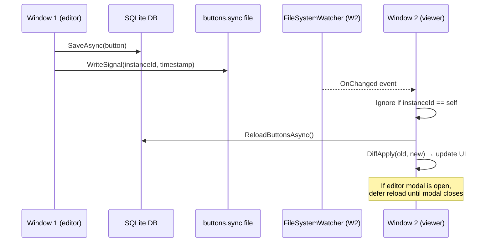
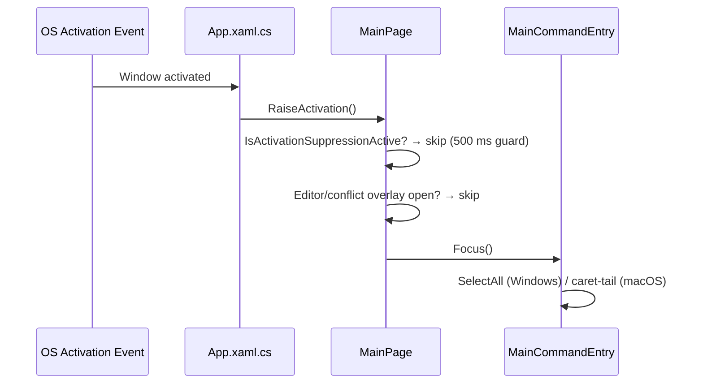
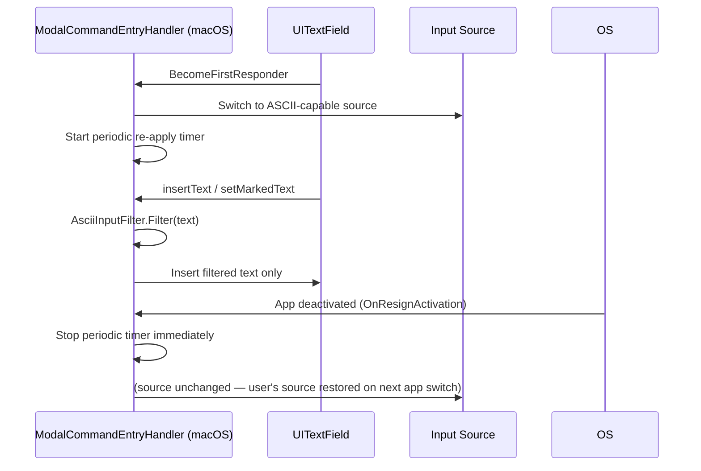
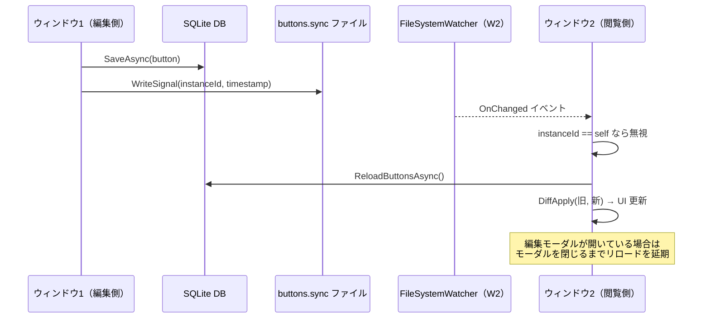
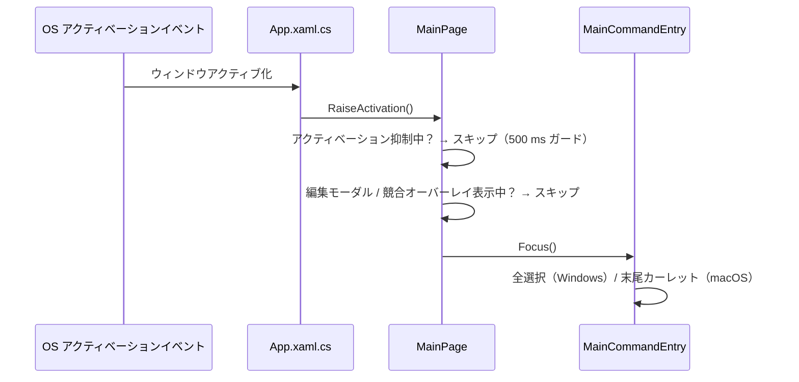
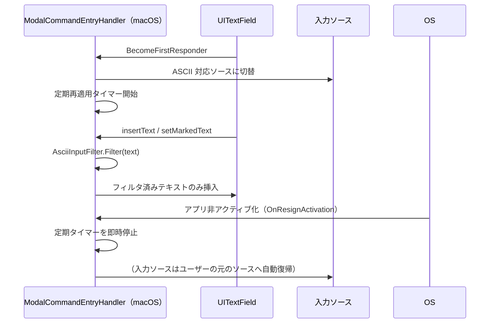

# Developer Guide

## Scope
This document is for developers working on Praxis.
README is user-facing summary; this guide is the implementation-level source of truth.
Test-specific operation and coverage inventory are documented in [`docs/TESTING_GUIDE.md`](TESTING_GUIDE.md).

## Tech Stack
- UI/App: .NET MAUI (`Praxis`)
- Core logic: .NET class library (`Praxis.Core`)
- Tests: xUnit (`Praxis.Tests`)
  - Includes linked-source workflow integration tests for `MainViewModel` with lightweight MAUI test stubs.
- Persistence: SQLite (`sqlite-net-pcl`)
- MVVM tooling: `CommunityToolkit.Mvvm`

## Target Platforms
- See [`../README.md`](../README.md) (`Supported Platforms` section).

## Environment Setup
- For .NET SDK / MAUI workload / package-restore setup, see [`../README.md`](../README.md) (`Environment Setup (Prerequisites)` section).

## Architecture Rules
- MVVM-centered architecture in app layer
- UI orchestration (focus, keyboard routing, platform-specific event handling) may live in code-behind/handlers
- Keep business logic and reusable policies in `Praxis.Core` when possible
- UI services (clipboard/theme/process) stay in `Praxis/Services`

## Main Components
- [`App.xaml.cs`](../Praxis/App.xaml.cs)
  - Resolves `IErrorLogger` from DI on construction and stores it as a static field for use in static `Raise*` helpers
  - Emits Info-level lifecycle breadcrumbs for constructor entry, `CreateWindow`, and root-page resolution so startup/initialization hangs leave a clearer last-known-good stage
  - Windows `Window.HandlerChanged` fallback paths now warning-log both the root page type and the current `PlatformView` type together with the safe exception summary, so activation-hook failures identify whether the broken shell had already reached a native window before input wiring completes
  - Registers `AppDomain.CurrentDomain.UnhandledException`, `TaskScheduler.UnobservedTaskException`, and `AppDomain.CurrentDomain.ProcessExit` global handlers once per process; crash-level handlers write to both `CrashFileLogger` (synchronous file) and `IErrorLogger` (async DB)
  - `UnhandledException` handler captures `IsTerminating` state and attempts synchronous `FlushAsync` before process death; non-`Exception` thrown objects are logged as warnings instead of degrading to empty exception payloads, and flush failures now persist the full exception body to `crash.log` before the warning breadcrumb
  - `ProcessExit` handler flushes pending DB log writes with a 3-second timeout and crash-logs full flush-failure exceptions plus the warning summary so shutdown diagnostics are not lost
  - `CreateWindow()` caches the resolved `MainPage`, but does not cache the fallback error page from `ResolveRootPage()`; later windows can retry normal page resolution after a transient startup failure
- [`MainPage.xaml.cs`](../Praxis/MainPage.xaml.cs)
  - Copy-notice animation warnings now include both overlay visibility and token-cancellation state, so normal teardown cancellation is easier to distinguish from unexpected animation faults
  - All static event-dispatch helpers (`RaiseThemeShortcut`, `RaiseEditorShortcut`, `RaiseCommandInputShortcut`, `RaiseHistoryShortcut`, `RaiseMiddleMouseClick`, `RaiseMacApplicationDeactivating`, `RaiseMacApplicationActivated`) log caught exceptions via `IErrorLogger` instead of silently discarding them
- Platform startup entrypoints ([`Platforms/Windows/App.xaml.cs`](../Praxis/Platforms/Windows/App.xaml.cs), [`Platforms/MacCatalyst/AppDelegate.cs`](../Praxis/Platforms/MacCatalyst/AppDelegate.cs))
  - Guard global exception-hook registration so repeated initialization does not stack duplicate unhandled-exception handlers
  - Windows `App.xaml.cs` warning-logs non-`Exception` AppDomain payloads with both a safe payload summary and the runtime payload type, so COM / platform-originated throw objects stay diagnosable in `crash.log` and `startup.log`
  - Mac `AppDelegate` warning-logs non-`Exception` AppDomain payloads with both a safe payload summary and the runtime payload type, so Objective-C / bridge-originated throw objects remain diagnosable
  - Windows startup logging now uses the normalized shared app-storage root for `startup.log` path resolution, tries to persist startup-log directory/build/append failures to `crash.log` before the warning breadcrumb, and falls back to an independent temp/current-directory diagnostics file if the normal `%LOCALAPPDATA%\\Praxis` sink is unavailable; secondary fallback roots are normalized to absolute directories so quoted absolute overrides still work while blank/relative roots are ignored
- [`MainPage`](../Praxis/MainPage.xaml.cs) partial classes
  - [`MainPage.xaml.cs`](../Praxis/MainPage.xaml.cs): lifecycle/event wiring and startup orchestration; crash-logs XAML load failures, only marks the page initialized after `viewModel.InitializeAsync()` succeeds, resets the init gate on failure so a later `OnAppearing` can retry, crash-logs initialization-alert failures separately, warning-breadcrumbs copy-notice animation failures together with overlay visibility, calls `viewModel.NotifyWindowDisappearing()` during `OnDisappearing` to log window close, and tears down activation hooks/observers before returning
  - [`MainPage.Fields.Core.cs`](../Praxis/MainPage.Fields.Core.cs): shared lifecycle/orchestration fields
  - [`MainPage.Fields.OverlayAndEditor.cs`](../Praxis/MainPage.Fields.OverlayAndEditor.cs): editor/overlay/quick-look field groups
  - [`MainPage.Fields.ConflictDialog.cs`](../Praxis/MainPage.Fields.ConflictDialog.cs): conflict-dialog field enum grouping
  - [`MainPage.Fields.Windows.cs`](../Praxis/MainPage.Fields.Windows.cs): Windows-only native field groups
  - [`MainPage.Fields.MacCatalyst.cs`](../Praxis/MainPage.Fields.MacCatalyst.cs): Mac Catalyst-only native field groups
  - [`MainPage.InteractionState.cs`](../Praxis/MainPage.InteractionState.cs): pointer/selection state fields
  - [`MainPage.PointerAndSelection.cs`](../Praxis/MainPage.PointerAndSelection.cs): drag/drop, selection rectangle, pointer button detection
  - [`MainPage.FocusAndContext.cs`](../Praxis/MainPage.FocusAndContext.cs): context/conflict focus visuals and tab-policy handling
  - [`MainPage.EditorAndInput.cs`](../Praxis/MainPage.EditorAndInput.cs): draggable button interactions, top-bar command/search input handlers, clear-button behavior, shared pointer-capture helpers
  - [`MainPage.ModalEditor.cs`](../Praxis/MainPage.ModalEditor.cs): editor modal handlers, modal theme text colors, dynamic editor height calculation
  - [`MainPage.ViewModelEvents.cs`](../Praxis/MainPage.ViewModelEvents.cs): [`MainViewModel`](../Praxis/ViewModels/MainViewModel.cs) / editor property-change wiring and modal/context open-close reactions
  - [`MainPage.StatusAndTheme.cs`](../Praxis/MainPage.StatusAndTheme.cs): status flash animation, neutral status background reset, theme dark/light resolution; warning breadcrumbs keep only message length plus error classification instead of the full status text
  - [`MainPage.DockAndQuickLook.cs`](../Praxis/MainPage.DockAndQuickLook.cs): dock scrollbar hover visibility and Quick Look popup show/hide/placement
  - [`MainPage.WindowsInput.cs`](../Praxis/MainPage.WindowsInput.cs): Windows native `TextBox` hooks, key routing, and modal/conflict focus restore
  - [`MainPage.ShortcutsAndConflict.cs`](../Praxis/MainPage.ShortcutsAndConflict.cs): shortcut routing, conflict dialog flow, command suggestion placement
  - [`MainPage.MacCatalystBehavior.cs`](../Praxis/MainPage.MacCatalystBehavior.cs): Mac Catalyst modal focus, key commands, observers/polling
  - [`MainPage.LayoutUtilities.cs`](../Praxis/MainPage.LayoutUtilities.cs): shared coordinate helpers and Windows tab-stop reflection
- [`ViewModels/MainViewModel.cs`](../Praxis/ViewModels/MainViewModel.cs) + partial classes
  - [`MainViewModel.cs`](../Praxis/ViewModels/MainViewModel.cs): shared state, observable properties, initialization, external sync; exposes `NotifyWindowDisappearing()` for `MainPage` to call on page lifecycle close, and external theme-sync warnings now keep the target `ThemeMode`
  - [`MainViewModel.Actions.cs`](../Praxis/ViewModels/MainViewModel.Actions.cs): create/edit/delete/drag/theme/dock command handlers; logs key user actions via `IErrorLogger.LogInfo` (button/command execution, editor open/cancel/save/delete, theme change, undo/redo, conflict resolution), now including execution-request and clipboard-copy breadcrumbs before/after process launch; conflict-dialog callback failures are persisted as full exceptions and warning breadcrumbs instead of silently canceling
  - Clipboard read/write failures are isolated from the main workflow: create-with-clipboard falls back to empty arguments, copy actions surface a failure status instead of throwing, and command execution still records launch results even if post-launch clipboard copy fails. These helper failures are also persisted as full exceptions before the warning summary
  - Window-sync notifier failures are treated as non-fatal after local success: save/delete/move/theme/dock/undo/redo complete locally, then log a warning summary instead of unwinding the user action, while the underlying exception is still persisted for diagnostics
  - Non-critical post-success persistence is also isolated: launch-log write/purge, dock-order persistence, undo/redo dock restore, and theme persistence log warnings on failure instead of turning an already-completed local action into an exception path, but now also preserve the full exception payload in the error logger
  - [`MainViewModel.CommandSuggestions.cs`](../Praxis/ViewModels/MainViewModel.CommandSuggestions.cs): suggestion list lifecycle, viewport diffing, command-match execution; logs command-not-found events and persists full exceptions for debounced refresh, main-thread dispatch, in-thread refresh, and repository lookup fallback failures before closing the popup safely, with all those suggestion warnings carrying only input length rather than the full command text
  - Main-thread dispatch failures for suggestion close/refresh still emit warning breadcrumbs, but they also persist the full exception so background/UI dispatch issues are debuggable
  - Overall behavior orchestrates command execution, filtering, edit modal, drag/save, dock, and theme apply
  - Persists dock order through repository when dock contents change
  - Handles cross-window sync reload with diff-apply when external button/dock changes are notified, Info-logs receipt/defer/start/finish boundaries for sync diagnostics, persists full exceptions for reload failures instead of letting the background task fail silently, and uses `TaskCreationOptions.RunContinuationsAsynchronously` for the non-main-thread dispatch bridge to reduce inline continuation re-entry on the UI thread
  - Applies cross-window theme sync by reloading persisted theme on external notifications, Info-logs no-op vs applied paths, persists full exceptions for theme reload failures, and also persists exceptions thrown from the dispatched main-thread apply path alongside warning breadcrumbs
  - Startup and external reload now isolate non-critical settings reads: theme read failures fall back to `System` or the current theme, dock-order read failures keep/prune the current Dock instead of failing the whole screen refresh, and both paths preserve full exceptions in addition to warning summaries
  - Refreshes command suggestions on external sync when command input is active
  - Defers sync reload while editor modal is open and applies it after close
  - If persisted `dock_order` becomes empty on external sync, the in-memory Dock is cleared instead of keeping stale buttons visible
  - On editor save, first checks `UpdatedAtUtc`, then treats timestamp-only drift as non-conflict when latest DB row content matches local pre-edit snapshot; material mismatch resolves by `Reload latest` / `Overwrite mine` / `Cancel`
  - Maintains command-pattern action history for button mutations (`move` / `edit` / `delete`) and applies Undo/Redo with optimistic version checks against latest DB rows
- [`Services/SqliteAppRepository.cs`](../Praxis/Services/SqliteAppRepository.cs)
  - Tables: button definitions, launch logs, error logs, app settings
  - Detailed table schema: [`docs/DATABASE_SCHEMA.md`](DATABASE_SCHEMA.md)
  - Tracks SQLite schema version with `PRAGMA user_version` and applies upgrades step-by-step (`current + 1 .. CurrentVersion`)
  - Updates `user_version` only after each migration step succeeds
  - Startup auto-migrates older DB layouts to the current layout (no manual migration step required for users)
  - Uses `SemaphoreSlim` gate on all public operations (DB + cache) to avoid async read/write races
  - Includes in-memory button cache and case-insensitive command cache
  - Keeps cached button order normalized to placement order (`Y`, then `X`) after initial load, reload, and upsert paths
  - Normalizes invalid `ThemeMode` enum values to `System` before persisting `AppSettingEntity["theme"]`
  - Publishes the shared `SQLiteAsyncConnection` only after schema upgrade and initial cache load succeed, so failed startup initialization can retry cleanly on the next call
  - Provides `ReloadButtonsAsync` for cross-window sync paths to force-refresh cache from SQLite
  - Provides `GetByIdAsync(id, forceReload: true)` for save-time conflict checks against latest persisted row
  - Uses explicit initialized-connection guard (`InvalidOperationException`) instead of null-forgiving access
  - Purges old launch logs and error logs with one SQL `DELETE ... WHERE TimestampUtc < threshold`
  - Stores dock order in `AppSettingEntity` key `dock_order` (comma-separated GUID list), deduplicating repeated / empty IDs while preserving first occurrence order
- [`Services/CrashFileLogger.cs`](../Praxis/Services/CrashFileLogger.cs)
  - Static synchronous file-based logger that writes to `crash.log` immediately on every call — survives abrupt process termination where async DB writes would be lost
  - Cross-platform path resolution: Windows `%LOCALAPPDATA%\Praxis\crash.log`, macOS `~/Library/Application Support/Praxis/crash.log`
  - Quoted/whitespace-padded `%LOCALAPPDATA%` values are normalized, and if no absolute platform directory can be resolved it falls back to `Environment.CurrentDirectory/Praxis` instead of a relative path
  - Automatic log rotation at 512 KB (`crash.log` → `crash.log.old`)
  - Null info/warning message payloads are normalized to `(no message payload)` so crash evidence stays explicit instead of persisting blank lines
  - Full exception chain output: inner exceptions, bounded `AggregateException` traversal with middle/tail sampling and duplicate collapse, `Exception.Data` dictionary, and indented per-exception stack traces. Exception messages are flattened to one line, and thrown `Message` / `StackTrace` getters or `Exception.Data` formatter failures degrade to inline fallback markers instead of dropping the crash record
  - All methods (`WriteException`, `WriteInfo`, `WriteWarning`) are thread-safe and never throw
- [`Services/IErrorLogger.cs`](../Praxis/Services/IErrorLogger.cs) / [`Services/DbErrorLogger.cs`](../Praxis/Services/DbErrorLogger.cs)
  - `IErrorLogger` exposes `void Log(Exception, string)` for exceptions, `void LogWarning(string, string)` for warnings, `void LogInfo(string, string)` for informational events, and `Task FlushAsync(TimeSpan)` to drain pending writes
  - `DbErrorLogger` writes every log call to `CrashFileLogger` synchronously first (file-based persistence), then enqueues an `ErrorLogEntry` for async DB write via a `ConcurrentQueue` with a single-writer drain loop
  - Error entries capture full exception type chains (`InvalidOperationException -> NullReferenceException`), concatenated single-line inner messages, and bounded stack output built from each exception node's `Exception.StackTrace` plus aggregate child index labels instead of `Exception.ToString()`
  - Null exception payloads are tolerated: the crash file keeps the `(no exception payload)` marker and the DB entry persists a placeholder instead of throwing from the logger itself
  - Null Warning/Info message payloads are also tolerated and persist the shared `(no message payload)` placeholder in both `crash.log` and `ErrorLogEntity.Message`
  - Error-level writes trigger a 30-day retention purge after DB insert; DB write failures for Error/Warning/Info entries and purge failures all write both the exception body and a warning breadcrumb to `crash.log` while the original file-first record remains preserved, and unexpected flush/drain/purge breadcrumbs now include the exception type before the safe message so shutdown-time failures can be bucketed by failure class without expanding the payload
  - `FlushAsync(timeout)` waits for both queued entries and already-dequeued in-flight DB writes within the timeout window, and timeout or unexpected flush failures also leave full exception details plus warning breadcrumbs during graceful shutdown paths (`ProcessExit`, `IsTerminating`)
  - Registered as singleton in DI ([`MauiProgram.cs`](../Praxis/MauiProgram.cs))
  - `App` stores a static reference to `IErrorLogger` set from the constructor so static `Raise*` event helpers can log exceptions
- [`Services/CommandExecutor.cs`](../Praxis/Services/CommandExecutor.cs)
  - Launches tool + arguments with shell execution
  - Validates process-start results (`Process.Start` null case) and returns contextual failure messages while warning-breadcrumbing start failures to `crash.log`, including the normalized target filename and `UseShellExecute` mode when no process handle comes back
  - Missing-path warnings also record whether the resolved target was rooted, so relative-path misses can be separated from broken absolute targets in cross-platform diagnostics
  - When fallback path resolution succeeds but the target does not exist, keeps the user-facing `Path not found: ...` result while also writing the normalized missing target to `crash.log`
  - Treats normalized empty tool values (for example `""` or `'   '`) as “no tool”, so execution falls back to URL/path handling instead of attempting to launch an empty filename
  - Expands home-prefixed tool values (`~`, `~/...`, `~\\...`) before executable launch too, not only in the empty-tool filesystem fallback path
  - If `tool` is empty, falls back to `Arguments` target resolution:
    - `http/https` => default browser
    - file path => default associated app (for example `.pdf`)
    - directory path => file manager (`Explorer`/`Finder`)
    - relative paths containing separators (`docs/readme.txt`, `./notes.txt`, `../notes.txt`), `.` / `..`, and bare `~` are treated as filesystem targets too
  - `~/...`, `~\...`, and bare `~` are expanded to the user-profile path before existence checks
  - quoted tool paths are normalized before process launch, so `"C:\Program Files\App\app.exe"` works as a tool value
  - on Windows UNC paths (`\\\\server\\share...`), bypasses pre-check and opens via `explorer.exe` to allow auth prompt first
  - When `tool` is a Windows shell-like executable (`cmd.exe`, `powershell`, `pwsh`, `wt`), overrides `WorkingDirectory` to the user profile so shells do not inherit the Praxis process directory; executable-name matching is case-insensitive even when the tool path comes from `%ComSpec%` / other expanded environment variables
- [`Platforms/Windows/Handlers/CommandEntryHandler.cs`](../Praxis/Platforms/Windows/Handlers/CommandEntryHandler.cs)
  - Applies `InputScopeNameValue.AlphanumericHalfWidth` only for command entries that opt into ASCII enforcement
  - If WinUI rejects the `InputScope` write, warning breadcrumbs now include both the current `EnforceAsciiInput` flag and native `TextBox` type before falling back to the `imm32`-based IME path
- [`Services/MauiClipboardService.cs`](../Praxis/Services/MauiClipboardService.cs)
  - Wraps MAUI clipboard reads/writes and now honors `CancellationToken` for both operations, including cancellation while awaiting the underlying MAUI task
- [`Services/MauiThemeService.cs`](../Praxis/Services/MauiThemeService.cs)
  - Skips no-op theme reapplication when the requested theme already matches `Application.Current.UserAppTheme`
  - On Mac Catalyst, crash-logs `BeginInvokeOnMainThread` failures while applying window style overrides and includes both the target `AppTheme` and current `UserAppTheme` in the warning breadcrumb so the failed theme transition is visible without reproducing the exact pre-dispatch state
- [`Services/FileStateSyncNotifier.cs`](../Praxis/Services/FileStateSyncNotifier.cs)
  - Uses a local signal file (`buttons.sync`) and `FileSystemWatcher` for multi-window notifications
  - Payload includes instance id and timestamp; self-origin events are ignored
  - Sync warning helpers include the exception type before the safe message, so retry exhaustion and unexpected publish failures can be bucketed by failure class from crash breadcrumbs alone
  - Hooks watcher events before enabling raising to avoid a construction-time notification gap
  - Tolerates malformed payloads and out-of-range timestamps without faulting the background notifier task, crash-logs subscriber exceptions, warning-logs sync-file read retry exhaustion plus unexpected publish failures, includes the normalized sync-file path in write, read, and malformed-payload warning breadcrumbs, ignores notify requests after disposal, disables watcher event raising before teardown, and writes crash-file Info/Warning breadcrumbs for written, observed, and malformed payloads
- [`Services/AppStoragePaths.cs`](../Praxis/Services/AppStoragePaths.cs)
  - Centralizes shared local-storage constants/paths (DB, sync signal)
  - DB path policy:
    - Windows: `%USERPROFILE%/AppData/Local/Praxis/praxis.db3`
    - macOS (Mac Catalyst): `~/Library/Application Support/Praxis/praxis.db3`
  - Sync signal path policy:
    - Windows: `%USERPROFILE%/AppData/Local/Praxis/buttons.sync`
    - macOS (Mac Catalyst): `~/Library/Application Support/Praxis/buttons.sync`
  - Legacy migration warnings now include the exception type before the safe message, so copy failures from I/O and permission boundaries can be distinguished without expanding the payload
  - Normalizes quoted `%LOCALAPPDATA%` values and avoids treating blank/relative legacy roots as migration candidates, so startup migration does not accidentally pull `./praxis.db3` from the process working directory
  - Invalid legacy path comparisons are warning-logged and ignored instead of letting `Path.GetFullPath(...)` abort migration candidate scanning
  - On startup, prepares target directories and migrates DB only from safe legacy locations (skips `Documents` paths on macOS to avoid permission prompts); unreadable or copy-failed legacy DB candidates are warning-logged and skipped so later candidates can still be tried
- [`Services/FileAppConfigService.cs`](../Praxis/Services/FileAppConfigService.cs)
  - Loads optional `praxis.config.json` theme override from app base directory first, then app-data directory
  - Skipped-config warnings include the exception type as well as the safe message, so permission failures, malformed JSON, and transient I/O remain distinguishable in crash breadcrumbs
  - Canonicalizes quoted absolute candidate roots with `Path.GetFullPath(...)` before deduplicating them, so equivalent absolute directories with `.` / `..` segments do not probe the same `praxis.config.json` twice
  - If an earlier config file is unreadable, unauthorized, malformed JSON, missing `theme`, or contains an invalid theme value, it warning-logs the skipped candidate and falls back to the next candidate instead of forcing `System`
  - Invalid-theme warnings include the normalized raw `theme` value so a broken `praxis.config.json` leaves evidence of what was actually read without letting multiline/blank payloads break the breadcrumb
- [`Controls/CommandEntry.cs`](../Praxis/Controls/CommandEntry.cs) / [`Platforms/MacCatalyst/Handlers/CommandEntryHandler.cs`](../Praxis/Platforms/MacCatalyst/Handlers/CommandEntryHandler.cs)
  - `Command`/`Search` initialize with `Keyboard.Plain` to prevent platform auto-capitalization side effects
  - Mac key-input reflection warnings render fallback keys as symbolic names like `Tab`, `Escape`, and arrow names, so `UIKeyCommand` lookup failures stay readable in plain-text crash logs across platforms
  - Top-bar `MainCommandEntry` and modal `ModalCommandEntry` both use `CommandEntry`; modal disables command-navigation shortcuts and activation-time native refocus, and explicitly opts into ASCII enforcement while the top-bar command input does not
  - macOS command input uses a dedicated handler so `Up/Down` suggestion navigation is handled at native `UITextField` level for main command input; ASCII input-source enforcement and `AsciiInputFilter` are applied only to command entries that opt in (currently modal `ModalCommandEntry`)
- Windows command input uses a dedicated handler. Only command entries that opt into ASCII enforcement apply native `InputScopeNameValue.AlphanumericHalfWidth` on focus and nudge IME open/conversion state toward ASCII via `imm32` with an immediate attempt plus one short delayed retry per focus acquisition. Global focused-state periodic re-apply and `TextChanging` rewrite remain disabled by default to protect text Undo/Redo granularity, while modal edit `Command` opts into focused-state ASCII reassertion to prevent manual IME-mode switching while focused. The focused-state reassert loop only treats its own cancellation token as expected shutdown. If native `InputScope` assignment throws `ArgumentException (E_RUNTIME_SETVALUE)` on some environments, the handler flips a one-way unsupported flag, skips later `InputScope` writes, and continues with the IME fallback path.
- [`Praxis.Core/Logic/`](../Praxis.Core/Logic/)
  - Search matcher, command line builder, grid snap, log retention, launch target resolver, button layout defaults, record version comparer, ASCII input filter
  - Clear-button focus behavior is policy-driven: `ClearButtonRefocusPolicy` chooses retry timing per platform, and `WindowsNativeFocusSafetyPolicy` gates native `TextBox.Focus/Select` to loaded/XamlRoot-backed controls only
  - [`UiTimingPolicy`](../Praxis.Core/Logic/UiTimingPolicy.cs) centralizes UI delay constants shared by app code (focus restore, mac activation windows, polling intervals)

## Architecture Flows

### Cross-Window Sync Flow

When a user saves a button change in one window, other open windows automatically reload and apply the diff.

### Focus Management Flow (Activation)

When the app window becomes active, focus is routed to the command input and the text is selected for immediate overwrite.

### Focus Management Flow (macOS Opt-In ASCII Enforcement)

macOS enforces an ASCII-capable input source only for `CommandEntry` instances that opt in, and only while the field is first responder in the active key window.

---

## Development Workflow
1. Complete environment setup from [`../README.md`](../README.md) before first build/test on a new machine.
2. Implement/modify pure logic in `Praxis.Core` first.
3. Add/adjust unit tests in `Praxis.Tests`.
4. Wire app behavior in `Praxis` ViewModel/Services and UI orchestration points (`MainPage.*.cs`, platform handlers) as needed.
5. Verify with:
   - `dotnet test Praxis.slnx`

## CI/CD (GitHub Actions)
- [`ci.yml`](../.github/workflows/ci.yml)
  - Push/PR on `main`/`master`
  - Executes:
    - `dotnet test Praxis.Tests/Praxis.Tests.csproj -c Release --no-restore -v minimal --collect:"XPlat Code Coverage" --results-directory ./TestResults`
    - Uploads `TestResults/**/coverage.cobertura.xml` as artifact (`praxis-test-coverage-cobertura`)
    - Windows app build (`net10.0-windows10.0.19041.0`)
    - Mac Catalyst app build (`net10.0-maccatalyst`)
- [`delivery.yml`](../.github/workflows/delivery.yml)
  - Manual run or `v*` tag push
  - Publishes Windows/Mac Catalyst outputs and uploads them as workflow artifacts

## Coding Conventions
- Prefer nullable-safe code and explicit guards
- Keep methods small; isolate side effects
- Preserve ASCII unless file already requires Unicode
- Use descriptive names for commands and services

## Adding New Features
- Add domain types or logic in `Praxis.Core` if testable without MAUI
- Add interfaces in `Praxis/Services` for platform-bound concerns
- Inject dependencies through DI in [`MauiProgram.cs`](../Praxis/MauiProgram.cs)
- Add tests for any new non-UI logic

## Current UI Notes
- Main modal copy buttons trigger a center overlay notification animation in [`MainPage.xaml`](../Praxis/MainPage.xaml)([`.cs`](../Praxis/MainPage.xaml.cs)).
- Top-bar create action uses a custom line-art logo (outer hexagon, inscribed circle, inner hexagon, center plus) built from MAUI shapes.
- Modal footer action buttons (`Cancel`/`Save`) are centered and use equal width for visual balance.
- Edit/Delete, editor, and conflict overlays share a full-window hit-target style (`TransparentOverlayHitTargetStyle`) that targets `Border` (not `Grid`); a `Border` UIView is reliable for MAUI `TapGestureRecognizer` pickup on Mac Catalyst whereas the `LayoutView` backing a `Grid` was not. The layer uses a near-black low-alpha `#01000000` background instead of `Opacity=0` so Windows and Mac Catalyst still include it in hit testing while it remains visually neutral over both light and dark glass surfaces; this matches the existing `PlacementSurface` workaround color and avoids the white-tint compositing that previously made placement-area buttons appear outlined while a modal was open. The Edit/Delete layer runs `CloseContextMenuCommand` when clicked outside the menu. Editor and conflict layers do not dismiss their dialogs; they only block interaction with lower layers. Conflict backdrop sits inside `ConflictOverlay`, behind the conflict panel and above the editor modal that may still be open underneath.
- Action-button focus visual: Edit/Delete context-menu buttons, modal Cancel/Save, and conflict-dialog Reload/Overwrite/Cancel use a background-tint focus indicator instead of a focus border ring (so the labels do not jitter on focus changes). [`Praxis.Core/Logic/ButtonFocusVisualPolicy.cs`](../Praxis.Core/Logic/ButtonFocusVisualPolicy.cs) returns the focus tint (`Light=#E6E6E6`, `Dark=#3D3D3D`) only when `focused`; for the unfocused branch it returns `#00000000` as a sentinel and `MainPage.ApplyButtonFocusVisual` clears the property via `ClearValue` so the button reverts to its platform-default idle fill (rather than disappearing into the modal). Border-related setters (`BorderColor` / `BorderWidth`) stay at transparent / 0 so no ring is drawn. Mac pseudo-focus (modal Cancel/Save, conflict dialog) and Windows native focus both converge on the same `ApplyModalActionButtonFocusVisuals` / `ApplyConflictActionButtonFocusVisuals` paths.
- The top-bar create action, modal copy/action buttons, and Dock launcher buttons share [`Behaviors/HoverHandCursorBehavior.cs`](../Praxis/Behaviors/HoverHandCursorBehavior.cs), so Windows and Mac Catalyst both switch to a pointing-hand cursor on hover instead of leaving clickable surfaces on the arrow cursor.
- Placement-area launcher buttons intentionally keep the default arrow cursor on hover and instead attach [`Behaviors/GrabHandCursorBehavior.cs`](../Praxis/Behaviors/GrabHandCursorBehavior.cs), which swaps to a closed-hand "grab" cursor while the primary pointer is pressed (macOS `NSCursor.closedHandCursor`, Windows `InputSystemCursorShape.SizeAll` substitute) so drag-to-reposition reads as a grabbed object instead of a generic clickable target.
- Dock item visuals are intentionally matched to placement-area button visuals.
- Dock keeps a compact minimum height and bottom-biased padding so the borderless layout gives more vertical room back to the placement area while still masking the horizontal scrollbar when it is idle. Both the Dock (`DockRegionBorder`) and the surrounding placement-area `Border` declare `BackgroundColor="Transparent"` and `Stroke="Transparent"`, so the page background reads through cleanly and only the launcher buttons themselves carry visible fills in those regions. The Dock horizontal scrollbar gets a small bottom margin so launcher buttons no longer brush against it, and the Dock scroll content clips at the left/right edges so partially scrolled buttons end in straight edges. `DockScrollBarMask` is kept in the visual tree (assertions in `AppLayerSourceGuardTests` lock its existence) but paints a transparent fill, so it no longer renders as a visible bar.
- The main window enforces `MinimumWidth = 860` and `MinimumHeight = 600` in [`App.xaml.cs::CreateWindow`](../Praxis/App.xaml.cs). The editor modal Border is `WidthRequest=760` plus 18 px padding (≈796 wide), sitting inside RootGrid's 18 px padding — 860 leaves a small chrome margin so the modal cannot be cropped at either side. 600 height keeps every editor row plus the Cancel/Save action row visible without the modal itself needing to scroll.
- Placement-area and Dock buttons support per-button inverted theme colors (`UseInvertedThemeColors`):
  - In Light theme: render with Dark-theme button colors
  - In Dark theme: render with Light-theme button colors
  - Configured from editor modal checkbox (`Invert Theme`)
  - In editor modal, the checkbox indicator is rendered as a flat square on both Windows and Mac (native checkbox visuals hidden) to keep monochrome two-tone styling
  - Both the checkbox indicator and its label ("Use opposite theme colors for this button") are tappable — each carries a `TapGestureRecognizer` bound to the same handler (`ModalInvertThemeToggle_Tapped`) and a `<behaviors:HoverHandCursorBehavior />`, so hovering shows the pointing-hand cursor consistent with modal Cancel / Save
  - Border color and empty-state background are matched to modal text-field palette (Light `#CECECE/#FFFFFF`, Dark `#4E4E4E/#2A2A2A`)
  - Border is rendered by four equal-thickness lines (`1`) to keep edge weight consistent
  - Checkmark is drawn by a `Polyline` (`StrokeThickness=2`) with a slightly sharper angle
  - Selected-state fill on inverted placement-area buttons is `Light=#787878 / Dark=#A0A0A0`, visibly distinct from the inverted idle (`#363636 / #FFFFFF`) so multi-select feedback stays visible while the palette stays monochrome (non-inverted selected fill is unchanged at `Light=#DCDCDC / Dark=#505050`)
- Placement-area/Dock button label text uses a dedicated style (`PlacementButtonTextLabelStyle`) and is set to `12` across all platforms.
- Dock horizontal scrollbar defaults to hidden and is shown only while the pointer is hovering the Dock region and horizontal overflow exists.
  - For macOS stability, Dock applies a bottom mask (`DockScrollBarMask`) while not hovered so the indicator stays visually hidden even when native indicator timing is inconsistent.
  - Hover-exit delay cancellation is limited to the active token; unexpected hide failures are warning-logged with the current Dock hover flag instead of faulting the delayed task
  - Quick Look delayed-show failures are warning-logged with the hovered `item.Id` plus current popup visibility, so label/animation issues do not escape as unobserved background task faults and still show whether the preview had already become visible
  - Quick Look delayed-hide failures are warning-logged with the current pending `item.Id`, especially around popup animation/teardown timing where the show path may already have queued a different preview
  - Modal primary-field focus failures are warning-logged with both `shouldSelectAll` and current modal visibility, so focus races can be distinguished from hidden-modal retries
- Middle click edit is implemented via [`Behaviors/MiddleClickBehavior.cs`](../Praxis/Behaviors/MiddleClickBehavior.cs) plus macOS fallbacks in [`MainPage.PointerAndSelection.cs`](../Praxis/MainPage.PointerAndSelection.cs) (pointer detection) and [`MainPage.MacCatalystBehavior.cs`](../Praxis/MainPage.MacCatalystBehavior.cs) (polling).
  - **Mac click-through quirk**: macOS delivers non-primary mouse clicks to whichever window is under the cursor regardless of focus. The polling timer uses `CGEventSource.GetButtonState` (global HID state), so it can fire for middle-clicks in other apps. `lastPointerOnRoot` is cleared to `null` in `OnMacApplicationDeactivating` (triggered by `OnResignActivation`) so stale cursor positions from a previous focus session cannot trigger the editor when the app is inactive. Additional guards: `IsMacApplicationActive()` (explicit volatile bool set by `OnResignActivation`/`OnActivated`), `IsActivationSuppressionActive()` (500 ms after re-activation), and a ViewModel-level `IsMacApplicationActive()` check in `OpenEditor`.
  - Deferred secondary-button execution treats token cancellation as expected, but warning-logs unexpected command-path exceptions with current context-menu-open / command-bound state plus the attached view type instead of letting the UI callback fail silently
  - CoreGraphics middle-button fallback warnings now include current `isActive` / `activationSuppressed` state plus whether a recent root-pointer position was known, so degraded polling logs show both whether the app was supposed to react and whether stale click-through coordinates were even possible
- Tab focus policy is applied in [`MainPage.FocusAndContext.cs`](../Praxis/MainPage.FocusAndContext.cs) (`ApplyTabPolicy`) by toggling native `IsTabStop`.
- Modal `ButtonText` focus fallback warnings now include the current `shouldSelectAll` state, so create-flow focus failures can be separated from normal re-entry focus retries.
- `SetTabStop` fallback warnings now include the native target control type, so `IsTabStop` reflection failures point at the specific Windows view that rejected the write.
- `DisableWindowsSystemFocusVisual` warnings now include the native control type too, so `UseSystemFocusVisuals` reflection failures identify which Windows control rejected the write.
- Selection rectangle is rendered as `SelectionRect` in [`MainPage.xaml`](../Praxis/MainPage.xaml) with a 1-pixel gray stroke (`Light=#7A7A7A, Dark=#A8A8A8`) and a translucent gray fill. On mouse release the rectangle fades to transparent over `UiTimingPolicy.SelectionRectFadeOutDurationMs` (110 ms) on both Windows and Mac Catalyst before its `IsVisible` flips off. Fade revisions are tracked through `selectionRectFadeRevision` in [`MainPage.InteractionState.cs`](../Praxis/MainPage.InteractionState.cs) so a new drag interrupts a stale fade.
- Selection toggle modifier handling is centralized in [`MainPage.PointerAndSelection.cs`](../Praxis/MainPage.PointerAndSelection.cs):
  - Windows: `Ctrl+Click`
  - macOS (Mac Catalyst): `Command+Click`
  - Implemented via reflection-based modifier detection (`IsSelectionModifierPressed`) to avoid Windows regressions.
- Button-tap execution warnings now include both `ButtonText` and `item.Id`, so failed launches can be mapped back to a concrete launcher record even if labels are duplicated.
- Secondary-tap create warnings now include the canvas point, so failed create-editor flows can be correlated with placement hit-testing or coordinate conversion issues.
- Theme switching buttons are intentionally removed from the UI.
- Theme mode is persisted via repository settings and restored on startup.
- Global shortcuts in [`MainPage.ShortcutsAndConflict.cs`](../Praxis/MainPage.ShortcutsAndConflict.cs):
  - `Ctrl+Shift+L` => Light
  - `Ctrl+Shift+D` => Dark
  - `Ctrl+Shift+H` => System
  - `Ctrl+Z` => Undo latest button mutation
  - `Ctrl+Y` => Redo latest undone mutation
  - Windows keeps shortcuts active in non-modal states by combining page-level key handlers, text-input key hooks, and root window key hook
  - In `Command`/`Search` text boxes, `Ctrl+Z`/`Ctrl+Y` first use native text Undo/Redo; once text history is exhausted, shortcut handling falls back to button-mutation Undo/Redo.
- Global shortcuts on macOS are wired in [`Platforms/MacCatalyst/AppDelegate.cs`](../Praxis/Platforms/MacCatalyst/AppDelegate.cs):
  - `Command+Shift+L` => Light
  - `Command+Shift+D` => Dark
  - `Command+Shift+H` => System
  - `Command+Z` => Undo latest button mutation
  - `Command+Shift+Z` => Redo latest undone mutation
  - App-level key commands keep theme switching active regardless of modal/context-menu state
- Status bar is a borderless rounded `Border` (`StatusBarBorder`, `Stroke="Transparent" StrokeThickness="0"`) at the bottom of the page. Idle background is `Transparent` so the bar disappears against the page background when not flashing, and the `StatusText` Label is horizontally centered (`HorizontalOptions="Fill" HorizontalTextAlignment="Center"`). On `StatusText` change the bar briefly flashes:
  - normal: green
  - error (`Failed`/`error`/`exception`/`not found`): red
  - `MainPage.StatusAndTheme.GetNeutralStatusBackgroundColor()` returns `Colors.Transparent`, so the fade animation interpolates alpha cleanly between transparent → flash → transparent. After the flash the local override is cleared so the idle Transparent fill resumes
  - Unexpected animation failures are warning-logged; only the active flash token's own cancellation is silent
- On macOS, when Enter execution in command input ends with `Command not found: ...`, focus is restored to command input for immediate retry typing.
- Command input suggestion UX:
  - `MainViewModel` builds `CommandSuggestions` from partial match on `LauncherButtonItemViewModel.Command`
  - Suggestion refresh is debounced (`~400ms`) to reduce rapid recomputation during typing
  - Candidate row displays `Command`, `ButtonText`, `Tool Arguments` in `1:1:4` width ratio
  - Suggestion row selected-background color is resolved by `CommandSuggestionRowColorPolicy` and applied with theme-aware binding, so visible suggestions repaint immediately on Light/Dark/System switches
  - Suggestion popup opens with no selected row; first `Down` selects the first candidate, then `Up/Down` wraps at list edges and `Enter` executes the selected suggestion
  - Suggestion click (primary) fills `CommandInput` and executes immediately.
  - Middle-click on a suggestion row closes the popup and opens the editor modal for that button (same as middle-clicking the button in the placement area). On macOS, the polling-based path (`HandleMacMiddleClick` / `TryGetSuggestionItemAtRootPoint`) also handles this via the global timer when `PointerGestureRecognizer` does not fire reliably.
  - Right-click on a suggestion row closes the popup and opens the context menu (Edit / Delete) for that button (same as right-clicking the button in the placement area). Implemented via `TapGestureRecognizer { Buttons = ButtonsMask.Secondary }` plus `PointerGestureRecognizer` secondary-button detection in `RebuildCommandSuggestionStack`.
  - Plain Enter execution from command box runs all exact command matches (trim-aware, case-insensitive)
  - When window activation is detected and editor/conflict overlays are closed, `MainCommandEntry` is refocused and text is selected for immediate overwrite input (Windows/macOS)
  - On macOS, `MainSearchEntry` uses `SearchFocusGuardPolicy`: non-user-initiated search focus is rejected so activation-time command focus is preserved
  - `MainCommandEntry` / `MainSearchEntry` use `Keyboard.Plain` to prevent lowercase input from being auto-capitalized by platform defaults.
  - Main command input no longer attempts to switch IME/input-source mode on focus on either Windows or macOS.
  - On macOS, only `ModalCommandEntry` enforces an ASCII-capable input source while it is first responder in the active key window/app, and blocks/strips non-ASCII input paths (`setMarkedText`, `insertText`, editing-changed safety net), backed by `AsciiInputFilter` and `MacCommandInputSourcePolicy`; focused-state periodic re-apply is enabled, and it is detached immediately on key-window/app deactivation.
  - On macOS, `ModalCommandEntry` disables command suggestion navigation and activation-time native refocus, so modal command IME control does not change top-bar focus behavior.
  - On Windows, only `ModalCommandEntry` applies native `InputScopeNameValue.AlphanumericHalfWidth` on focus and nudges IME open/conversion state toward ASCII via `imm32` immediately plus one short delayed retry per focus acquisition. Focused-state periodic re-apply and `TextChanging` rewrite are disabled by default to avoid degrading text Undo/Redo granularity, while modal `ModalCommandEntry` enables focused-state ASCII reassertion so IME cannot be switched away from alphanumeric mode during modal editing.
  - `Command` / `Search` placeholder is rendered as a small SVG-style icon inside the field at the left edge (instead of the literal `Placeholder="Command"` / `"Search"` strings). The Command icon is a `shapes:Polyline` chevron + `shapes:Line` underscore (terminal-prompt shape); the Search icon is a `shapes:Ellipse` + `shapes:Line` (magnifying glass). Both use `Stroke="{AppThemeBinding Light=#A0A0A0, Dark=#7C7C7C}"`, are wrapped in a `Grid` overlay with `InputTransparent="True"` so taps reach the underlying `Entry`, and a `DataTrigger` on `IsCommandInputClearVisible` / `IsSearchTextClearVisible` flips the overlay's `Opacity` to `0` once the field has any text.
  - `Command`/`Search` use an in-field circular clear button (`x`) shown only while text is non-empty; right text inset is increased to prevent overlap with the button.
  - Clear-button tap clears the target input and refocuses the same input so caret/editing state stays active.
  - Clear-button taps also write lightweight crash-file Info breadcrumbs (`Command` vs `Search`, previous text length) so clear-button-triggered hangs/aborts leave a last interaction marker even if async DB logging does not complete.
  - On macOS, clear-button refocus is deferred to the next frame (plus one short retry) so the field does not re-enter first-responder negotiation while the clear button is disappearing.
  - Windows clear-button glyph alignment uses `ClearButtonGlyphAlignmentPolicy` (`-0.5` translation on both axes) so the `x` intersection stays centered in the circle.
  - Windows clear-button focus restore uses `ClearButtonRefocusPolicy` (immediate + short delayed retry) and native `TextBox.Focus(Programmatic)` + caret-tail placement to avoid pointer-tap timing blur.
  - On Windows, native refocus/caret restore is skipped unless the current `TextBox` is still loaded and has a live `XamlRoot`; the handler-backed `PlatformView` is preferred over cached references to avoid touching stale controls after clear-button visibility/layout churn.
  - If Windows native refocus still throws, the exception is written synchronously to `crash.log` via `CrashFileLogger` so abort-class failures leave evidence even when async DB logging never completes.
  - Clear button hover sets hand cursor on Windows/macOS. Windows applies `ProtectedCursor` via reflection (`NonPublicPropertySetter`) to avoid access-level differences across SDKs; macOS uses `NSCursor.pointingHandCursor`.
  - Opening context menu from right click closes suggestions and moves focus target to `Edit` (on macOS, command-input first responder is also resigned)
  - Windows arrow key handling is attached in [`MainPage.WindowsInput.cs`](../Praxis/MainPage.WindowsInput.cs) (`MainCommandEntry_HandlerChanged` wires native hooks, `KeyDown` routes the keys)
  - macOS arrow key handling is attached in [`Controls/CommandEntry`](../Praxis/Controls/CommandEntry.cs) + [`Platforms/MacCatalyst/Handlers/CommandEntryHandler.cs`](../Praxis/Platforms/MacCatalyst/Handlers/CommandEntryHandler.cs) (`PressesBegan`)
  - macOS `Tab`/`Shift+Tab`/`Escape`/`Command+S`/`Enter`/arrow keyboard shortcuts for context menu, editor modal, and conflict dialog are dispatched via `App.RaiseEditorShortcut(...)` from:
    - `CommandEntryHandler` (command input)
    - `MacEntryHandler` (`Entry` fields such as `GUID` / `Command` / `Arguments`)
    - `MacEditorHandler` (`Clip Word` / `Note` editors via `TabNavigatingEditor`)
  - macOS `Entry` visual/focus behavior is handled by [`Platforms/MacCatalyst/Handlers/MacEntryHandler.cs`](../Praxis/Platforms/MacCatalyst/Handlers/MacEntryHandler.cs):
    - suppresses default blue focus ring
    - uses bottom-edge emphasis that respects corner radius
    - sets caret color by theme (Light=black, Dark=white)
    - in `System` mode, dark/light resolution prefers native `TraitCollection`; theme switches trigger visual-state refresh
  - macOS theme application (`MauiThemeService`) synchronizes `UIWindow.OverrideUserInterfaceStyle` for all open windows (`Light` / `Dark` / `Unspecified`)
- macOS editor modal keyboard behavior:
  - `Tab` / `Shift+Tab` traversal is confined to modal controls and wraps at edges.
  - `Shift+Tab` from `GUID` is intercepted by `MacEntryHandler` and kept inside the modal focus ring (does not move focus to main-page inputs).
  - In `Clip Word` / `Note`, `Tab` / `Shift+Tab` moves focus next/previous (no literal tab insertion).
  - `Esc` in any modal field (including `Clip Word` / `Note`) dispatches cancel immediately instead of only resigning first responder.
  - `Command+S` in any modal field (including `Clip Word` / `Note`) dispatches save.
  - If a tab character is injected by platform input path, fallback sanitization removes it and resolves focus direction via `EditorTabInsertionResolver`.
  - `MacEditorHandler.MacEditorTextView.KeyCommands` override returns non-null to match UIKit nullable contract and avoid CS8764 warnings.
  - `GUID` is selectable but not editable.
  - On editor open, `ButtonText` receives initial focus.
  - When `Command` is focused inside the modal, it places the caret at tail and avoids select-all.
  - When pseudo-focus is on `Cancel` / `Save`, `Enter` executes the focused action.
- macOS context menu keyboard behavior:
  - `Up` / `Down` cycles between `Edit` and `Delete`.
  - `Tab` / `Shift+Tab` cycles between `Edit` and `Delete`.
  - `Enter` executes the focused context action (`Edit` / `Delete`).
- OS titlebar is intentionally left without a title:
  - [`App.xaml.cs::CreateWindow`](../Praxis/App.xaml.cs) sets `Window.Title = string.Empty`, the fallback `ContentPage` `Title = string.Empty`, and `MainPage.xaml` sets `ContentPage Title=""`. This is enough on Windows.
  - On Mac Catalyst the platform falls back to the bundle / display name regardless of the empty MAUI title, so [`Platforms/MacCatalyst/AppDelegate.cs`](../Praxis/Platforms/MacCatalyst/AppDelegate.cs) runs a `ClearMacWindowTitles` helper from `OnActivated` that walks every connected `UIWindowScene` and (a) sets `windowScene.Title = string.Empty` and (b) sets `windowScene.Titlebar.TitleVisibility = UITitlebarTitleVisibility.Hidden`. Failures are wrapped with the existing `WriteWarning(nameof(AppDelegate))` pattern, and `MacAppDelegate_GuardsDuplicateGlobalExceptionHookRegistration` asserts the warning site exists.
- Windows custom title bar:
  - [`MainPage.xaml`](../Praxis/MainPage.xaml) wraps the existing `RootGrid` inside a new `WindowShell` outer `Grid` whose row 0 is a 30 px `WindowTitleBar`. The title bar collapses to height 0 on non-Windows so Mac Catalyst's OS title bar continues to draw normally.
  - [`MainPage.WindowsTitleBar.cs`](../Praxis/MainPage.WindowsTitleBar.cs) sets `Microsoft.UI.Xaml.Window.ExtendsContentIntoTitleBar = true` (the canonical WinUI 3 XAML Window property — the `AppWindow.TitleBar.ExtendsContentIntoTitleBar` property is not reliably honored under MAUI's WinUI host) from `HandlerChanged`, and [`App.xaml.cs::CreateWindow`](../Praxis/App.xaml.cs) calls `OverlappedPresenter.SetBorderAndTitleBar(hasBorder: true, hasTitleBar: false)` and clears `Window.SystemBackdrop` (MAUI applies `MicaBackdrop` by default, which painted a lavender tint at the top of the window). Together this removes the OS title bar, the system caption buttons, and the Mica tint while keeping the resize border and Windows 11 rounded corners.
  - The drag region is declared via `Microsoft.UI.Input.InputNonClientPointerSource.GetForWindowId(...).SetRegionRects(NonClientRegionKind.Caption, ...)`. The rect is computed in window pixels from `WindowTitleBarDragRegion.TransformToVisual(xamlRoot.Content)` so it tracks the visible caption-buttons row even when MAUI's host inserts a layout offset above it, and it is recomputed on `WindowTitleBar.SizeChanged`, `WindowTitleBarDragRegion.SizeChanged`, `WindowCaptionButtonsStack.SizeChanged`, and `AppWindow.Changed` (`DidPresenterChange` / `DidSizeChange`) so dragging, double-click-to-maximize, snap-to-edge, and Aero Snap stay correct at every window size. Importantly, this preserves the user's "Animate windows when minimizing and maximizing" setting because the OS owns the drag interaction.
  - The three custom caption buttons (`WindowMinimizeButton` / `WindowMaximizeButton` / `WindowCloseButton`) call `OverlappedPresenter.Minimize` / `Maximize` / `Restore` and `Window.Close` respectively, which preserves OS-native min/restore animations.
  - The maximize glyph swaps between `ChromeMaximize` and `ChromeRestore` (Segoe Fluent Icons) on `AppWindow.Changed` so the icon stays in sync with the actual window state. All three buttons share the same theme-aware hover/press tint (`Light=#E0E0E0 / Dark=#3A3A3A` hover, `Light=#D0D0D0 / Dark=#4A4A4A` pressed) so close does not paint a conventional destructive red.
  - `App.CreateWindow` paints the WinUI root content panel, the Win32 window class brush (`SetClassLongPtrW(GCLP_HBRBACKGROUND, ...)`), and the DWM border + caption colors (`DwmSetWindowAttribute(DWMWA_BORDER_COLOR=34, DWMWA_CAPTION_COLOR=35)`) with the same idle page color (`Light=#F2F2F2 / Dark=#161616`). This narrows but does not entirely eliminate the white strip that the OS paints when the user drags the right or bottom resize handle outward and the WinUI compositor has not yet rasterized the new client area (see Known issues below).
  - `App.TryNullAppTitleBarRecursive` walks the WinUI visual tree at `Window.HandlerChanged`, on `Window.SizeChanged`, and once more from a deferred `DispatcherQueue.TryEnqueue(Low)` callback. It uses reflection to find `Microsoft.Maui.Platform.WindowRootView` (a child of `Microsoft.Maui.Platform.WindowRootViewContainer`, both internal) and clears its title-bar fields: `_appTitleBar=null`, `_appTitleBarHeight=0`, `_useCustomAppTitleBar=false`, `_titleBar=null`, plus `WindowTitleBarContent=null`, `AppTitleBarTemplate=null`, `AppTitleBarContainer=null`, `AppTitleBarContentControl=null`, `WindowTitleBarContentControlVisibility=Collapsed`, and `WindowTitleBarContentControlMinHeight=0`. The deferred pass also issues a 1-pixel `AppWindow.Resize` + restore so the drag-region transform settles before the user touches the window — this is what enables drag and double-click-to-maximize on the caption-buttons row immediately at startup instead of only after the first manual resize.
  - Approaches tried that did **not** work and were removed: (1) `AppWindow.TitleBar.ExtendsContentIntoTitleBar` alone (under MAUI's WinUI host this left the OS title bar in place); (2) transparenting the system caption-button color properties (`ButtonBackgroundColor` / `ButtonHoverBackgroundColor` / `ButtonForegroundColor` etc.) — this was redundant once `SetBorderAndTitleBar(true, false)` removed the system caption buttons entirely; (3) installing a `WM_NCCALCSIZE` HWND subclass that returned 0 — it eliminated the right/bottom non-client paint but also stripped the resize border and Win11 rounded corners, so it was the wrong knob.
  - Known issues:
    - A ~32 px phantom row above the visible caption-buttons row still receives layout space. `[DragRegion]` logs in `crash.log` show the title-bar element's `TransformToVisual` origin starts at `(0,0)` immediately after activation and then jumps to `(0,32)` after the next measure pass — the drag region tracks this so dragging itself works, but the page content visually starts 32 px lower than it should. We have nulled every `*Title*` / `*Caption*` property and field we could find on `WindowRootView`; the reserve likely originates higher up in `WindowRootViewContainer`, whose internals we have not yet fully mapped.
    - Dragging the right or bottom edge outward still flashes a thin white strip during the resize. The Win32 class brush, DWM colors, and WinUI root background reduce the flash but do not eliminate it; the remaining strip is almost certainly the WinUI compositor's swapchain not being re-rasterized at the new size before the OS presents the frame. A real fix likely needs `WM_ERASEBKGND` interception or coordination with the WinUI swapchain panel directly.
- Mac Catalyst AppDelegate selector safety:
  - Do not export UIKit standard action selectors (`save:`, `cancel:`, `dismiss:`, `cancelOperation:`) from [`Platforms/MacCatalyst/AppDelegate.cs`](../Praxis/Platforms/MacCatalyst/AppDelegate.cs).
  - Exporting these selectors can trigger launch-time `UINSApplicationDelegate` assertions and abort app startup (`SIGABRT`, `MSB3073` code 134 on `-t:Run`).
- Mac Catalyst launch safety:
  - In some environments, direct app-binary launch can fail initial scene creation with `Client is not a UIKit application`.
  - [`Platforms/MacCatalyst/Program.cs`](../Praxis/Platforms/MacCatalyst/Program.cs) detects direct launch and relays to LaunchServices (`open`) to stabilize startup.
- Placement-area rendering/performance:
  - [`MainPage.ShortcutsAndConflict.cs`](../Praxis/MainPage.ShortcutsAndConflict.cs) forwards viewport scroll/size to `MainViewModel.UpdateViewport(...)`
  - `MainViewModel` keeps filtered list and updates `VisibleButtons` via diff (insert/move/remove), not full clear+rebind
  - Visible target is viewport-based with a safety margin for smooth scrolling
  - Drag updates throttle `UpdateCanvasSize()` during move and force final update on completion
  - Button taps execute through an `async void` UI handler (`Draggable_Tapped`), so unexpected execution failures are warning-logged at the page boundary instead of surfacing as unhandled UI callbacks
- Create flows:
  - Top-bar create icon button uses `CreateNewCommand` and does not consume clipboard.
  - Top-bar create button visuals are implemented as a tappable `Border` + shape stack (outer hexagon, inscribed circle, inner hexagon, center plus), not a platform glyph text button.
  - Right-click on empty placement area opens create editor at clicked canvas coordinates (`Selection_PointerPressed` and `PlacementCanvas_SecondaryTapped` paths).
  - The `PlacementCanvas_SecondaryTapped` async-void entrypoint warning-logs unexpected create-flow failures so page-level gesture callbacks do not fault silently.
  - Right-click create flow seeds editor `Arguments` from clipboard.
  - Starting create flow clears `SearchText` (top-bar create and empty-area right-click).
  - On new-button create, the first modal focus still lands on `ButtonText`, and the initial `ButtonText` value is selected on both Windows and macOS for immediate overwrite.
- Quick Look preview:
  - Hovering a placement/dock button shows a minimal tooltip-style overlay.
  - Preview fields: `Command` / `Tool` / `Arguments` / `Clip Word` / `Note`.
  - Values are whitespace-normalized/truncated by `QuickLookPreviewFormatter` for compact readability.
- Editor modal field behavior:
  - `Clip Word` uses multiline `Editor` (same behavior class as `Note`).
  - Copy icon buttons are vertically centered per row, and for multiline `Clip Word` / `Note` they follow the same dynamic height as the editor field.
  - Height recalculation also follows programmatic `Editor.ClipText` / `Editor.Note` updates so a once-expanded modal shrinks back when content is cleared.
  - On Windows, multiline height growth is computed from editor `TextChanged` latest values (not only ViewModel snapshot) to keep line-by-line expansion reliable while typing `Enter` newlines.
  - On Windows, multiline editors (`Clip Word` / `Note`) configure native `ScrollViewer` vertical mode/visibility to `Auto`, so overflow text can be scrolled.
  - The modal field section uses `Auto` row sizing (not `*`) so cleared multiline content releases extra whitespace immediately.
  - On Windows Dark theme, `Clip Word` / `Note` text color is explicitly synchronized to theme-aware modal input text color to keep contrast readable.
  - On open, the editor modal focuses `ButtonText`, matching the topmost editable field after `GUID`.
  - On new-button create, initial `ButtonText` focus selects the full text on both Windows and macOS; follow-up focus restores do not reselect automatically.
  - On Windows, when focus leaves all modal inputs/actions, focus is restored to modal `ButtonText` so modal shortcuts (`Esc` / `Ctrl+S`) remain active.
- Conflict resolution dialog:
  - Replaces native action sheet with in-app overlay dialog (`ConflictOverlay`) for visual consistency.
  - Supports both Light and Dark themes.
  - On open, initial focus target is `Cancel`.
  - `Cancel` focus uses a single custom focus border (no Windows double focus ring).
  - On Windows, conflict-action buttons keep a constant border width (transparent when unfocused) to avoid label-position jitter when focus changes.
  - `Left` moves to previous and `Right` moves to next conflict action (both with wrap: `Reload latest` / `Overwrite mine` / `Cancel`).
  - `Tab` traverses left-to-right, and `Shift+Tab` traverses right-to-left (both with wrap).
  - `Enter` executes the currently focused conflict action.
  - On Windows, if all conflict action buttons lose focus, focus is restored to the last conflict target (fallback `Cancel`) so `Esc` is still handled immediately.
  - On close, editor focus is restored to modal `ButtonText` when editor remains open; this keeps `Esc` / `Ctrl+S` active on Windows immediately after returning from conflict dialog.
  - While conflict dialog is open, focus is constrained to the conflict dialog and does not move to the underlying editor modal.

## Testing Documentation
- Detailed test execution, conventions, and file-by-file coverage map: [`docs/TESTING_GUIDE.md`](TESTING_GUIDE.md)

## Release/License
- Project license is MIT ([`../LICENSE`](../LICENSE))
- Keep copyright header/year aligned when needed

---

# 開発者ガイド（日本語）

## 対象範囲
このドキュメントは Praxis の開発者向けです。
README はユーザー向け要約、このガイドは実装仕様の正本です。
テスト実行手順とカバレッジ一覧は [`docs/TESTING_GUIDE.md`](TESTING_GUIDE.md) に分離しています。

## 技術スタック
- UI / アプリ: .NET MAUI（`Praxis`）
- コアロジック: .NET クラスライブラリ（`Praxis.Core`）
- テスト: xUnit（`Praxis.Tests`）
  - `MainViewModel` の実ソースをリンクし、軽量 MAUI スタブで動かすワークフロー統合テストを含む
- 永続化: SQLite（`sqlite-net-pcl`）
- MVVM ツール: `CommunityToolkit.Mvvm`

## 対応ターゲット
- 対応ターゲットは [`../README.md`](../README.md)（`対応プラットフォーム`）を参照する。

## 環境設定
- .NET SDK / MAUI workload / パッケージ復元の手順は [`../README.md`](../README.md)（`開発環境の前提`）を参照する。

## アーキテクチャ方針
- アプリ層は MVVM ベースで構成する
- フォーカス制御・キー入力ルーティング・プラットフォーム依存イベントなどの UI 調停はコードビハインド/ハンドラで扱ってよい
- ビジネスロジックと再利用可能なポリシーは可能な限り `Praxis.Core` に置く
- クリップボード / テーマ / プロセスなどの UI 依存処理は `Praxis/Services` に置く

## 主要コンポーネント
- [`App.xaml.cs`](../Praxis/App.xaml.cs)
  - コンストラクタで DI から `IErrorLogger` を取得して static フィールドに保持し、static な `Raise*` ヘルパーから参照できるようにする
  - コンストラクタ突入、`CreateWindow`、root page 解決の各境界で Info ログを出し、起動・初期化ハング時の「どこまで進んだか」を追いやすくする
  - Windows の `Window.HandlerChanged` fallback path は safe exception summary と一緒に root page 型名も warning 記録し、入力配線前にアクティベーション hook が落ちたウィンドウを特定しやすくする
  - `AppDomain.CurrentDomain.UnhandledException`、`TaskScheduler.UnobservedTaskException`、`AppDomain.CurrentDomain.ProcessExit` のグローバルハンドラーはプロセスごとに一度だけ登録し、クラッシュ級ハンドラは `CrashFileLogger`（同期ファイル）と `IErrorLogger`（非同期 DB）の両方に書き込む
  - `UnhandledException` ハンドラは `IsTerminating` 状態を記録し、プロセス終了前に `FlushAsync` による同期フラッシュを試行する。`Exception` 以外のスローオブジェクトは空 payload 扱いにせず warning として記録し、flush 失敗も黙殺せず `crash.log` に breadcrumb を残す
  - `ProcessExit` ハンドラは 3 秒タイムアウトで保留中の DB ログ書き込みをフラッシュし、flush 失敗も `crash.log` に残す
  - `CreateWindow()` は正常に解決できた `MainPage` だけをキャッシュし、`ResolveRootPage()` のエラー表示ページはキャッシュしない。これにより一時的な起動失敗後でも後続ウィンドウで通常ページ解決を再試行できる
  - static なイベント中継ヘルパー（`RaiseThemeShortcut`、`RaiseEditorShortcut`、`RaiseCommandInputShortcut`、`RaiseHistoryShortcut`、`RaiseMiddleMouseClick`、`RaiseMacApplicationDeactivating`、`RaiseMacApplicationActivated`）は例外を黙って捨てる代わりに `IErrorLogger` で記録する
- プラットフォーム起動エントリ（[`Platforms/Windows/App.xaml.cs`](../Praxis/Platforms/Windows/App.xaml.cs)、[`Platforms/MacCatalyst/AppDelegate.cs`](../Praxis/Platforms/MacCatalyst/AppDelegate.cs)）
  - グローバル例外 hook の登録は多重化を防ぐガードを持ち、初期化再実行で unhandled-exception handler が積み増されないようにする
    - Windows の `startup.log` は正規化済み共有 app-storage root を使って保存先を解決する
    - `startup.log` の directory/build/append 失敗は、まず `%LOCALAPPDATA%\\Praxis\\crash.log` に完全な例外本体を残そうとし、同じ保存先 root 自体が壊れている場合は temp/current directory 配下の独立した fallback diagnostics file へ退避する。secondary fallback root は絶対パスへ正規化し、quote 付き絶対パス override は許可しつつ、空/相対 root は無視する
- [`MainPage`](../Praxis/MainPage.xaml.cs) の partial class 群
  - [`MainPage.xaml.cs`](../Praxis/MainPage.xaml.cs): ライフサイクル/イベント接続と起動オーケストレーション。XAML 読込失敗を crash-log へ記録し、`viewModel.InitializeAsync()` 成功後にのみ初期化済みへ遷移し、初期化失敗時はフラグを戻して次回 `OnAppearing` で再試行できるようにし、エラー表示ダイアログ自体の失敗も別途 crash-log へ記録する。copy notice animation はアクティブな通知トークン自身のキャンセルだけ静かに吸収し、それ以外の失敗は overlay 可視状態つきの warning breadcrumb として残す。`OnDisappearing` では `viewModel.NotifyWindowDisappearing()` でウィンドウ終了をログに記録した後、window activation hook / observer を解除する
  - [`MainPage.Fields.Core.cs`](../Praxis/MainPage.Fields.Core.cs): 共通ライフサイクル/オーケストレーションのフィールド
  - [`MainPage.Fields.OverlayAndEditor.cs`](../Praxis/MainPage.Fields.OverlayAndEditor.cs): 編集モーダル/オーバーレイ/Quick Look のフィールド群
  - [`MainPage.Fields.ConflictDialog.cs`](../Praxis/MainPage.Fields.ConflictDialog.cs): 競合ダイアログの enum/状態フィールド
  - [`MainPage.Fields.Windows.cs`](../Praxis/MainPage.Fields.Windows.cs): Windows 専用ネイティブ状態フィールド群
  - [`MainPage.Fields.MacCatalyst.cs`](../Praxis/MainPage.Fields.MacCatalyst.cs): Mac Catalyst 専用ネイティブ状態フィールド群
  - [`MainPage.InteractionState.cs`](../Praxis/MainPage.InteractionState.cs): ポインタ/選択の状態フィールド
  - [`MainPage.PointerAndSelection.cs`](../Praxis/MainPage.PointerAndSelection.cs): ドラッグ&ドロップ、選択矩形、ポインタボタン判定
  - [`MainPage.FocusAndContext.cs`](../Praxis/MainPage.FocusAndContext.cs): コンテキスト/競合のフォーカス表示と Tab ポリシー
  - [`MainPage.EditorAndInput.cs`](../Praxis/MainPage.EditorAndInput.cs): ドラッグ可能ボタンの入力処理、トップバーの command/search 入力ハンドラ、クリアボタン挙動、共有ポインターキャプチャ補助
  - [`MainPage.ModalEditor.cs`](../Praxis/MainPage.ModalEditor.cs): 編集モーダルのイベント処理、モーダル用テキスト色同期、可変高さ計算
  - [`MainPage.ViewModelEvents.cs`](../Praxis/MainPage.ViewModelEvents.cs): [`MainViewModel`](../Praxis/ViewModels/MainViewModel.cs) / editor の PropertyChanged 配線とモーダル/コンテキスト開閉時の反応
  - [`MainPage.StatusAndTheme.cs`](../Praxis/MainPage.StatusAndTheme.cs): ステータスフラッシュ、ニュートラル背景復帰、ダーク/ライト判定。warning breadcrumb には full status text ではなく message length と error/non-error 判定だけを残す
  - [`MainPage.DockAndQuickLook.cs`](../Praxis/MainPage.DockAndQuickLook.cs): Dock スクロールバーのホバー表示制御と Quick Look の表示/非表示/配置
  - [`MainPage.WindowsInput.cs`](../Praxis/MainPage.WindowsInput.cs): Windows ネイティブ `TextBox` フック、キー入力ルーティング、モーダル/競合ダイアログのフォーカス復帰
  - [`MainPage.ShortcutsAndConflict.cs`](../Praxis/MainPage.ShortcutsAndConflict.cs): ショートカット配線、競合ダイアログ遷移、候補ポップアップ配置
  - [`MainPage.MacCatalystBehavior.cs`](../Praxis/MainPage.MacCatalystBehavior.cs): Mac のモーダルフォーカス、キーコマンド、オブザーバ/ポーリング
  - [`MainPage.LayoutUtilities.cs`](../Praxis/MainPage.LayoutUtilities.cs): 座標ユーティリティと Windows TabStop 反映
- [`ViewModels/MainViewModel.cs`](../Praxis/ViewModels/MainViewModel.cs) + partial class 群
  - [`MainViewModel.cs`](../Praxis/ViewModels/MainViewModel.cs): 共有状態、ObservableProperty、初期化、外部同期。`NotifyWindowDisappearing()` を公開し `MainPage` のライフサイクルクローズ時に呼ばせる。external theme-sync warning には target `ThemeMode` も残す
  - [`MainViewModel.Actions.cs`](../Praxis/ViewModels/MainViewModel.Actions.cs): 作成/編集/削除/ドラッグ/テーマ/Dock のコマンド処理。主要ユーザー操作（ボタン/コマンド実行、エディタ開閉/保存/削除、テーマ変更、Undo/Redo、競合解決）を `IErrorLogger.LogInfo` で記録し、実行リクエスト開始やクリップボード反映も breadcrumb として残す。競合ダイアログ callback の失敗は無言キャンセルではなく、完全な例外本体と warning breadcrumb の両方を残す
  - clipboard の read/write 失敗は主処理から分離する。clipboard から新規作成引数を読む経路は空文字へフォールバックし、コピー操作は例外送出ではなく失敗ステータスを出し、コマンド実行後の clipboard 反映失敗でも実行結果ログは残す。これら helper 失敗は warning 要約だけでなく完全な例外本体も保持する
  - window sync notifier の失敗はローカル成功後の非致命エラーとして扱う。save/delete/move/theme/dock/undo/redo はローカル変更を維持しつつ warning ログを残し、ユーザー操作自体は失敗扱いに戻さない一方、元例外は診断用に保持する
  - さらに、成功後の非本質永続化（launch log 書き込み/古い log purge/Dock 順序保存/undo-redo 時の Dock 復元/theme 永続化）も失敗を warning ログ化して分離し、すでに完了したローカル操作を例外扱いへ戻さない。ただし完全な例外本体は `IErrorLogger` 側へ保存する
  - [`MainViewModel.CommandSuggestions.cs`](../Praxis/ViewModels/MainViewModel.CommandSuggestions.cs): 候補表示ライフサイクル、ビューポート差分反映、command 実行解決。コマンド未検出イベントに加え、候補再計算・main-thread dispatch・repository lookup fallback の失敗もポップアップを安全に閉じる前に、warning 要約と完全な例外本体の両方を残す
  - 候補ポップアップ close / refresh の main-thread dispatch 失敗も warning ログに残し、無言で消えないようにしつつ、完全な例外本体も保持する
  - 全体としてコマンド実行、検索、編集モーダル、ドラッグ保存、Dock、テーマ適用を統括
  - Dock 更新時にリポジトリ経由で順序を永続化
  - 外部通知時にボタン/Dock 変更を差分再読込してウィンドウ間同期し、受信・保留・開始・終了の境界を Info ログ化する。再読込失敗はバックグラウンドで握り潰さず warning ログ化し、非メインスレッドからの dispatch bridge には `TaskCreationOptions.RunContinuationsAsynchronously` を使って UI スレッド上の継続再入を抑える
  - 外部通知受信時に保存済みテーマを再読込して、ウィンドウ間でテーマ同期する。変更なし / 適用済み / 失敗の各分岐に加え、dispatch 先メインスレッドでの適用例外も warning ログに残す
  - command 入力中は外部同期時に候補一覧を再計算する
  - 編集モーダル表示中は同期反映を保留し、閉じた後に反映する
  - 外部同期で保存済み `dock_order` が空になった場合は、Dock の表示も明示的に空へそろえる
  - 起動時と外部 reload 時は、非本質な設定読込失敗を局所化する。theme 読込失敗は `System` または現在 theme へフォールバックし、dock_order 読込失敗は warning ログ化しつつ現在 Dock を prune/維持して画面全体の初期化・同期を止めない
  - 編集保存時は `UpdatedAtUtc` を一次判定に使い、タイムスタンプ差分のみで内容一致の場合は非競合として扱う。内容差分がある場合のみ `Reload latest` / `Overwrite mine` / `Cancel` で解決する
  - ボタン変更（`move` / `edit` / `delete`）の履歴をコマンドパターンで保持し、Undo/Redo 適用時も最新DB行の `UpdatedAtUtc` を照合して整合性を保つ
- [`Services/SqliteAppRepository.cs`](../Praxis/Services/SqliteAppRepository.cs)
  - テーブル: ボタン定義、実行ログ、エラーログ、アプリ設定
  - テーブル詳細設計: [`docs/DATABASE_SCHEMA.md`](DATABASE_SCHEMA.md)
  - `PRAGMA user_version` で SQLite スキーマバージョンを管理し、未適用バージョン（`current + 1 .. CurrentVersion`）を順次適用
  - 各マイグレーション成功後にのみ `user_version` を更新
  - 起動時に旧DBレイアウトを現行レイアウトへ自動移行する（ユーザーの手動移行は不要）
  - すべての公開操作（DB + キャッシュ）を `SemaphoreSlim` で直列化し、非同期競合を防止
  - ボタンキャッシュと大文字小文字非依存の command キャッシュを保持
  - 初期読込・再読込・upsert 後は、キャッシュ上のボタン順序を配置順（`Y`、次に `X`）へ正規化する
  - `AppSettingEntity["theme"]` へ保存する前に、範囲外の `ThemeMode` enum 値は `System` へ正規化する
  - 共通 `SQLiteAsyncConnection` はスキーマ更新と初回キャッシュ読込が成功した後にのみ公開し、起動初期化の途中失敗後でも安全に再試行できるようにする
  - ウィンドウ間同期経路では `ReloadButtonsAsync` で SQLite から強制再読込し、キャッシュを更新する
  - 保存時競合チェック向けに `GetByIdAsync(id, forceReload: true)` で最新行を取得できる
  - 初期化前アクセスは null-forgiving ではなく明示ガード（`InvalidOperationException`）で扱う
  - 実行ログ・エラーログとも `TimestampUtc` 閾値の SQL 一括 `DELETE` で古いレコードを削除
  - `AppSettingEntity` の `dock_order` キーに Dock 順序（GUID CSV）を保存し、重複/空 GUID は先頭優先で除外する
- [`Services/CrashFileLogger.cs`](../Praxis/Services/CrashFileLogger.cs)
  - 全呼び出しで `crash.log` に即座に同期書き込みする静的ファイルベースロガー。非同期 DB 書き込みが完了しないまま異常終了してもログを保持する
  - クロスプラットフォームパス解決: Windows `%LOCALAPPDATA%\Praxis\crash.log`、macOS `~/Library/Application Support/Praxis/crash.log`
  - quote 付き/前後空白付き `%LOCALAPPDATA%` は正規化し、絶対パスの保存先が解決できない場合は相対パスではなく `Environment.CurrentDirectory/Praxis` へフォールバックする
  - 512 KB での自動ログローテーション（`crash.log` → `crash.log.old`）
  - source/context と Info/Warning の message payload は単一行へ正規化し、`null` / 空白のみ / 改行だけの payload は `(unknown source)`、`(unknown context)`、`(no message payload)` へ置換して診断性を落とさない
  - 完全な例外チェーン出力: InnerException、middle/tail sampling と duplicate 集約を含む有界 `AggregateException` 走査、`Exception.Data` 辞書、インデント付きの例外単位スタックトレース。例外メッセージは単一行へ正規化し、`Message` / `StackTrace` getter や `Exception.Data` の key/value `ToString()` が投げても行内 fallback marker に劣化して記録を落とさない
  - 全メソッド（`WriteException`、`WriteInfo`、`WriteWarning`）はスレッドセーフかつ例外を投げない
- [`Services/IErrorLogger.cs`](../Praxis/Services/IErrorLogger.cs) / [`Services/DbErrorLogger.cs`](../Praxis/Services/DbErrorLogger.cs)
  - `IErrorLogger` は例外記録用 `void Log(Exception, string)`、警告用 `void LogWarning(string, string)`、情報ログ用 `void LogInfo(string, string)`、保留書き込みドレイン用 `Task FlushAsync(TimeSpan)` を公開する
  - `DbErrorLogger` は全ログ呼び出しでまず `CrashFileLogger` に同期書き込み（ファイルベースの永続化）した後、`ConcurrentQueue` 経由のシングルライタードレインループで `ErrorLogEntry` を非同期 DB 書き込みにキューイングする
  - 例外 payload が `null` でもロガー自体は落ちず、crash file には `(no exception payload)` を残し、DB にはプレースホルダ Error エントリを永続化する
  - context と Warning/Info の message payload は file/DB の両方で単一行へ正規化し、`null` / 空白のみ / 改行だけの値は `(unknown context)` と `(no message payload)` プレースホルダへ置換する
  - エラーエントリは完全な例外型チェーン（`InvalidOperationException -> NullReferenceException`）、単一行へ正規化された内部メッセージ連結、`Exception.ToString()` ではなく各例外ノードの `Exception.StackTrace` と aggregate 子 index ラベルから構築した有界スタック出力を記録する。`Message` / `StackTrace` getter が投げる custom exception でも inline marker に劣化してロガー自体は落とさない
  - Error レベル書き込み後に 30 日超過分を削除する。Error/Warning/Info いずれの DB 書き込み失敗でも、また purge 失敗でも、file-first で記録済みの内容を残したまま、例外本体と warning breadcrumb の両方を `crash.log` に追加する
  - `FlushAsync(timeout)` はタイムアウト内で保留キューだけでなく、すでに dequeue 済みの進行中 DB 書き込みも待機し、timeout や予期しない flush 失敗でも例外本体と warning breadcrumb を `crash.log` に残す — グレースフルシャットダウンパス（`ProcessExit`、`IsTerminating`）で呼び出される
  - [`MauiProgram.cs`](../Praxis/MauiProgram.cs) で singleton として DI 登録する
  - `App` はコンストラクタで取得した `IErrorLogger` を static フィールドに保持し、static な `Raise*` ヘルパーから参照できるようにする
- [`Services/CommandExecutor.cs`](../Praxis/Services/CommandExecutor.cs)
  - ツール + 引数をシェル実行で起動
  - `Process.Start` の null 戻り値も失敗扱いにし、対象を含む失敗メッセージを返す。process start 失敗は `crash.log` に warning breadcrumb も残す
  - fallback path 解決自体は成功していても対象が存在しない場合は、ユーザー向けの `Path not found: ...` を維持しつつ、正規化済みの欠落 target を `crash.log` に残す
  - 正規化後に空になる tool 値（`""` や `'   '` など）は「tool 未指定」として扱い、空ファイル名の実行ではなく URL / path フォールバックへ回す
  - `~` / `~/...` / `~\\...` のような home 省略つき `tool` も、empty-tool fallback だけでなく通常の実行ファイル起動前に展開する
  - `tool` が空の場合は `Arguments` を解決してフォールバック起動:
    - `http/https` => 既定ブラウザ
    - ファイルパス => 既定関連付けアプリ（例: `.pdf`）
    - フォルダパス => ファイルマネージャ（`Explorer` / `Finder`）
    - `docs/readme.txt`、`./notes.txt`、`../notes.txt` のような区切り文字付き相対パス、`.` / `..`、bare `~` もファイルシステム対象として扱う
    - `~/...`、`~\...`、bare `~` は存在確認前にユーザープロファイル配下へ展開する
    - quoted tool path は起動前に正規化するため、`"C:\Program Files\App\app.exe"` のような値も `tool` に保存できる
    - Windows の UNC パス（`\\\\server\\share...`）は事前存在確認をバイパスし、認証ダイアログを優先できるよう `explorer.exe` で開く
  - `tool` が Windows のシェル系実行ファイル（`cmd.exe`、`powershell`、`pwsh`、`wt`）なら、Praxis プロセスの作業ディレクトリを引き継がないよう `WorkingDirectory` をユーザープロファイルへ上書きする
- [`Services/MauiClipboardService.cs`](../Praxis/Services/MauiClipboardService.cs)
  - MAUI clipboard API のラッパー。読み取り/書き込みの両方で `CancellationToken` を尊重し、内部の MAUI 非同期処理待機中のキャンセルも伝播させる
- [`Services/MauiThemeService.cs`](../Praxis/Services/MauiThemeService.cs)
  - 要求された theme がすでに `Application.Current.UserAppTheme` と一致している場合は no-op 再適用を避ける
  - Mac Catalyst では window style override 適用の `BeginInvokeOnMainThread` 失敗を `crash.log` に記録し、warning breadcrumb には対象 `AppTheme` も含めて失敗したテーマ遷移を追えるようにする
- [`Services/FileStateSyncNotifier.cs`](../Praxis/Services/FileStateSyncNotifier.cs)
  - ローカル通知ファイル（`buttons.sync`）と `FileSystemWatcher` で複数ウィンドウ通知を実現
  - ペイロードのインスタンスID/時刻で自己通知を除外
  - constructor ではイベント購読後に watcher を有効化し、初期化直後の通知取りこぼしを避ける
  - 壊れた payload や範囲外 timestamp でバックグラウンド notifier 経路を落とさず、購読者例外は `CrashFileLogger` に記録する。加えて、payload 書き込み・他インスタンス payload 観測・malformed payload 無視・sync ファイル読込リトライ枯渇・予期しない publish 失敗も crash-file breadcrumb / warning として残し、書き込み系だけでなく読込リトライ枯渇 warning にも正規化済み sync ファイル path を含め、dispose 後の notify 要求は no-op とし、teardown 前に watcher の event raising も停止する
- [`Services/AppStoragePaths.cs`](../Praxis/Services/AppStoragePaths.cs)
  - ローカル保存先の共通定数/パス（DB、同期シグナル）を集約
  - DB パス方針:
    - Windows: `%USERPROFILE%/AppData/Local/Praxis/praxis.db3`
    - macOS（Mac Catalyst）: `~/Library/Application Support/Praxis/praxis.db3`
  - 同期シグナルのパス方針:
    - Windows: `%USERPROFILE%/AppData/Local/Praxis/buttons.sync`
    - macOS（Mac Catalyst）: `~/Library/Application Support/Praxis/buttons.sync`
  - quote 付き `%LOCALAPPDATA%` を正規化し、空/相対 legacy root は移行元候補から除外するため、起動時移行でプロセス作業ディレクトリ配下の `praxis.db3` を誤検出しない
  - 壊れた legacy path 比較は warning 記録して無視し、`Path.GetFullPath(...)` 例外で移行候補走査全体が止まらないようにする
  - 起動時に保存先ディレクトリを準備し、安全な旧パスのみ DB 移行を試行する（macOS の `Documents` は権限ダイアログ回避のため移行元探索から除外）。旧 DB のコピー失敗は warning 記録してスキップし、後続候補の移行を継続する
- [`Services/FileAppConfigService.cs`](../Praxis/Services/FileAppConfigService.cs)
  - 任意の `praxis.config.json` からテーマ override を読む。探索順は app base directory が先、次に app-data directory
  - quote 付き absolute candidate root は `Path.GetFullPath(...)` で正規化してから重複排除し、`.` / `..` を含む等価ディレクトリで同じ `praxis.config.json` を二重探索しないようにする
  - 先頭候補が unreadable / unauthorized / malformed JSON / theme 欠落 / invalid theme の場合でも、スキップ理由を warning 記録しつつ次候補へフォールバックし、単一の壊れた設定で常に `System` に固定されないようにする
  - invalid theme の warning には正規化済みの生 `theme` 値も含め、壊れた `praxis.config.json` が実際に何を返したかを multiline/blank payload で breadcrumb を壊さず残す
- [`Controls/CommandEntry.cs`](../Praxis/Controls/CommandEntry.cs) / [`Platforms/MacCatalyst/Handlers/CommandEntryHandler.cs`](../Praxis/Platforms/MacCatalyst/Handlers/CommandEntryHandler.cs)
  - `Command` / `Search` は `Keyboard.Plain` 初期化で自動大文字化の副作用を抑止する
  - 上部 `MainCommandEntry` とモーダル `ModalCommandEntry` はどちらも `CommandEntry` を使う。モーダル側は「候補ショートカット」と「アクティブ化時ネイティブ再フォーカス」を無効化し、ASCII 強制を明示 opt-in している一方、上部 command 欄は opt-in しない
  - macOS の command 入力は専用ハンドラで、上部 command 欄の候補 `↑/↓` をネイティブ `UITextField` レベルで安定処理する。ASCII 入力ソース強制と `AsciiInputFilter` は opt-in した command 欄（現状はモーダル `ModalCommandEntry`）にのみ適用する
- Windows の command 入力は専用ハンドラで、ASCII 強制を opt-in した command 欄にだけフォーカス時 `InputScopeNameValue.AlphanumericHalfWidth` を適用し、`imm32` で IME の Open/Conversion 状態を英字入力寄りへ「即時 + 短遅延の 1 回再試行」で補正する。全体としてはフォーカス中の周期再強制と `TextChanging` 書き換えを無効化して Undo/Redo 粒度を守るが、編集モーダル `Command` のみはフォーカス中の英字再強制を有効化し、手動IME切替を抑止する。`InputScope` 設定時に `ArgumentException (E_RUNTIME_SETVALUE)` が発生した環境では、一方向フラグを立てて以後の `InputScope` 再設定を停止し、IME フォールバックのみで継続する。
- [`Platforms/MacCatalyst/Program.cs`](../Praxis/Platforms/MacCatalyst/Program.cs)
  - LaunchServices relay startup treats `Process.Start(...) == null` as failure and crash-logs relay failures instead of silently swallowing them
  - Relay warnings now include both the normalized `open` executable path and relay argument, so failures distinguish bundle-path issues, relay-binary issues, and argument-contract mismatches
- [`Praxis.Core/Logic/`](../Praxis.Core/Logic/)
  - 検索マッチャー、コマンドライン構築、グリッドスナップ、ログ保持期間処理、起動ターゲット解決、ボタンレイアウト既定値、レコード版比較、ASCII 入力フィルタ
  - [`UiTimingPolicy`](../Praxis.Core/Logic/UiTimingPolicy.cs) でフォーカス復帰・mac アクティベーション・ポーリング間隔などの UI タイミング定数を一元化

## アーキテクチャフロー

### ウィンドウ間同期フロー

あるウィンドウでボタン変更を保存すると、他の開いているウィンドウが自動的にリロードして差分を適用します。

### フォーカス管理フロー（ウィンドウアクティベーション）

アプリウィンドウがアクティブになると、フォーカスをコマンド入力欄に誘導し、テキストを全選択して即時上書き入力できるようにします。

### フォーカス管理フロー（macOS の opt-in ASCII 入力強制）

macOS では、ASCII 強制を opt-in した `CommandEntry` だけが、アクティブキーウィンドウのファーストレスポンダである間に ASCII 入力ソースを強制します。

---

## 開発ワークフロー
1. 新しい環境では、最初に [`../README.md`](../README.md) の環境設定手順を完了する
2. まず `Praxis.Core` に純粋ロジックを実装 / 修正する
3. `Praxis.Tests` に単体テストを追加 / 調整する
4. `Praxis` の ViewModel / Services と UI 調停ポイント（`MainPage.*.cs`、プラットフォームハンドラ）にアプリ動作を接続する
5. 次のコマンドで確認する
   - `dotnet test Praxis.slnx`

## CI/CD（GitHub Actions）
- [`ci.yml`](../.github/workflows/ci.yml)
  - `main` / `master` への push・PR で実行
  - 実行内容:
    - `dotnet test Praxis.Tests/Praxis.Tests.csproj -c Release --no-restore -v minimal --collect:"XPlat Code Coverage" --results-directory ./TestResults`
    - `TestResults/**/coverage.cobertura.xml` をアーティファクト（`praxis-test-coverage-cobertura`）として保存
    - Windows アプリビルド（`net10.0-windows10.0.19041.0`）
    - Mac Catalyst アプリビルド（`net10.0-maccatalyst`）
- [`delivery.yml`](../.github/workflows/delivery.yml)
  - 手動実行または `v*` タグ push で実行
  - Windows / Mac Catalyst 向け publish 結果を Actions アーティファクトとして保存

## コーディング規約
- nullable 安全なコードと明示的なガードを優先する
- メソッドは小さく保ち、副作用を分離する
- 既存ファイルが必要としない限り ASCII を維持する
- コマンドやサービスには意図が分かる名前を付ける

## 新機能の追加
- MAUI 非依存でテストできるものは `Praxis.Core` に追加する
- プラットフォーム依存の関心事は `Praxis/Services` にインターフェースを追加する
- [`MauiProgram.cs`](../Praxis/MauiProgram.cs) の DI 経由で依存関係を注入する
- UI 非依存ロジックの新規追加時は必ずテストを追加する

## 現在の UI 実装メモ
- モーダルのコピーアイコン押下時は [`MainPage.xaml`](../Praxis/MainPage.xaml)([`.cs`](../Praxis/MainPage.xaml.cs)) で中央通知オーバーレイをアニメーション表示する。
- 上部 Create アクションは MAUI Shapes で構成した線画ロゴ（外六角形・内接円・内六角形・中央 +）を使用する。
- モーダル下部のアクションボタン（`Cancel` / `Save`）は中央寄せ・同一幅で揃えている。
- Edit/Delete、編集、conflict の各オーバーレイは全画面の hit-target style（`TransparentOverlayHitTargetStyle`）を共有し、これは `Grid` ではなく `Border` をターゲットにする。Mac Catalyst で MAUI `TapGestureRecognizer` を確実に拾うのは `Border` の UIView であり、`Grid` の `LayoutView` では拾えなかったため。`Opacity=0` ではなく低アルファ寄りの黒 `#01000000` 背景色を使い、dark/light どちらの glass 表面にもほぼ中立な合成にする（`PlacementSurface` と同じ色）。これにより、以前の白系 `#02FFFFFF` で起きていた「モーダル表示中に配置エリアのボタン枠が強調されて見える」問題を避ける。Edit/Delete の layer はメニュー外クリックで `CloseContextMenuCommand` を実行する。編集/conflict の layer はダイアログを閉じず、下層への操作だけを止める。Conflict backdrop は `ConflictOverlay` 内で conflict panel の背面、かつ下に残り得る編集モーダルの上に置く。
- アクションボタンのフォーカス表示: Edit/Delete コンテキストメニュー、モーダルの Cancel/Save、conflict ダイアログの Reload/Overwrite/Cancel は、フォーカスを枠線リングではなく背景色チントで示す（フォーカス遷移でラベルがずれないため）。[`Praxis.Core/Logic/ButtonFocusVisualPolicy.cs`](../Praxis.Core/Logic/ButtonFocusVisualPolicy.cs) は `focused` のときだけフォーカスチント（`Light=#E6E6E6 / Dark=#3D3D3D`）を返し、unfocused では `#00000000` を sentinel として返す。`MainPage.ApplyButtonFocusVisual` は unfocused のとき `ClearValue` で `BackgroundColor` を解除し、ボタンはプラットフォーム既定の idle 塗りに戻る（透明にしてしまうとモーダル背景に溶け込んでしまうため）。`BorderColor` / `BorderWidth` は常に Transparent / 0 で、リングは描かない。Mac の擬似フォーカス（モーダル Cancel/Save、conflict ダイアログ）と Windows のネイティブフォーカスは、どちらも `ApplyModalActionButtonFocusVisuals` / `ApplyConflictActionButtonFocusVisuals` の同じ経路に集約される。
- 上部 Create アクション、モーダルのコピー/アクションボタン、Dock のランチャーボタンは [`Behaviors/HoverHandCursorBehavior.cs`](../Praxis/Behaviors/HoverHandCursorBehavior.cs) を共有し、Windows / Mac Catalyst の両方で hover 時に矢印ではなく hand cursor へ切り替える。
- 配置領域のランチャーボタンは意図的に hover では既定の矢印カーソルのままにし、代わりに [`Behaviors/GrabHandCursorBehavior.cs`](../Praxis/Behaviors/GrabHandCursorBehavior.cs) を貼って、主ポインタが押下されている間だけ「掴んだ手」のカーソル（macOS は `NSCursor.closedHandCursor`、Windows は代替として `InputSystemCursorShape.SizeAll`）へ切り替える。これによりボタンのドラッグ移動が「掴んで動かす」操作として読み取れるようにしている。
- Dock ボタンの見た目は、配置領域のボタンと意図的に揃えている。
- Dock は最小高と下寄せの余白をコンパクトにし、横スクロールバーの非表示マスクを維持しつつ、枠線なしレイアウトで浮いた縦方向の余白を配置領域へ戻している。Dock（`DockRegionBorder`）と配置領域を囲む `Border` は `BackgroundColor="Transparent"` と `Stroke="Transparent"` を宣言しており、ページ背景がそのまま見える状態にする。各領域内で塗られて見えるのはランチャーボタンだけ。Dock 横スクロールバーには下方向の小さなマージンを設けてランチャーボタンと干渉しないようにし、Dock のスクロール内容は左右端で clip して部分表示のボタン端を直線で切る。`DockScrollBarMask` 自体は visual tree に残しつつ（`AppLayerSourceGuardTests` がその存在を固定する）、塗りは透明にして可視のバーとしては描かれないようにしている。
- メインウィンドウは [`App.xaml.cs::CreateWindow`](../Praxis/App.xaml.cs) で `MinimumWidth = 860` / `MinimumHeight = 600` を強制する。編集モーダルの Border は `WidthRequest=760` + 18px padding（≒796px）で、RootGrid の 18px padding の中に置かれる。860px はその上に少しの chrome 余白を残し、モーダルが左右で見切れない最小幅。600px はすべての編集行 + Cancel/Save 行が一画面に収まる高さで、モーダル自身がスクロールしないことを保証する。
- 配置領域/Dock の各ボタンは `UseInvertedThemeColors` で個別に反転配色できる。
  - ライトテーマ時はダークテーマ配色
  - ダークテーマ時はライトテーマ配色
  - 編集モーダルの `Invert Theme` チェックボックスで切り替える
  - 編集モーダルのチェック表示は Windows / Mac ともにフラットな正方形で統一し、ネイティブチェックボックスの立体表現やアクセント色（青）を出さない
  - チェック表示のインジケーターとラベル（"Use opposite theme colors for this button"）はどちらもタップ可能で、それぞれ同じハンドラ（`ModalInvertThemeToggle_Tapped`）を持つ `TapGestureRecognizer` と `<behaviors:HoverHandCursorBehavior />` を配置しており、ホバー時はモーダルの Cancel / Save と同じ pointing-hand カーソルになる
  - 枠色と未チェック背景色はモーダルのテキスト入力欄に合わせる（Light `#CECECE/#FFFFFF`, Dark `#4E4E4E/#2A2A2A`）
  - 枠線は四辺を同一太さ（`1`）の線で描画して見え方を安定させる
  - チェックマークは `Polyline`（`StrokeThickness=2`）で描画し、少し鋭角の形状にしている
  - 配置領域の inverted ボタンの選択時の塗りは `Light=#787878 / Dark=#A0A0A0` とし、inverted idle（`#363636 / #FFFFFF`）とのコントラストをはっきり広げて、モノトーンの範囲内で多重選択フィードバックの可視性を保つ（非 inverted の選択時の塗りは `Light=#DCDCDC / Dark=#505050` のまま変えていない）
- 配置領域/Dock のボタン文言は専用スタイル（`PlacementButtonTextLabelStyle`）を使い、全プラットフォームで `12` を適用している。
- Dock の横スクロールバーは通常非表示で、ポインターが Dock 領域をホバーしており、かつ横オーバーフローがある場合のみ表示する。
  - macOS ではネイティブインジケータ更新の揺らぎ対策として、非ホバー時に下端マスク（`DockScrollBarMask`）を重ねて視覚的に確実に隠す。
- ホイールクリック編集は [`Behaviors/MiddleClickBehavior.cs`](../Praxis/Behaviors/MiddleClickBehavior.cs) に加え、macOS 向けフォールバックを [`MainPage.PointerAndSelection.cs`](../Praxis/MainPage.PointerAndSelection.cs)（ポインター判定）と [`MainPage.MacCatalystBehavior.cs`](../Praxis/MainPage.MacCatalystBehavior.cs)（ポーリング）で実装している。
  - **macOS クリックスルー問題**: macOS はフォーカスに関わらず、カーソル下のウィンドウへ非プライマリクリックを配送する。ポーリングタイマーは `CGEventSource.GetButtonState`（グローバル HID 状態）を参照するため、他アプリ上のホイールクリックでも発火する。`lastPointerOnRoot` は `OnMacApplicationDeactivating`（`OnResignActivation` から呼ばれる）で `null` にリセットし、前回フォーカス時の古いカーソル位置が非アクティブ中にエディターを開かないようにする。追加ガード: `IsMacApplicationActive()`（`OnResignActivation`/`OnActivated` で更新する volatile bool）、`IsActivationSuppressionActive()`（再アクティブ化後 500ms）、ViewModel の `OpenEditor` にも `IsMacApplicationActive()` チェックを配置。
- Tab フォーカス制御は [`MainPage.FocusAndContext.cs`](../Praxis/MainPage.FocusAndContext.cs) の `ApplyTabPolicy` でネイティブ `IsTabStop` を切り替えて実現している。
- 矩形選択は [`MainPage.xaml`](../Praxis/MainPage.xaml) の `SelectionRect` で描画する。ストロークは 1px のグレー（`Light=#7A7A7A, Dark=#A8A8A8`）、塗りはグレーの半透過。マウスリリース時は Windows / Mac Catalyst の両方で `UiTimingPolicy.SelectionRectFadeOutDurationMs`（110ms）かけて Opacity をフェードアウトしてから `IsVisible` を false にする。フェードのリビジョンは [`MainPage.InteractionState.cs`](../Praxis/MainPage.InteractionState.cs) の `selectionRectFadeRevision` で管理し、新しいドラッグが始まったら古いフェードはキャンセル扱いにする。
- 選択トグル修飾キー判定は [`MainPage.PointerAndSelection.cs`](../Praxis/MainPage.PointerAndSelection.cs) に集約している。
  - Windows: `Ctrl+クリック`
  - macOS（Mac Catalyst）: `Command+クリック`
  - Windows 既存挙動を壊さないため、反射ベースで修飾キーを取得して分岐する。
- テーマ切替ボタンは UI から削除している。
- テーマモードはリポジトリ設定として保存され、次回起動時に復元される。
- [`MainPage.ShortcutsAndConflict.cs`](../Praxis/MainPage.ShortcutsAndConflict.cs) でグローバルショートカットを処理している。
  - `Ctrl+Shift+L` => ライト
  - `Ctrl+Shift+D` => ダーク
  - `Ctrl+Shift+H` => システム
  - `Ctrl+Z` => 直近のボタン変更を Undo
  - `Ctrl+Y` => 直近に Undo した変更を Redo
  - Windows ではページレベルのキー処理、入力欄キーフック、ルートウィンドウキーフックを併用して、モーダル非表示時も有効化
  - `Command` / `Search` 入力欄では `Ctrl+Z` / `Ctrl+Y` はまずテキストの Undo/Redo を優先し、テキスト履歴が尽きた後にボタン変更履歴の Undo/Redo へフォールバックする
- macOS のグローバルショートカットは [`Platforms/MacCatalyst/AppDelegate.cs`](../Praxis/Platforms/MacCatalyst/AppDelegate.cs) で処理している。
  - `Command+Shift+L` => ライト
  - `Command+Shift+D` => ダーク
  - `Command+Shift+H` => システム
  - `Command+Z` => 直近のボタン変更を Undo
  - `Command+Shift+Z` => 直近に Undo した変更を Redo
  - アプリレベルのキーコマンドとして登録し、モーダル/コンテキストメニュー表示状態に依存せず有効にする
- ステータスバーは枠なしの角丸 `Border`（`StatusBarBorder`、`Stroke="Transparent" StrokeThickness="0"`）でページ下端に配置する。フラッシュしていない待機状態の背景は `Transparent` で、ページ背景に溶け込んで見えなくなる。`StatusText` の Label は `HorizontalOptions="Fill" HorizontalTextAlignment="Center"` で水平中央揃え。`StatusText` が変わったときは短時間の色フラッシュを行う。
  - 通常: 緑
  - エラー（`Failed` / `error` / `exception` / `not found` 判定）: 赤
  - `MainPage.StatusAndTheme.GetNeutralStatusBackgroundColor()` は `Colors.Transparent` を返すので、フェードアニメーションは「透明 → flash 色 → 透明」というアルファ補間になる。フラッシュ完了後はローカル背景上書きを解除し、待機状態の Transparent に戻る
- macOS では、command 入力の Enter 実行結果が `Command not found: ...` の場合、再入力しやすいよう command 入力へフォーカスを戻す。
- command 入力補助:
  - `MainViewModel` で `LauncherButtonItemViewModel.Command` の部分一致候補 (`CommandSuggestions`) を構築
  - 候補更新はデバウンス（約 `400ms`）して、連続入力時の再計算を抑える
  - 候補行は `Command`、`ButtonText`、`Tool Arguments` を `1:1:4` 比率で表示
  - 選択中の候補行背景色は `CommandSuggestionRowColorPolicy` で解決し、テーマ連動バインディングで適用するため、候補表示中の Light/Dark/System 切替でも即時に再描画される
  - 候補ポップアップの行描画は `RebuildCommandSuggestionStack` を Windows 側 [`MainPage.ShortcutsAndConflict.cs`](../Praxis/MainPage.ShortcutsAndConflict.cs) / macOS 側 [`MainPage.MacCatalystBehavior.cs`](../Praxis/MainPage.MacCatalystBehavior.cs) に分割して管理
  - 候補ポップアップ表示直後は未選択。最初の `↓` で先頭候補を選択し、その後は `↑/↓` が候補端で循環、`Enter` で選択候補を実行する
  - 候補の左クリックは `CommandInput` を埋めて即時実行する
  - 候補行のミドルクリックはポップアップを閉じ、そのボタンの編集モーダルを開く（配置領域のボタンをミドルクリックしたときと同じ動作）。macOS では `PointerGestureRecognizer` が確実に発火しない場合に備え、ポーリングパス（`HandleMacMiddleClick` / `TryGetSuggestionItemAtRootPoint`）でも処理する
  - 候補行の右クリックはポップアップを閉じ、そのボタンのコンテキストメニュー（Edit / Delete）を開く（配置領域のボタンを右クリックしたときと同じ動作）。`TapGestureRecognizer { Buttons = ButtonsMask.Secondary }` と `PointerGestureRecognizer` のセカンダリボタン判定を `RebuildCommandSuggestionStack` 内に実装している
  - コマンド欄で候補未選択の `Enter` 実行時は、`command` 完全一致（前後空白除去・大文字小文字非依存）の対象を全件実行する
  - ウィンドウ再アクティブ時に、編集モーダル/競合ダイアログが閉じていれば `MainCommandEntry` を再フォーカスし、入力文字列を全選択して即入力上書きしやすくする（Windows/macOS）
  - `MainCommandEntry` / `MainSearchEntry` は `Keyboard.Plain` を適用し、小文字入力が自動大文字化される経路を抑止する
  - メインの command 入力欄は、Windows / macOS ともフォーカス時に IME / 入力ソースのモード切替を試みない
  - macOS の command 入力欄では、ASCII 強制は `ModalCommandEntry` にだけ適用する。「対象欄が first responder かつ自アプリが前面 active のキーウィンドウ」の間だけ ASCII 入力ソースを維持し、`setMarkedText` / `insertText` / 編集変更時の安全網で非 ASCII 入力を遮断・除去する（`AsciiInputFilter` / `MacCommandInputSourcePolicy` 使用。フォーカス中は周期再強制し、キーウィンドウ喪失/アプリ非 active で即停止する）
  - macOS の `ModalCommandEntry` は候補ナビゲーションとアクティブ化時再フォーカスを無効化し、モーダル外の command 欄フォーカス挙動に干渉しない
- Windows の command 入力欄では、ASCII 強制は `ModalCommandEntry` にだけ適用する。フォーカス時にネイティブ `InputScopeNameValue.AlphanumericHalfWidth` を適用し、`imm32` で IME の Open/Conversion 状態を英字入力寄りへ「即時 + 短遅延の 1 回再試行」で戻す。通常はフォーカス中のタイマー再強制や `TextChanging` での文字列書き換えを無効化して Undo/Redo 粒度への副作用を避けるが、モーダル `ModalCommandEntry` はフォーカス中の英字再強制を有効化して、フォーカス後の手動IME切替を抑止している。`InputScope` 設定が `ArgumentException (E_RUNTIME_SETVALUE)` で失敗した環境では、再設定を無効化してフォールバック動作を維持する。
  - `Command` / `Search` の placeholder は、文字列ではなく欄内左端に置いた SVG 風アイコンで表現する（`Placeholder="Command"` / `"Search"` の文字は使わない）。`Command` は `shapes:Polyline` の chevron + `shapes:Line` のアンダースコア（ターミナルプロンプト形）、`Search` は `shapes:Ellipse` + `shapes:Line`（虫眼鏡）。どちらも `Stroke="{AppThemeBinding Light=#A0A0A0, Dark=#7C7C7C}"` で控えめなグレー、`InputTransparent="True"` の `Grid` でラップしてタップは下層の `Entry` に届くようにし、`IsCommandInputClearVisible` / `IsSearchTextClearVisible` の `DataTrigger` で文字列が入った瞬間に `Opacity=0` へ切り替えて見えなくする
  - `Command`/`Search` は、文字列が空でないときのみ欄内右端に丸形クリアボタン（`x`）を表示し、文字重なり防止のため右側テキスト余白を拡張する
  - 配置領域/Dock のボタンをホバーすると、ミニマルな Quick Look オーバーレイで `Command` / `Tool` / `Arguments` / `Clip Word` / `Note` の概要を表示する。遅延表示失敗は hover 対象の `item.Id` つき warning として残す
  - クリアボタン押下時は対象入力欄をクリアし、同じ入力欄へ再フォーカスしてキャレット表示を維持する
  - クリアボタン押下は `Command` / `Search` 別と直前テキスト長を `CrashFileLogger.WriteInfo` で残し、clear-button 起点のフリーズ/abort の直前操作を追いやすくする
  - macOS では、クリアボタン非表示切替中の responder 再入を避けるため、再フォーカスを次フレームへ遅延し、必要なら短い追試行を行う
  - Windows のクリアボタン `x` 位置補正は `ClearButtonGlyphAlignmentPolicy` で管理し、X/Y ともに `-0.5` 平行移動して `x` の交点を丸背景中心へ合わせる
  - Windows のクリア後フォーカス復帰は `ClearButtonRefocusPolicy`（即時＋短遅延）で再試行し、ネイティブ `TextBox.Focus(Programmatic)` とキャレット末尾配置を併用してタップ由来のフォーカス外れを防ぐ
  - Windows では、ネイティブ再フォーカス/キャレット復帰は loaded かつ `XamlRoot` を持つ `TextBox` にだけ適用し、cached 参照よりも現在の handler `PlatformView` を優先して stale control 参照を避ける
  - それでも Windows の native refocus が例外を投げた場合は、async DB ログより先に `CrashFileLogger` で `crash.log` へ同期記録し、abort 系失敗でも痕跡を残す
  - クリアボタンのホバー時カーソルは Windows/macOS で手形にする。Windows は SDK 差分を吸収するため `NonPublicPropertySetter` を使って `ProtectedCursor` をリフレクション設定し、macOS は `NSCursor.pointingHandCursor` を使う
  - 右クリックでコンテキストメニューを開いたときは、候補を閉じて `Edit` をフォーカス対象にする（macOS では Command 入力の first responder も解除する）
  - Windows の方向キー上下は [`MainPage.WindowsInput.cs`](../Praxis/MainPage.WindowsInput.cs) で処理し、`MainCommandEntry_HandlerChanged` からネイティブフックを接続して `KeyDown` へルーティングする
  - Windows の `Tab`/`Shift+Tab` 遷移時は、遷移先 `TextBox` で `SelectAll()` を適用（ポインターフォーカス時は適用しない）
  - macOS の方向キー上下は [`Controls/CommandEntry`](../Praxis/Controls/CommandEntry.cs) + [`Platforms/MacCatalyst/Handlers/CommandEntryHandler.cs`](../Praxis/Platforms/MacCatalyst/Handlers/CommandEntryHandler.cs) の `PressesBegan` で処理
  - macOS の `Tab`/`Shift+Tab`/`Escape`/`Command+S`/`Enter`/方向キー は、`App.RaiseEditorShortcut(...)` を通して以下からコンテキストメニュー/編集モーダル/競合ダイアログへ中継する。
    - `CommandEntryHandler`（command 入力欄）
    - `MacEntryHandler`（`GUID` / `Command` / `Arguments` などの `Entry`）
    - `MacEditorHandler`（`TabNavigatingEditor` を使う `Clip Word` / `Note` の `Editor`）
  - macOS の `Entry` 見た目/フォーカス挙動は [`Platforms/MacCatalyst/Handlers/MacEntryHandler.cs`](../Praxis/Platforms/MacCatalyst/Handlers/MacEntryHandler.cs) で制御する。
    - 標準の青いフォーカスリングを抑制
    - 角丸に沿った下辺強調を適用
    - キャレット色をテーマ連動（Light=黒、Dark=白）
    - `System` モード時はネイティブ `TraitCollection` を優先して明暗判定し、テーマ切替時に見た目を再適用する
  - macOS のテーマ適用（`MauiThemeService`）では、全ウィンドウの `UIWindow.OverrideUserInterfaceStyle` を `Light` / `Dark` / `Unspecified` へ同期する
- macOS の編集モーダルのキーボード挙動:
  - `Tab` / `Shift+Tab` の遷移はモーダル内に閉じ、端で循環する。
  - `GUID` 欄での `Shift+Tab` は `MacEntryHandler` で補足し、メイン画面側へ抜けずモーダル内循環を維持する。
  - `Clip Word` / `Note` では `Tab` / `Shift+Tab` 入力をフォーカス遷移として扱い、タブ文字は挿入しない。
  - `Clip Word` / `Note` を含むモーダル入力欄での `Esc` は、フォーカス解除だけで終わらず即時にキャンセル動作へ中継する。
  - `Clip Word` / `Note` を含むモーダル入力欄での `Command+S` は、即時に保存動作へ中継する。
  - プラットフォーム入力経路でタブ文字が混入した場合は、`EditorTabInsertionResolver` で方向判定し、文字を除去してフォーカス遷移に補正する。
  - `MacEditorHandler.MacEditorTextView.KeyCommands` は non-null 戻り値でオーバーライドし、UIKit 側の nullable 契約に合わせて CS8764 警告を防止する。
  - `GUID` 欄は選択可能だが編集不可。
  - モーダル表示時の初期フォーカスは `ButtonText` 欄とする。
  - モーダル内で `Command` 欄をフォーカスした場合は、全選択せずキャレットを末尾に置く。
  - `Cancel` / `Save` の擬似フォーカス中は `Enter` で該当アクションを実行する。
- macOS のコンテキストメニューのキーボード挙動:
  - `↑` / `↓` で `Edit` と `Delete` を循環する。
  - `Tab` / `Shift+Tab` で `Edit` と `Delete` を循環する。
  - `Enter` でフォーカス中のコンテキストアクション（`Edit` / `Delete`）を実行する。
- OS のタイトルバーには意図的にタイトルを出さない:
  - [`App.xaml.cs::CreateWindow`](../Praxis/App.xaml.cs) で `Window.Title = string.Empty` を設定し、フォールバック `ContentPage` の `Title = string.Empty`、`MainPage.xaml` の `ContentPage Title=""` も空にしている。Windows ではこれだけで十分。
  - Mac Catalyst では MAUI の `Title` を空にしてもプラットフォームが bundle / display name にフォールバックしてしまうため、[`Platforms/MacCatalyst/AppDelegate.cs`](../Praxis/Platforms/MacCatalyst/AppDelegate.cs) の `OnActivated` で `ClearMacWindowTitles` ヘルパーを実行し、接続中のすべての `UIWindowScene` に対して `windowScene.Title = string.Empty` と `windowScene.Titlebar.TitleVisibility = UITitlebarTitleVisibility.Hidden` を適用する。失敗時は既存の `WriteWarning(nameof(AppDelegate))` パターンで warning を残す。`MacAppDelegate_GuardsDuplicateGlobalExceptionHookRegistration` テストはこの warning site の存在を固定する。
- Windows カスタムタイトルバー:
  - [`MainPage.xaml`](../Praxis/MainPage.xaml) は既存の `RootGrid` を新しい `WindowShell` 外側 `Grid` で包み、行 0 に高さ 30px の `WindowTitleBar` を置く。非 Windows 環境ではタイトルバー行の高さが 0 に潰されるため、Mac Catalyst では引き続き OS のタイトルバーが描画される。
  - [`MainPage.WindowsTitleBar.cs`](../Praxis/MainPage.WindowsTitleBar.cs) は `HandlerChanged` 経路で `Microsoft.UI.Xaml.Window.ExtendsContentIntoTitleBar = true`（WinUI 3 XAML 公式の API。`AppWindow.TitleBar.ExtendsContentIntoTitleBar` は MAUI の WinUI ホスト下で OS タイトルバーを残してしまう）を設定し、[`App.xaml.cs::CreateWindow`](../Praxis/App.xaml.cs) では `OverlappedPresenter.SetBorderAndTitleBar(hasBorder: true, hasTitleBar: false)` を呼び `Window.SystemBackdrop = null`（MAUI は既定で `MicaBackdrop` を適用し、上部にラベンダー調の tint が乗る）も設定する。これにより OS タイトルバー・システムキャプションボタン・Mica tint をすべて除去しつつ、リサイズボーダーと Windows 11 の角丸は維持できる。
  - ドラッグ領域は `Microsoft.UI.Input.InputNonClientPointerSource.GetForWindowId(...).SetRegionRects(NonClientRegionKind.Caption, ...)` で「タイトルバーのうちキャプションボタン群より左側」を OS に通知する。矩形は `WindowTitleBarDragRegion.TransformToVisual(xamlRoot.Content)` でウィンドウピクセル座標を実測してから渡すため、MAUI のホストが上に余分な行を入れた場合でも視覚的なキャプションボタン行に追従する。`WindowTitleBar.SizeChanged` / `WindowTitleBarDragRegion.SizeChanged` / `WindowCaptionButtonsStack.SizeChanged` / `AppWindow.Changed`（`DidPresenterChange` / `DidSizeChange`）で再計算するため、どのウィンドウサイズでもドラッグ移動・ダブルクリック最大化・スナップ・Aero Snap が動く。OS がドラッグ操作を所有するため、ユーザーが OS で有効化している「ウィンドウの最小化と最大化のアニメーション」設定が無効化されない。
  - 3 つのカスタムキャプションボタン（`WindowMinimizeButton` / `WindowMaximizeButton` / `WindowCloseButton`）はそれぞれ `OverlappedPresenter.Minimize` / `Maximize` / `Restore`、`Window.Close` を呼ぶため、OS ネイティブの最小化・復元アニメーションがそのまま使われる。
  - 最大化グリフは `AppWindow.Changed` 経路で `ChromeMaximize` ⇔ `ChromeRestore`（Segoe Fluent Icons）が切り替わる。3 ボタンは同じテーマ連動の薄い tint（`Light=#E0E0E0 / Dark=#3A3A3A` ホバー、`Light=#D0D0D0 / Dark=#4A4A4A` 押下）を共有し、close は赤系を使わない。
  - `App.CreateWindow` は WinUI ルート content パネル、Win32 ウィンドウクラスブラシ（`SetClassLongPtrW(GCLP_HBRBACKGROUND, ...)`）、DWM のボーダー／キャプション色（`DwmSetWindowAttribute(DWMWA_BORDER_COLOR=34, DWMWA_CAPTION_COLOR=35)`）を、いずれも同じアイドル時のページ色（`Light=#F2F2F2 / Dark=#161616`）で塗る。これにより右端・下端を引いてリサイズアウトした際の白帯は緩和されるが、完全には消えない（後述「Known issues」参照）。
  - `App.TryNullAppTitleBarRecursive` は `Window.HandlerChanged` 時、`Window.SizeChanged` ごと、および `DispatcherQueue.TryEnqueue(Low)` 経由の遅延コールバックでも実行される。WinUI のビジュアルツリーをたどり、リフレクションで `Microsoft.Maui.Platform.WindowRootView`（同じく internal な `Microsoft.Maui.Platform.WindowRootViewContainer` の子）を見つけて、タイトルバー関連メンバを片っ端からクリアする: `_appTitleBar=null`、`_appTitleBarHeight=0`、`_useCustomAppTitleBar=false`、`_titleBar=null`、`WindowTitleBarContent=null`、`AppTitleBarTemplate=null`、`AppTitleBarContainer=null`、`AppTitleBarContentControl=null`、`WindowTitleBarContentControlVisibility=Collapsed`、`WindowTitleBarContentControlMinHeight=0`。遅延パスはさらに 1 ピクセルだけ `AppWindow.Resize` してから元サイズへ戻すことで、ドラッグ領域の TransformToVisual がユーザー操作前に確定する。これにより、起動直後（手動リサイズ前）でも視覚的なキャプションボタン行でドラッグ／ダブルクリック最大化が効くようになる。
  - 試したが採用しなかったアプローチ: (1) `AppWindow.TitleBar.ExtendsContentIntoTitleBar` 単独（MAUI の WinUI ホスト下では OS タイトルバーが消えない）、(2) システムキャプションボタンの色プロパティ（`ButtonBackgroundColor` / `ButtonHoverBackgroundColor` / `ButtonForegroundColor` 等）を完全透明にする方法（`SetBorderAndTitleBar(true, false)` でシステムキャプションボタン自体が消えるため不要）、(3) HWND を subclass して `WM_NCCALCSIZE` で 0 を返す方法（右下のリサイズ非クライアント塗りは消えるが、同時にリサイズボーダーと Win11 角丸まで消失するため使えない）。
  - Known issues:
    - 視覚的なキャプションボタン行のさらに上に、レイアウト上 ~32px の余白行が残っている。`crash.log` の `[DragRegion]` ログを見ると、タイトルバー要素の `TransformToVisual` 原点はアクティブ化直後は `(0,0)` だが、次の measure パス後には `(0,32)` にジャンプする。ドラッグ領域はこの差分を追跡するためドラッグ自体は機能するが、ページ内容の見た目の開始位置が本来より 32 px 下にずれる。`WindowRootView` 側で見つけた `*Title*` / `*Caption*` のメンバはすべて null 化済みのため、この余白は外側の `WindowRootViewContainer` 側のレイアウト予約に由来している可能性が高い。`WindowRootViewContainer` の internal な内部構造はまだ完全に把握できていない。
    - 右端あるいは下端をドラッグしてリサイズアウトすると、依然として薄い白帯が一瞬出る。Win32 クラスブラシ・DWM 色・WinUI ルート背景でかなり緩和されるが完全には消えず、残る白帯はおそらく WinUI コンポジタの swapchain が新しい client サイズへ再ラスタライズされる前に OS が present するために起きている。本格的に消すには `WM_ERASEBKGND` のフックや、WinUI swapchain パネル側との連動が必要になる見込み。
- Mac Catalyst の AppDelegate セレクタ安全性:
  - [`Platforms/MacCatalyst/AppDelegate.cs`](../Praxis/Platforms/MacCatalyst/AppDelegate.cs) で UIKit 標準アクションセレクタ（`save:`, `cancel:`, `dismiss:`, `cancelOperation:`）を `Export` しないこと。
  - これらを `Export` すると、起動時に `UINSApplicationDelegate` のアサートが発生し、アプリ起動が `SIGABRT`（`-t:Run` では `MSB3073` code 134）で中断する場合がある。
- Mac Catalyst の起動安定化:
  - 環境によってはアプリ本体の直実行で `Client is not a UIKit application` として初期シーン生成が失敗する場合がある。
  - [`Platforms/MacCatalyst/Program.cs`](../Praxis/Platforms/MacCatalyst/Program.cs) で直実行を検出したら LaunchServices（`open`）経由にリレーして起動を安定化する。relay 失敗や `Process.Start(...)` の null 戻り値は `crash.log` に記録する。
- 配置領域の描画/性能最適化:
  - [`MainPage.ShortcutsAndConflict.cs`](../Praxis/MainPage.ShortcutsAndConflict.cs) からスクロール位置と表示サイズを `MainViewModel.UpdateViewport(...)` に連携
  - `MainViewModel` はフィルタ済み一覧を保持し、`VisibleButtons` を差分更新（insert/move/remove）する
  - 描画対象はビューポート＋余白で判定して、スクロール時の負荷を低減
  - ドラッグ中の `UpdateCanvasSize()` は間引き、完了時に最終更新を保証
- Create 作成フロー:
  - 上部の Create アイコンボタンは `CreateNewCommand` を実行し、クリップボードは参照しない。
  - 上部 Create ボタンの見た目は、タップ可能な `Border` 上に線画ロゴ（外六角形・内接円・内六角形・中央 +）を重ねた構成で実装する。
  - ボタン配置領域の空きスペース右クリックは、クリックしたキャンバス座標で新規作成モーダルを開く（`Selection_PointerPressed` と `PlacementCanvas_SecondaryTapped` の両経路）。
  - ボタン配置領域の空きスペース右クリック作成時のみ、エディタの `Arguments` にクリップボード値を初期設定する。
  - 新規作成開始時（上部 Create / ボタン配置領域の空きスペース右クリック）の両経路で `SearchText` をクリアする。
  - 新規ボタン作成時の初回モーダルフォーカスは `ButtonText` のままとし、Windows / macOS とも初期値を全選択して即上書き入力できるようにする。
- 編集モーダルの欄仕様:
  - `Clip Word` は `Note` と同様に複数行 `Editor` を使い、行数に応じて高さを調整する。
  - コピーアイコンボタンは各行で縦中央揃えとし、`Clip Word` / `Note` の複数行拡張時は入力欄と同じ高さに追従する。
  - `Editor.ClipText` / `Editor.Note` のプログラム更新時も高さ再計算を行い、一度最大まで拡張した後に空欄化した場合でもモーダル高さが縮む。
  - Windows では `TextChanged` の最新値を基準に複数行高さを算出し、`Enter` 改行入力中でも行単位で確実に高さ拡張する。
  - Windows では `Clip Word` / `Note` のネイティブ `ScrollViewer` を `Auto` 縦スクロールに設定し、オーバーフローしたテキストを縦スクロール可能にする。
  - モーダル項目領域は `*` ではなく `Auto` 行サイズで構成し、複数行入力を消した際に余白を即時解放する。
  - Windows ダークテーマでは、`Clip Word` / `Note` の文字色をテーマ連動のモーダル入力文字色に明示同期し、コントラストを維持する。
  - 表示時の初期フォーカスは、`GUID` を除く先頭の編集可能欄である `ButtonText` とする。
  - 新規ボタン作成時は、初回の `ButtonText` フォーカスで全文を選択し、以後のフォーカス復帰では自動再選択しない。
  - Windows では、モーダル入力欄/操作ボタンすべてからフォーカスが外れたとき、`ButtonText` へフォーカスを復帰して `Esc` / `Ctrl+S` ショートカットを維持する。
- 競合解決ダイアログ:
  - OS 既定のアクションシートではなく、アプリ内オーバーレイ（`ConflictOverlay`）で表示してデザインを統一。
  - ライト/ダーク両テーマに対応。
  - 表示時の初期フォーカスは `Cancel` とする。
  - `Cancel` は単一のカスタム枠線でフォーカス強調表示する（Windows の二重フォーカス線は出さない）。
  - Windows では競合アクションボタンの枠幅を一定に保ち（非フォーカス時は透明）、フォーカス移動時のラベル位置のズレを防ぐ。
  - `←` は前の競合アクション、`→` は次の競合アクションへ移動（どちらも端でラップ）する（`Reload latest` / `Overwrite mine` / `Cancel`）。
  - `Tab` は左から右、`Shift+Tab` は右から左へ循環（どちらも端でラップ）する。
  - `Enter` で現在フォーカス中の競合アクションを実行する。
  - Windows では競合アクションボタンすべてからフォーカスが外れた場合、最後に選択していた競合ターゲット（未設定時は `Cancel`）へ復帰して `Esc` を即時処理する。
  - クローズ後に編集モーダルが継続表示される場合は `ButtonText` へフォーカスを戻し、Windows でも復帰直後から `Esc` / `Ctrl+S` を有効に保つ。
  - 競合ダイアログ表示中は、フォーカスを競合ダイアログ内に閉じ、背面の編集モーダルには移動させない。

## テストドキュメント
- テスト実行手順・運用方針・ファイル別カバレッジ一覧は [`docs/TESTING_GUIDE.md`](TESTING_GUIDE.md) を参照してください。

## リリース / ライセンス
- ライセンスは MIT（[`../LICENSE`](../LICENSE)）
- 必要に応じて著作権ヘッダと年表記を整合させる
